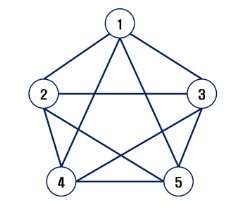

# 학습 목표
- 실 세계 문제를 그래프로 추상화해서 해결하는 방법을 학습
  - 그래프 탐색 기법인 BFS와 DFS에 대해 학습
  - 그래프 알고리즘에 활용되는 상호배타 집합(Disjoint-Sets)의 자료구조에 대해 학습
  - 최소 신장 트리(Minimum Spanning Tree)를 이해하고 탐욕 기법을 이용해서 그래프에서 최소 신장 트리를 찾는 알고리즘 학습
  - 그래프의 두 정점 사이의 최단 경로(Shortest Path)를 찾는 방법 학습

---

 

# 그래프
- 그래프는 아이템(사물 또는 추상적 개념)들과 이들 사이의 연괄 관계의 표현
- 정점(Vertex)들의 집합과 이들을 연결하는 간선(Edge)들의 집합으로 구성된 자료 구조
  - |V| : 정점의 개수, |E| : 그래프에 포함된 간선의 개수
  - |V|개의 정점을 가지는 그래프는 최대 |V|(|V|-1)/2 간선이 가능
- 선형 자료구조나 트리 자료구조로 표현하기 어려운 N:N 관계를 가지는 원소들을 표현하기 용이

## 그래프 유형
- 무향 그래프(Undirected Graph)
- 유향 그래프(Directed Graph)
- 가중치 그래프(Weighted Graph)
- 사이클 없는 방향 그래프(DAG, Directed Acyclic Graph)

- 완전 그래프 : 정점들에 대해 가능한 모든 간선들을 가진 그래프
- 부분 그래프 : 원래 그래프에서 일부의 정점이나 간선을 제외한 그래프

## 인접 정점
- 인접(Adjacency) 
  - 두 개의 정점에 간선이 존재(연결됨)하면 서로 인접해 있다고 한다.
  - 완전 그래프에 속한 임의의 두 정점들은 모두 인접해 있다.

## 그래프 경로
- 경로란 간선들을 순서대로 나열한 것
  - 간선들: (0,2), (2,4), (4,6)
  - 정점들: 0 - 2 - 4 - 6

- 경로 중 한 정점을 최대한 한번만 지나는 경로를 단순경로라 한다.
  - 0 - 2 - 4 - 6, 0 - 1 - 6

- 시작한 정점에서 끝나는 경로를 사이클(Cycle)이라고 한다.
  - 1 - 3 - 5 - 1

## 그래프 표현
- 간선의 정보를 저장하는 방식, 메모리나 성능을 고려해서 결정
- 인접 행렬(Adjacent matrix)
  - |V| X |V| 크기의 2차원 배열을 이용해서 간선 정보를 저장
  - 배열의 배열 (포인터 배열)
- 인접 리스트(Adjacent List)
  - 각 정점마다 해당 정점으로 나가는 간선의 정보를 저장
- 간선의 배열
  - 간선(시작 정점, 끝 정점)을 배열에 연속적으로 저장
- 