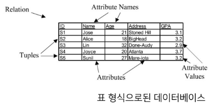
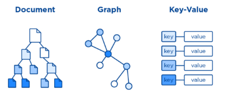
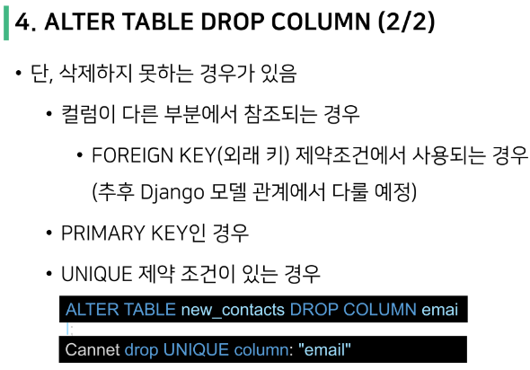

> 파일을 이용한 데이터 관리
- 장점 
  - 운영체제에 관계 없이 어디에서나 쉽게 사용가능
  - 이메일이나 메신저를 이용해 간편하게 전송 가능
- 단점
  - 성능과 보안적 측면에서 한계가 명확
  - 대용량 데이터를 다루기에 적합하지 않음
  - 데이터를 구조적으로 정리하기에 어려움
  - 확장이 불가능한 구조

> 표(스프레드 시트)를 이용한 데이터 관리
- 엑셀 시트(스프레드 시트)를 사용
- 스프레드 시트는 컬럼(열)을 통해 데이터의 유형을 지정하고 레코드(행)을 통해 구체적인 데이터 값을 포함
- 무한하게 커질 수 없음(100만 행 정도가 최대)
- 데이터 보안 측면
- 데이터 무결성 측면

</br>

# 데이터베이스

- 데이터베이스(Database) : an organized collection of data (잘 정돈된 데이터 모음)
- DBMS(Database Management System) : 사용자 간, 어플리케이션 간, 데이터베이스 간의 수집, 분석하도록 고안된 소프트웨어 

</br>

> 데이터베이스의 종류
- SQL : 관계형 데이터베이스
- NoSQL : 비관계형 데이터베이스

</br>

> 관계형 데이터베이스
- Relation
- 수학 > 집합/논리 > 관계




</br>

> 비관계형 데이터베이스
- No 보다는 Not Only
- 관계형 데이터베이스의 한계를 극복하기 위해 조금 더 유연한 데이터베이스
- 실제로 많이 쓰이는 데이터베이스
- 서브 데이터베이스로 두고 빠른 처리, 확장이 필요한 기능에서 사용하는 경우가 많음
- 채팅, 소셜, 실시간 사진, 메세지, 추천 등




</br>

> 데이터베이스를 조작하는 언어 = SQL(Structured Query Language)

</br>

# 관계형 데이터베이스
> Intro
- 우리가 사용하는 서비스 = 데이터베이스를 사용한 CRUD의 반복
  - 회원가입
  - 회원탈퇴
  - 프로필 조회
  - 프로필 수정
  - 새로운 피드 작성
  - 좋아요
  - 팔로우

</br>

> 관계형 데이터베이스(RDB)
- 데이터를 테이블, 행, 열 등으로 나누어 구조화 하는 방식
- 구조화해서 저장하므로 보다 체계적으로 데이터를 저장하고 관리할 수 있음
- 자료를 여러 테이블로 나누어서 관리하고, 테이블간 관계를 설정해 여러 데이터를 조작할 수 있음
- 데이터의 무결성(정확성, 일관성) 유지에 장점이 있음
- SQL을 사용하여 데이터를 조회하고 조작

</br>

> 관계형 데이터베이스의 구조
1. 스키마
2. 테이블
  - 필드
  - 레코드
  - 기본 키

</br>

> 스키마
- 테이블의 구조(Structure)
- 데이터베이스에서 자료의 구조, 표현 방법, 관계 등 전반적인 명세를 기술한 것


</br>

> 테이블(Table)
- 필드와 레코드를 사용해 조직된 데이터 요소들의 집합
- 관계(Relation)라고도 부름
</br>
1. 필드(field)
   - 속성, 컬럼(Column)
2. 레코드(record)
   - 튜플, 행(Row)


</br>

> PK(Primary Key)
- 기본 키
- 각 레코드의 고유한 값
  - 각각의 데이터를 구분할 수 있는 고윳값
- 기술적으로 다른 항목과 절대로 중복될 수 없는 단일 값(unique)
- 데이터베이스 관리 및 테이블 간 관계 설정 시 주요하게 활용


</br>

> FK(Foreign Key)
- 외래 키
- 한 테이블의 속성 중 다른 테이블의 레코드를 식별할 수 있는 키
- 다른 테이블의 기본 키를 참조
- 참조하는 테이블의 속성 1개의 값은, 참조되는 측 테이블의 레코드 값에 대응됨
- 각 레코드에서 서로 다른 테이블 간의 관계를 만드는데 사용할 수 있음


</br>

# SQL
- 관계형 데이터베이스에서 데이터를 관리하기 위해 사용하는 언어 == <span style='color:red'> 데이터베이스 관리 + CRUD 하는 언어</span>

</br>

# SQL Commands
> 종류
1. DDL (Data Definition Language)
2. DML (Data Manipulation Language)
3. DCL (Data Control Lanugage)


</br>

# SQL Synatax

```SQL
-- SQL Syntax 예시
SELECT column_name FROM table_name
```
- 모든 SQL 문(statement)는 SELECT, INSERT, UPDATE 등과 같은 키워드로 시작하고, 하나의 statement는 <span style='color: #2D3748;background-color:#fff5b1'>세미콜론(;)</span>으로 끝남
  - 세미콜론은 각 SQL 문을 구분하는 표준 방법
- SQL 키워드는 대문자로 작성하는 것을 권장

</br>

# DDL
1. 'SQLite3', 'SQLite Viewer' 설치 + Vscode SQLite 확장 프로그램 설치 확인


2. 
```git bash
git clone https://lab.ssafy.com/s09/python/database
```
3. 'sqlite3.zip' 복사해서 바탕화면에서 압축해제하면 안에 파일 5개 존재


4. 로컬디스크C에 'sqlite'라는 이름의 폴더 만들고 안에 압축해제한 파일 5개를 복사해서 붙여넣기


5. 아무곳에서나 git bash를 열고 'cd ~' (홈 디렉토리로 이동) 후 'code .'으로 Vscode 열기

6. 많은 파일 중 '.bashrc' 찾기 (없으면 만들기)

7. '.bashrc' 안에 다음과 같이 타이핑
```
alias sqlite3="winpty sqlite3"
```


8. '윈도구 검색 기능'에서 '시스템 환경 변수 편집'에서 '환경 변수' 클릭, 밑에 '시스템 변수' 중 'PATH'를 찾아 클릭하면 '환경 변수 편집'이 따로 열리는데, '새로 만들기 후 'C:|squlit' 만들기


9.  Vscocde Settings(crtl + '+' + ',')에서 '설정 검색' 창에 'sqlite' 검색 후 뜨는 창 중 맨 밑에 있는 'SQLite:SQLite3'의 'sqlite3'를 'sqlite'로 바꿔줍니다.


10.  git bash 창에 'sqlite3'를 치면 실행 확인 가능


</br>

# CREATE TABEL 
- "Create a new table in the database."
- 데이터베이스에 새 테이블을 만듦


> 실습
1. contacts 테이블 생성


2. Query 실행하기
   - 실행하고자 하는 명령문 안에 커서를 두고 마우스 우측 버튼 -> 'Run Selected Query' 선택


3. 쿼리 실행 후 테이블 및 스키마 확인


</br>

# SQLite Data Types
> 종류
1. NULL
  - NULL value
  - 정보가 없거나 알 수 없음을 의미(missing information or unknown)
2. INTEGER
  - 정수
  - 크기에 따라 0, 1, 2, 3, 4, 6, 또는 8바이트와 같은 가변 크기를 가짐
3. REAL
   - 실수
   - 8바이트 부동 소수점을 사용하는 10진수 값이 있는 실수
4. TEXT
   - 문자 데이터
5. BLOB
   - 입력된 그대로 저장된 데이터 덩어리 (대용 타입 없음)
   - 바이너리 등 멀티미디어 파일

</br>

# Constraints
- "제약 조건"
- 입력하는 자료에 대해 제약을 정함
- 제약에 맞지 않다면 입력이 거부됨
- 사용자가 원하는 조건의 데이터만 유지하기 위한, 즉 데이터의 무결성을 유지하기 위한 보편적인 방법
- 테이블의 특정 컬럼에 설정하는 제약

</br>

> 데이터 무결성
- 데이터베이스 내의 데이터에 대한 정확성, 일관성을 보장하기 위해 데이터 변경 혹은 수정 시 여러 제한을 두어 데이터의 정확성을 보증하는 것
  - 무결성 = 데이터의 정확성, 일관성
- 데이터베이스에 저장된 데이터의 무결성을 보장하고 데이터베이스의 상태를 일관되게 유지하는 것이 목적

</br>

> Constraints 종류
1. NOT NULL
   - 컬럼이 NULL 값을 허용하지 않도록 지정
   - 기본적으로 테이블의 모든 컬럼은 NOT NULL 제약 조건을 명시적으로 사용하는 경우를 제외하고는 NULL 값을 허용함
2. UNIQUE
   - 컬럼의 모든 값이 서로 구별되거나 고유한 값이 되도록 함
3. PRIMARY KEY
- 테이블에서 행의 고유성을 식별하는데 사용되는 컬럼
  - 각 테이블에는 하나의 기본 키만 있음
  - 암시적으로 NOT NULL 제약 조건이 포함
  - 


4. AUTOINCREMENT
  - 사용되지 않은 값이나 이전에 삭제된 행의 값을 재사용하는 것을 방지
  - INTEGER PRIMARY KEY 다음에 작성하면 해당 rowid를 다시 재사용하지 못하도록 함
  - Django에서 테이블 생성 시 id 칼럼에 기본적으로 사용하는 제약조건


5. 기타

</br>

> rowid의 특징
- 테이블을 생성할 때마다 rowid라는 암시적 자동 증가 컬럼이 자동으로 생성됨
- 테이블의 행을 고유하게 식별하는 64비트 부호 있는 정수 값
- 테이블에 새 행을 삽입할 때마다 정수 값을 자동으로 할당
  - 값은 1에서 시작
  - 데이터 삽입 시에 rowid 또는 INTEGER PRIMARY KEY 컬럼에 명시적으로 값이 지정되지 않은 경우, SQLite는 테이블에서 가장 큰 reowid보다 하나 큰 다음 순차 정수를 자동으로 할당 (AUTOINCREMENT와 관계없이)
- 만약 INTEGER PRIMARY KEY 키워드를 가진 컬럼을 직접 만들면 이 컬럼은 rowid 컬럼의 별칭(alias)이 됨
  - 즉, 새 컬럼 이름으로 rowid에 액세스 할 수 있으며 rowid 이름으로도 여전히 엑세스 가능
- 데이터가 최대 값에 도달하고 새 행을 삽입하려고 하면 SQLite는 사용되지 않은 정수를 찾아 사용
- 만약 SQLite가 사용되지 않은 정수를 찾을 수 없으면 SQLITE_FULL 에러가 발생
  - 또한 일부 행을 삭제하고 새 행을 삽입하면 SQLite는 삭제된 행에서 rowid 값을 재사용하려고 시도

</br>

# ALTER TABLE
- "Modify the structure of an existing tabel"
- 기존 테이블의 구조를 수정(변경)
- SQLite의 ALTER TABLE 문을 사용하면 기존 테이블을 다음과 같이 변경 가능
1. Rename a table
2. Rename a column
3. Add a new column to a table
4. Delete a column




</br>

# DROP TABLE


> DROP TABLE 특징
- 한 번에 하나의 테이블만 삭제 가능
- 여러 테이블을 제거하려면 여러 DROP TABLE 문 실행 필요
- DROP TABLE 문은 실행 취소나 복구 불가능
  - 각별히 주의해서 사용 요망

</br>

# DML
- Simple query
- Sorting rows
- Filtering data
- Grouping data
- Changing data

</br>

- DML을 통해 데이터 조작 (CRUD)


</br>

# Simple query
> SELECT statement

```SQL
SELECT column1, column2 FROM table_name;
```

- 특정 테이블에서 데이터를 조회하기 위해 사용
- 문법 규칙
  1. SELECT 절에서 컬럼 또는 쉼표로 구분된 컬럼 목록을 지정
  2. FROM 절(clause)에서 데이터를 가져올 테이블을 지정
- SQLite에서 가장 복잡한 문
  - ORDER BY
  - DISTINCT
  - WHERE
  - LIMIT
  - LIKE
  - GROUP BY

</br>

> cf) 모든 칼럼에 대한 shorthand(약칭) = *(asterick)

</br>

# Sorting rows
> ORDER BY clause

```SQL
SELECT select_list FROM table_name
ORDER BY column_1 ASC, column_2 DESC;
```

- SELECT 문에 추가하여 결과를 정렬
- ORDER BY 절은 FROM 절 뒤에 위치함
- 하나 이상의 칼럼을 기준으로 결과를 오름차순, 내림차순으로 정렬할 수 있음
- 이를 위해 ORDER BY 절 다음에 'ASC' 또는 'DESC' 키워드를 사용
  - ASC:오름차순(기본값)
  - DESC:내림차순
- ORDER BY 절은 하나 이상의 컬럼을 정렬할 경우 첫번째 열을 사용하여 행을 정렬하고, 그런 다음 두번째 열을 사용하여 정령 되어있는 행을 정렬하는 방식

</br>

# Filtering data
- 데이터를 필터링하여 중복 제거, 조건 설정 등 쿼리를 제어하기
- Clause
  - SELECT DISTINCT
  - WHERE
  - LIMIT
- Operator
  - LIKE
  - IN 
  - BETWEEN
  
> SELECT DISTINCT clause

```SQL
SELECT DISTINCT select_list FROM table_name;
```
- 조회 결과에서 중복된 행을 제거
- DISTINCT 절은 SELECT에서 선택적으로 사용할 수 있는 절
- 문법 규칙
  - DISTINCT 절은 SELECT 키워드 바로 뒤에 나타나야 함
  - DISTINCT 키워드 뒤에 컬럼 또는 컬럼 목록을 작성

</br>

> WHERE clause

```SQL
SELECT column_list FROM table_name
WHERE search_condition;
```

- "Specify the search condition for rows returned by the query"
- 조회 시 특정 검색 조건을 지정
- WHERE 절은 SELECT 문에서 선택적으로 사용할 수 있는 절
  - SELECT 문 외에도 UPDATE 및 DELETE 문에서 WHERE 절을 사용할 수 있음
- FROM 절 뒤에 작성


</br>

> SQLite comparison operators (비교연산자)
- = or ==
- <> or !=
- < , >
- <=, >=

</br>

> SQLite logical operators (논리연산자)
- 일부 표현식의 truth를 테스트할 수 있음
- 1, 0 또는 NULL 값을 반환
- SQLite는 Boolean 데이터 타입을 제공하지 않으므로 1은 TRUE를, 0은 FALSE를 의미
- ALL, AND, ANY, BETWEEN, IN, LIKE, NOT, OR 등

</br>

> LIKE operator
- "Query data based on pattern matching"
- 패턴 일치를 기반으로 데이터를 조회
- SELECT, DELETE, UPDATE 문의 WHERE 절에서 사용
- 기본적으로 대소문자를 구분하지 않음
  - 'A' LIKE 'a'는 TRUE
- SQLite는 패턴 구성을 위한 두 개의 와일드카드(wildcards)를 제공
1. % (percent) : 0개 이상의 문자가 올 수 있음을 의미
2. _ (underscore) : 단일(1개) 문자가 있음을 의미


</br>

> IN operator
- "Determine whether a value matches any value in a list of values"
- 값이 값 목록 결과에 있는 값과 일치하는지 확인
- 표현식이 값 목록의 값과 일치하는지 여부에 따라 true 또는 false를 반환
- IN 연산자의 결과를 부정하려면 NOT IN 연산자 사용
  
</br>

> BETWEEN operator

```
test_expression BETWEEN low_expression AND high_expression
```

- 값이 값 범위에 있는지 테스트
- 값이 지정된 범위에 있으면 true를 반환
- SELECT, DELETE, 및 UPDATE 문의 WHERE 절에서 사용할 수 있음
- BETWEEN 연산자의 결과를 부정하려면 NOT BETWEEN 연산자를 사용

</br>

> LIMIT clause

```SQL
SELECT column_list FROM table_name LIMIT row_count;
```

- "Constrain the number of rows returned by a query"
- 쿼리에서 반환되는 행 수를 제한
- SELECT 문에서 선택적으로 사용할 수 있는 절
- row_count는 반환되는 행 수를 지정하는 양의 정수를 의미

> OFFSET keyword
- LIMIT 절을 사용하면 첫번째 데이터부터 지정한 수만큼의 데이터를 받아올 수 있지만, OFFSET과 함께 사용하면 특정 지정된 위치에서부터 데이터를 조회할 수 있음

</br>

# SQL 실행 순서
1. FROM / JOIN
2. WHERE
3. GROUP BY
4. HAVING
5. SELECT
6. DISTINCT
7. ORDER BY
8. LIMIT / LIMIT OFFSET