# N:1 (Comment-User)
- Comment(N) - User(1)
- Comment 모델과 User 모델 간 관계 설정
- "0개 이상의 댓글은 1개의 회원에 의해 작성 될 수 있음"

## 모델 관계 설정

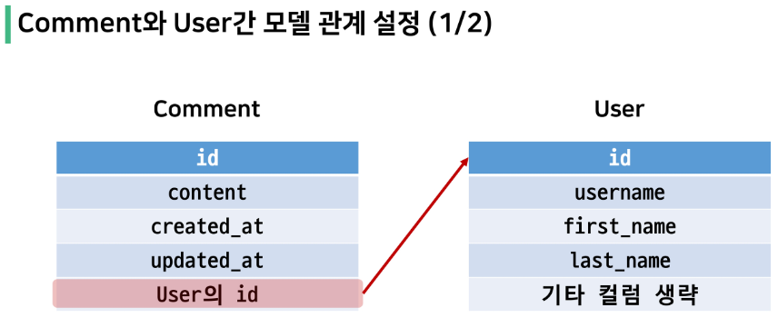

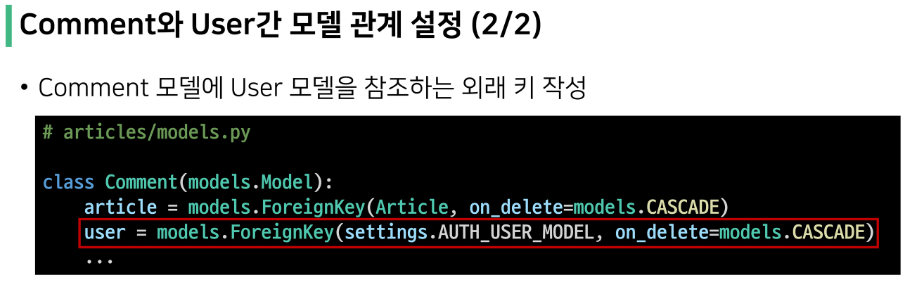

> Migration 진행
1. 이전에 User와 Article 모델 관계 설정 때와 마찬가지로 기존에 존재하던 테이블에 새로운 컬럼이 추가되어야 하는 상황이기 때문에 migrations 파일이 곧바로 만들어지지 않고 일련의 과정이 필요

```
$ python manage.py makemigrations
```


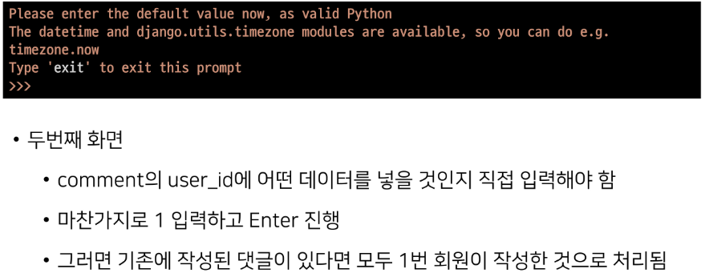

2. migrations 파일 생성 후 migrate 진행 & superuser 만들기

```
$ python manage.py migrate
$ python manage.py createsuperuser
```

   - comment 테이블 스키마 변경 및 확인

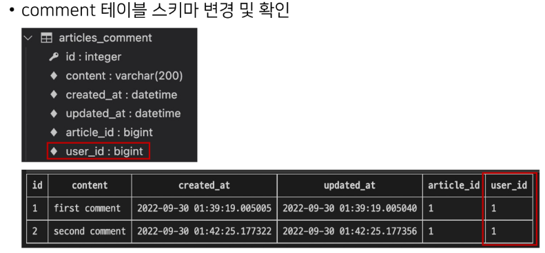

</br>

## CREATE

> 개요
- 인증된 회원의 댓글 작성 구현하기
- 작성하기 전 로그인을 먼저 진행한 상태로 진행


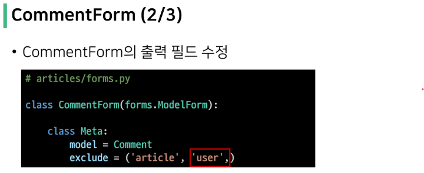

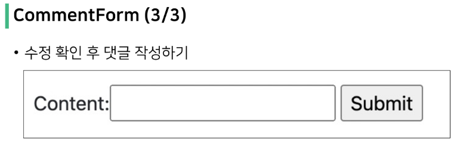

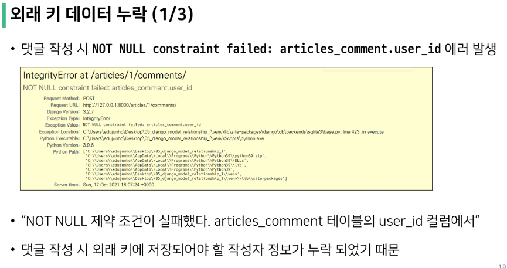

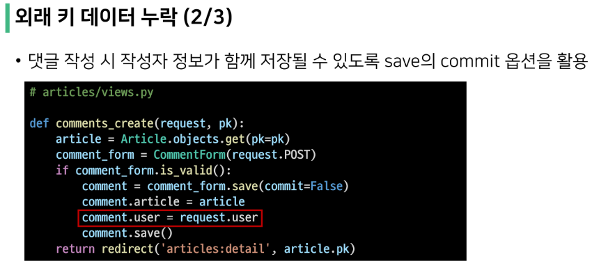

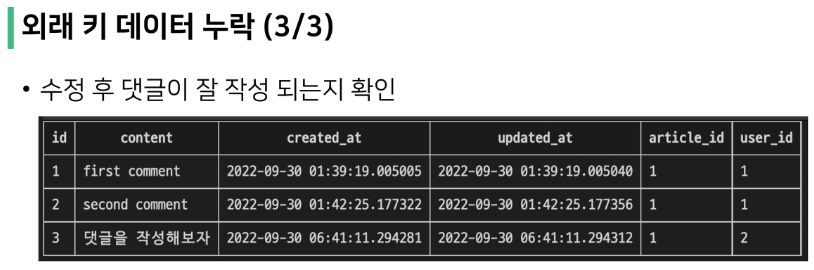

</br>

## READ

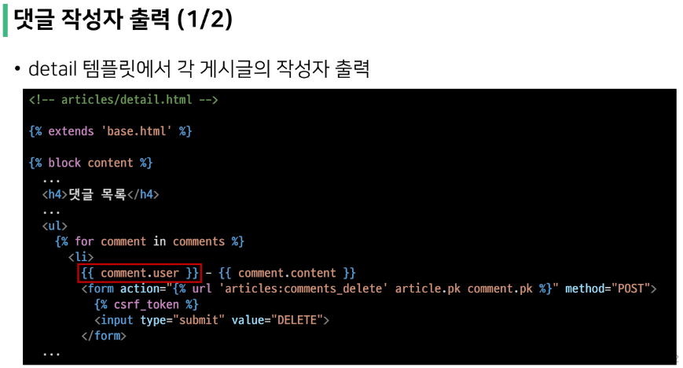


</br>

## DELETE

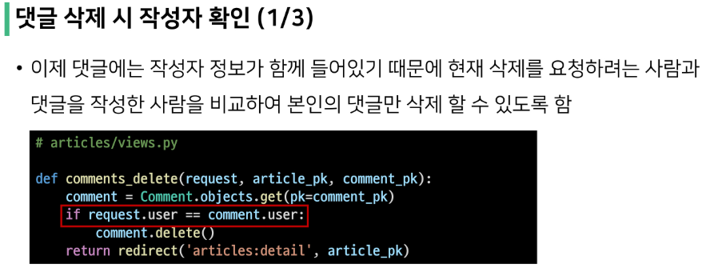

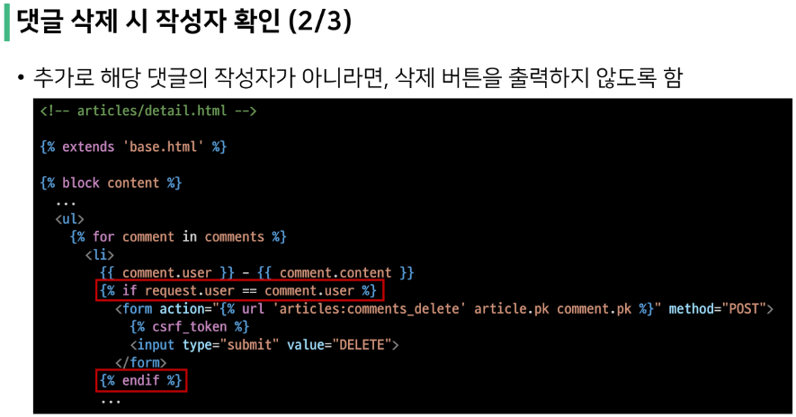

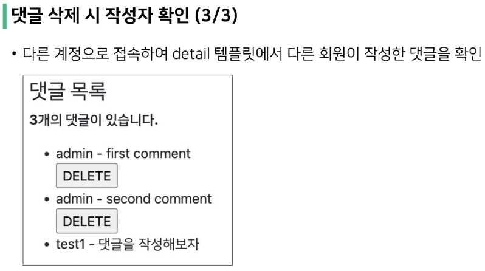

</br>

## 인증된 사용자에 대한 접근 제한하기

> 개요
- is_authenticated 와 View decorator를 활용하여 코드 정리하기

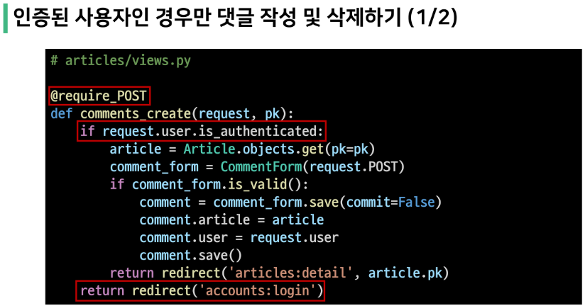

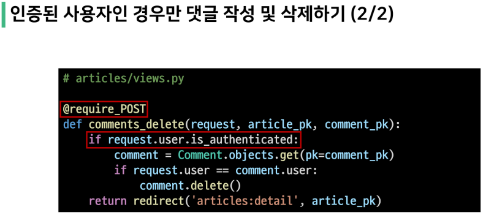

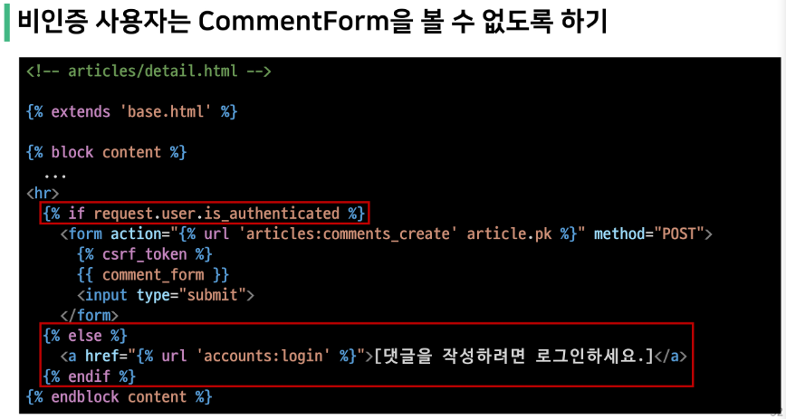

</br>

# Many to many relationship

> Intro
- 병원에 내원하는 환자와 의사의 예약 시스템을 구축하라는 업무를 지시 받음
  - 필요한 데이터 베이스 모델을 고민해보고 모델링 진행하기
  - 모델링을 하는 이유는 현실 세계를 최대한 유사하게 반영하기 위함
- 무엇보다 고민해야 할까?
  - 병원 시스템에서 가장 핵심이 되는 것은? -> 의사와 환자
  - 이 둘의 관계를 어떻게 표현할까?
- 우리 일상에 가까운 예시를 통해 DB를 모델링하고 그 내부에서 일어나는 데이터의 흐름을 어떻게 제어할 수 있을지 고민해보기

</br>

> 데이터 모델링
- 주어진 개념으로부터 논리적인 데이터 모델을 구성하는 작업
- 물리적인 데이터베이스 모델로 만들어 고객의 요구에 따라 특정 정보 시스템의 데이터베이스에 반영하는 작업

</br>

> 용어 정리
- target model : 관계 필드를 가지지 않은 모델
- source model : 관계 필드를 가진 모델

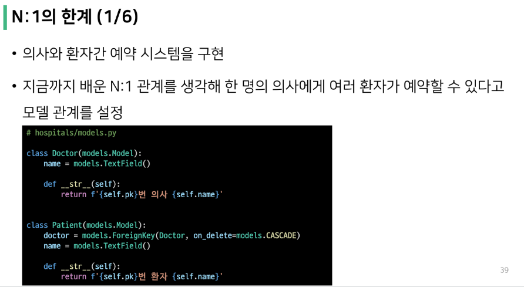

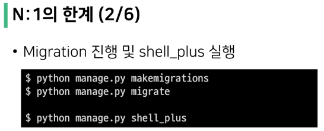

> shell_plus 사용 시 'settings.py'의 'INSTALLED_APPS'에 'django_extensions', 추가

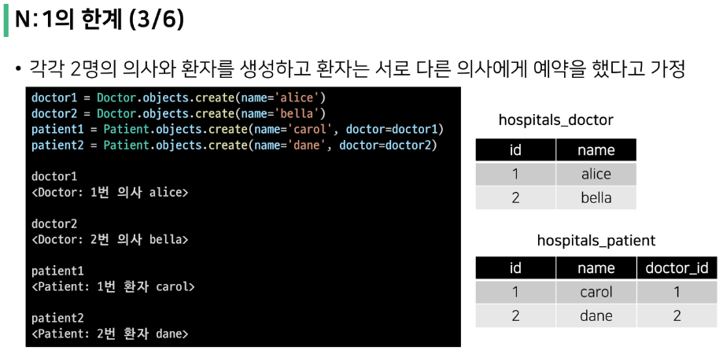

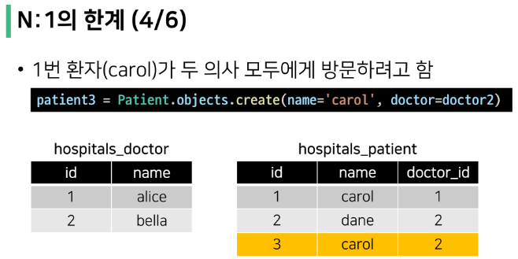

> 데이터 중복 시 수정이 용이하지 않고, 이름만 같고 다른 carol이면 구분이 안 된다.

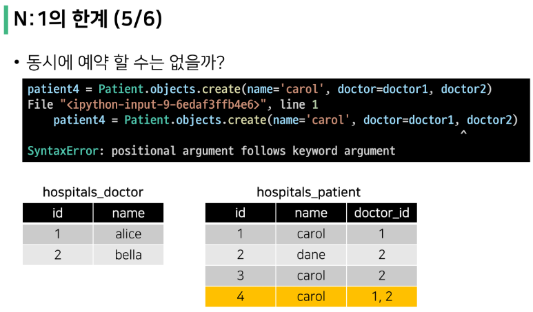

> 제 1 정규화 규정 위반


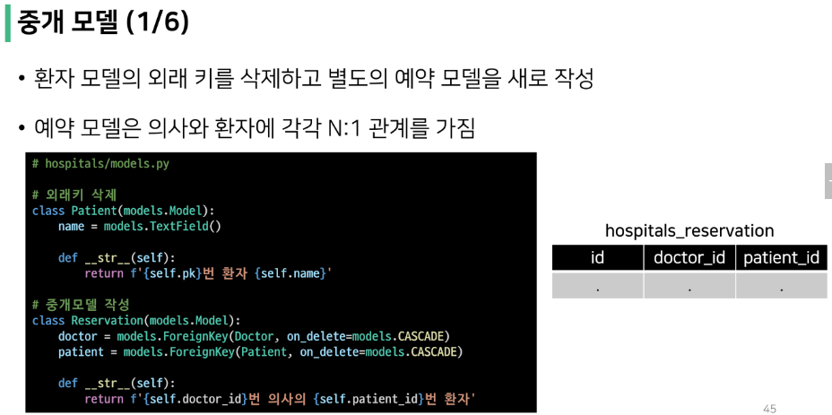

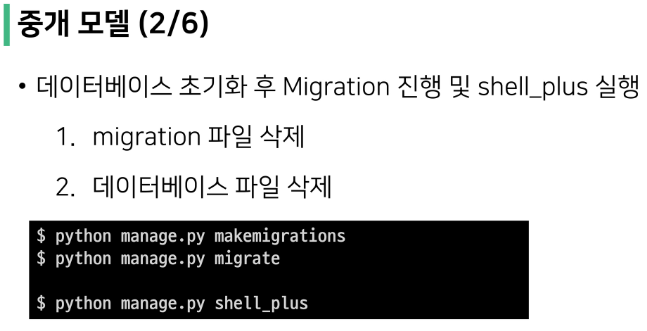

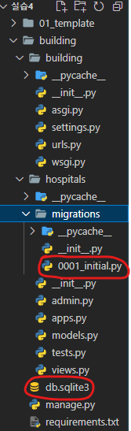

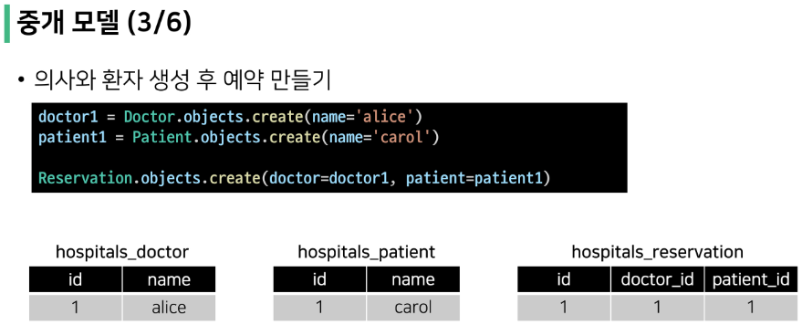

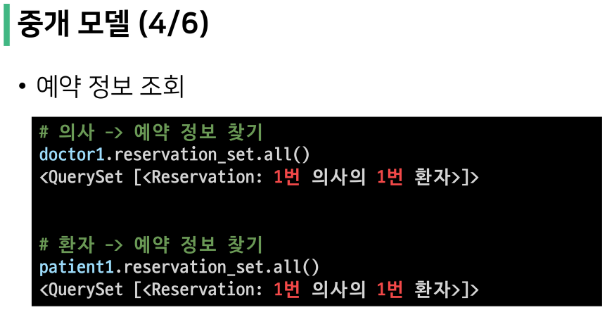

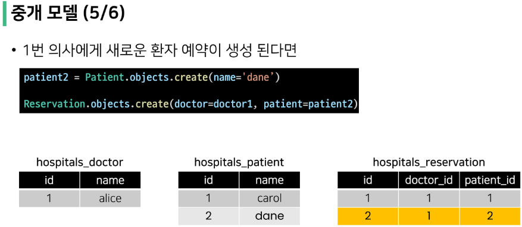

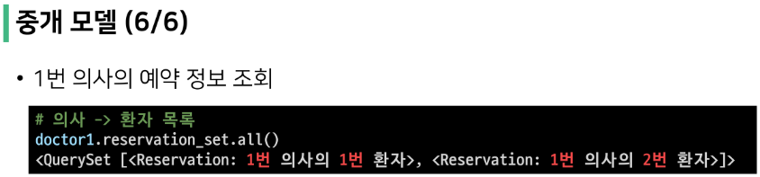

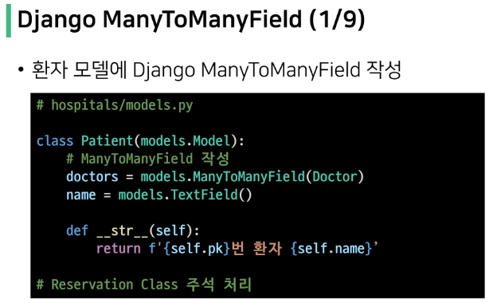

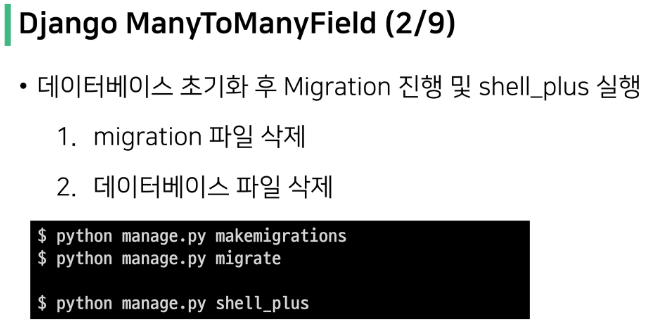

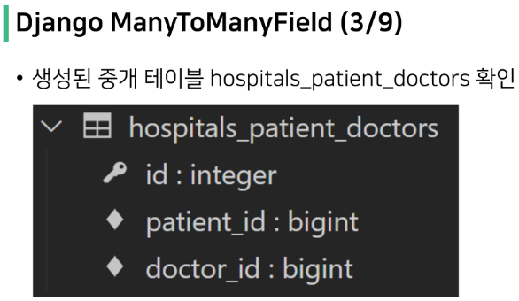

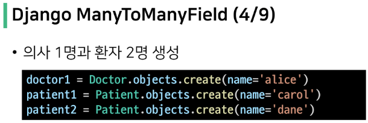

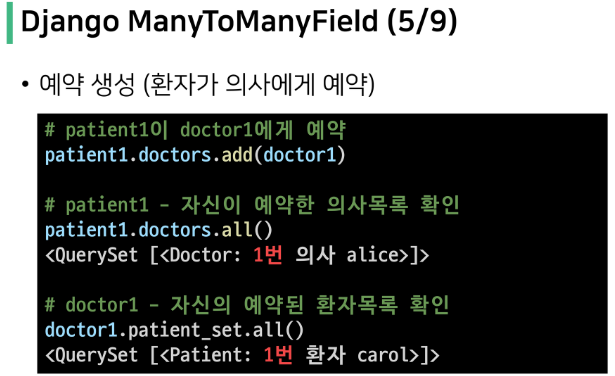