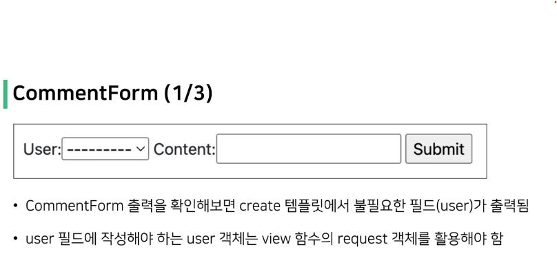
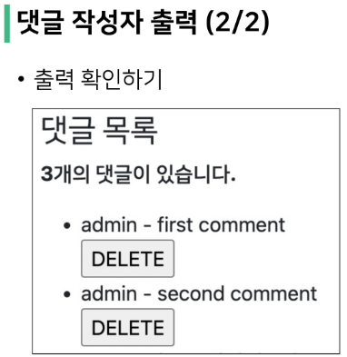
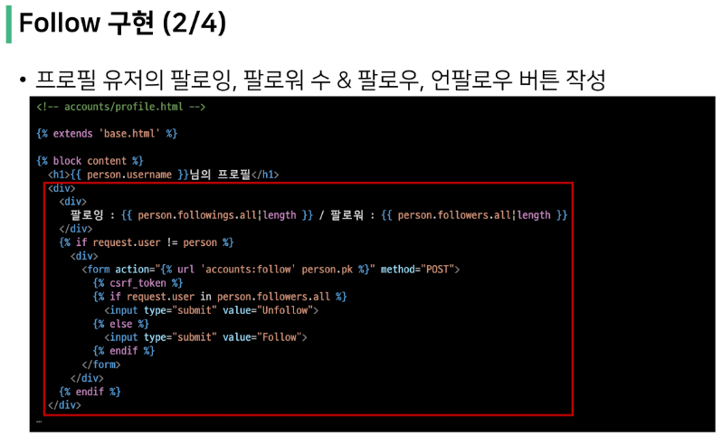
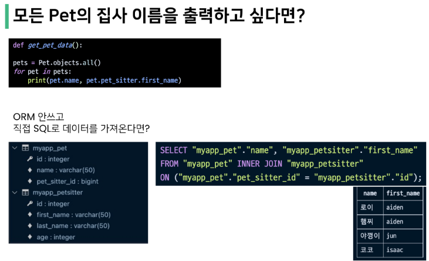

# N:1 (Comment-User)
- Comment(N) - User(1)
- Comment 모델과 User 모델 간 관계 설정
- "0개 이상의 댓글은 1개의 회원에 의해 작성 될 수 있음"

## 모델 관계 설정


> Migration 진행
1. 이전에 User와 Article 모델 관계 설정 때와 마찬가지로 기존에 존재하던 테이블에 새로운 컬럼이 추가되어야 하는 상황이기 때문에 migrations 파일이 곧바로 만들어지지 않고 일련의 과정이 필요

```
$ python manage.py makemigrations
```


2. migrations 파일 생성 후 migrate 진행 & superuser 만들기

```
$ python manage.py migrate
$ python manage.py createsuperuser
```

   - comment 테이블 스키마 변경 및 확인


</br>

## CREATE

> 개요
- 인증된 회원의 댓글 작성 구현하기
- 작성하기 전 로그인을 먼저 진행한 상태로 진행




</br>

## READ




</br>

## DELETE


</br>

## 인증된 사용자에 대한 접근 제한하기

> 개요
- is_authenticated 와 View decorator를 활용하여 코드 정리하기


</br>

# Many to many relationship

> Intro
- 병원에 내원하는 환자와 의사의 예약 시스템을 구축하라는 업무를 지시 받음
  - 필요한 데이터 베이스 모델을 고민해보고 모델링 진행하기
  - 모델링을 하는 이유는 현실 세계를 최대한 유사하게 반영하기 위함
- 무엇보다 고민해야 할까?
  - 병원 시스템에서 가장 핵심이 되는 것은? -> 의사와 환자
  - 이 둘의 관계를 어떻게 표현할까?
- 우리 일상에 가까운 예시를 통해 DB를 모델링하고 그 내부에서 일어나는 데이터의 흐름을 어떻게 제어할 수 있을지 고민해보기

</br>

> 데이터 모델링
- 주어진 개념으로부터 논리적인 데이터 모델을 구성하는 작업
- 물리적인 데이터베이스 모델로 만들어 고객의 요구에 따라 특정 정보 시스템의 데이터베이스에 반영하는 작업

</br>

> 용어 정리
- target model : 관계 필드를 가지지 않은 모델
- source model : 관계 필드를 가진 모델


> shell_plus 사용 시 'settings.py'의 'INSTALLED_APPS'에 'django_extensions', 추가


> 데이터 중복 시 수정이 용이하지 않고, 이름만 같고 다른 carol이면 구분이 안 된다.


> 제 1 정규화 규정 위반


## M:N (User-USer)
- User 자기 자신과의 M:N 관계 설정을 통한 팔로우 기능 구현하기
-혼자서 구현할 줄 알아야한다.

### Profile
- follow 흐름을 위한 프로필 페이지 먼저 작성


## Follow





## Fixtures
- Fixtures를 사용해 모델에 초기 데이터를 제공하는 방법

</br>

> 초기 데이터의 필요성
- 협업하는 A, B가 있다고 가정
  1. A가 먼저 프로젝트를 작업 후 github에 push한다.
     - gitignore 설정으로 인해 DB는 업로드하지 않기 때문에 A가 개발하면서 사용한 데이터는 올라가지 않는다.
  2. B가 github에서 A push한 프로젝트를 pull (혹은 clone) 한다.
     - 마찬가지로 프로젝트는 받았지만 A가 생성하고 조작한 데이터는 없는 빈 프로젝트를 맏게 된다.
- 이처럼 Django 프로젝트의 앱을 처음 설정할 때 동일하게 준비된 데이터로 데이터베이스를 미리 채우는 것이 필요한 순간이 있다.
- Django에서는 fixtures를 사용해 앱에 초기 데이터(initial data)를 제공할 수 있다.
- 즉, migrations와 fixtures를 사용하여 data와 구조를 공유하게 된다.

### Providing data with fixtures
- 실무 위주
- 검색 후 사용할 줄만 알면 됨

</br>

> 사전준비
- M:N까지 모두 작성된 Django 프로젝트에서 각 데이터를 최소 2개 이상 생성해두기

</br>

> fixtures
- Django가 데이터베이스로 가져오는 방법을 알고 있는 데이터 모음
  -  Django가 직접 만들기 때문에 데이터베이스 구조에 맞추어 작성 되어있음
- fixtures 파일은 직접 만드는 것이 아니라 dumpdata를 사용하여 생성하는 것!

</br>

> fixtures 생성 및 로드
- 생성(데이터 추출)
  - dumpdata
- 로드(데이터 입력)
  - loaddata


> Json 파일 예쁘게 보기
1. 


1. 'crtl+shift+p'에서 'prettify json' 검색 후 적용 후 json 파일 열기 


> 수정
- 'articles.user'이 아니라, 'accounts.user'


## Improve Query
- 개념적 이해가 중요
- 면접 시 중요





> select_related vs. prefetch_related
- select_related : 나를 기준으로 대상이 1명일 때
- prefetch_related : 나를 기준으로 대상이 다수일 때


