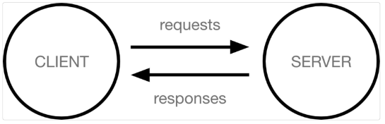

bㅠ## Django 시작하기

> Framework 이해하기
- 서비스 개발에 필요한 기능들을 미리 구현해서 모아 놓은 것
- Frame(뼈대, 틀) + Work(일하다)
  - 일정한 뼈대와 틀을 가지고 일하다
  - 제공받은 도구들과 뼈대, 규약을 가지고 무언가를 만드는 일
  - 특정 프로그램 개발 위한 여러 도구들과 규약을 제공
- 잘 사용하기만 하면 웹 서비스 개발에 있어서 모두 직접 개발할 필요 없이, 내가 반들고자 하는 본질(비즈니스 로직)에 집중해 개발 가능
- 소프트웨어의 생산성과 품질을 높임
  
</br>

> Django를 배워야하는 이유
1. Python으로 작성된 프레임워크
   - Python이라는 언어의 강력함과 거대한 커뮤니티
2. 수많은 여러 유용한 기능들
3. 검증된 웹 프레임워크
   - 유명한 많은 서비들이 사용한다는 것 == 안정적으로 서비스를 할 수 있다는 검증

</br>

## 클라이언트와 서버

> 구조
- 클라이언트-서버 구조 : 오늘날 우리가 사용하는 대부분의 웹 서비스 동작 기반
- 클라이언트와 서버 역시 하나의 컴퓨터
- 상호작용 간소화 다이어그램



</br>

- 클라이언트
  - 서비스를 요청하는 주체
  - 웹 사용자의 인터넷에 연결된 장치
  - Chrome 또는 Firefox와 같은 웹 브라우저
- 서버
  - 요청에 대해 서비스를 응답하는 주체
  - 클라이언트가 웹 페이지에 접근할려고 할 때, 서버에서 클라이언트 컴퓨터로 웹 페이지 데이터를 응답해 사용자의 웹 브라우저에 표시됨

</br>

- 상호작용 예시
  - 예를 들어, 우리가 Google 홈페이지에 접속한다는 것은 무엇을 뜻하는지 알아보자
  1. 결론적으로 인터넷에 연결된 전세계 어딘가에 있는 구글 컴퓨터에게 'Google 홈페이지.html'파일을 달라고 요청하는 것
  2. 그러면 구글 컴퓨터는 우리의 요청을 받고 'Google 홈페이지.html'파일을 인터넷을 통해서 우리 컴퓨터에게 응답해줌
  3. 그렇게 전달받은 Google 홈페이지.html 파일을 웹 브라우저가 우리가 볼 수 있도록 해석해주는 것

   - 여기서 'Google 홈페이지.html'을 달라고 요청한 컴퓨터, 웹 브라우저를 클라이언트라고 하고, 'Google 홈페이지.html'파일을 제공한 컴퓨터, 프로그램을 서버라고 함
   - 어떠한 자원(resource)을 달라고 요청(request)하는 쪽을 클라이언트라고 하고 자원을 제공해주는 쪽을 서버(server)라고 함.

</br>

> 정리
- 우리가 사용하는 웹은 클라이언트-서버 구조로 이루어져 있음
- 배울 것도 이 클라이언트-서버 구조를 만드는 방법을 배우는 것
- Django는 서버를 구현하는 웹 프레임워크

</br> 

## Django 무작정 따라하기

> Django 설치
```
$ pip install django==3.2.18
```

</br>

> 