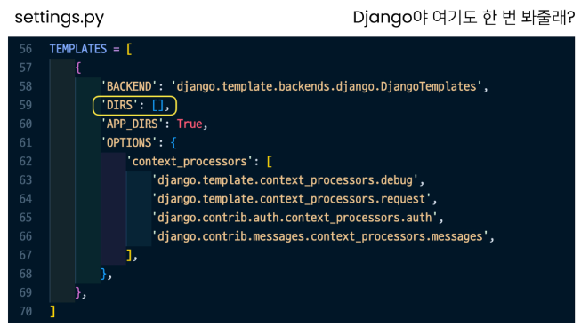
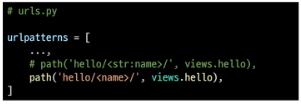

bㅠbㅠb# Design Pattern

> Design Pattern
- 자주 사용되는 구조를 일반화해서 하나의 공법으로 만들어 둔 것
- 소프트웨어적 관점 : 각기 다른 기능을 가진 다양한 응용 소프트웨어 개발 때 공통적인 설계 문제가 존재, 처리하는 해결책 사이에서도 공통점 발견 = 패턴

</br>

> 소프트웨어 디자인 패턴
- 클라이언트-서버 구조도 소프트웨어 디자인 패턴 중 하나
- Like 건축 공법
- 목적
  - 특정 문맥에서 공통적으로 발생하는 문제에 대해 재사용 가능한 해결책 제시
  - 발생하는 공통된 문제들을 해결하는데 형식화 된 가장 좋은 관행
- 장점
  - 복잡한 커뮤니케이션이 매우 간단해짐 : 다수의 엔지니어들이 일반화된 패턴으로 소프트웨어 개발을 할 수 있도록 한 규칙, 커뮤니케이션의 효율성을 높이는 기법


# Django's Design Pattern

- MTV 패턴 : MVC 디자인 패턴을 기반으로 조금 변형된 패턴

> MVC 소프트웨어 디자인 패턴
- Model - View - Controller의 준말
- 데이터 및 논리 제어를 구현하는데 널리 사용되는 소프트웨어 디자인 패턴
- 하나의 큰 프로그램을 세가지 역활로 구분한 개발 방법론

</br>

1. Model : 데이터와 관련된 로직을 관리
2. View : 레이아웃과 화면을 처리
3. Controller : 명령을 model과 view 부분으로 연결
  
</br>

> MVC 소프트웨어 디자인 패턴의 목적
- 관심사 분리
- 더 나은 업무의 분리와 향상된 관리를 제공
- 각 부분을 독립적으로 개발, 수정 용이
  - == 개발 효율성 및 유지보수가 쉬워짐
  - == 다수의 멤버로 개발하기 용이함

</br>

> MTV 디자인 패턴


- Model
  - MVC 패턴에서 Model의 역활에 해당
  - 데이터와 관련된 로직을 관리
  - 응용프로그램의 데이터 구조를 정의하고 데이터베이스의 기록을 관리
- Template
  - 레이아웃과 화면을 처리
  - 화면상의 사용자 인터페이스 구조와 레이아웃을 저으이
  - MVC 패턴에서 View의 역활에 해당
- View
  -  Model & Template과 관련한 로직을 처리해서 응답을 반환
  -  클라이언트의 요청에 대해 처리를 분기하는 역활
  -  동작 예시
     -  데이터가 필요하다면 model에 접근해서 데이터를 가져오고 
     -  가져온 데이터를 template로 보내 화면을 구성하고 
     -  구성된 화면을 응답으로 만들어 클라이언트에게 반환
  - MVC 패턴에서 Controller의 역활에 해당


</br>

> 정리
- Model : 데이터 관련
- Template : 화면 관련
- View : Model & Template 중간 처리 및 응답 반환

# Django Template
- 데이터 표현을 제어하는 도구이자 표현에 관련된 로직
- Django Template을 이용한 HTML 정적 부분과 동적 컨텐츠 삽입
- Template System의 기본 목표를 숙지

</br>

- Django Template System
  - 데이터 표현을 제어하는 도구이자 표현에 관련된 로직을 담당

</br>

> Django Template Language (DTL)
- Django template에서 사용하는 built-in template system
- 조건, 반복, 변수 치환, 필터 등의 기능을 제공
  - Python처럼 일부 프로그래밍 구조(if, for 등)를 사용할 수 있지만 이것은 **Python 코드로 실행되는 것이 아님**
  - Django 템플릿 시스템은 단순히 Python이 HTML에 포함된 것이 아니니 주의

</br>

> DTL Syntax
1. Variable
2. Filter
3. Tags
4. Comments

</br>

> Variable
```django
{{  variable  }}
```
- 변수명은 영어, 숫자와 밑줄(_)의 조합으로 구성될 수 있으나 밑줄로는 시작할 수 없음
  - 공백이나 구두점 문자 또한 사용할 수 없음
- dot(.)을 사용하여 변수 속성에 접근할 수 있음
- render()의 세번째 인자로 {'key':value}와 같이 딕셔너리 형태로 넘겨주며, 여기서 정의한 key에 해당하는 문자열이 template에서 사용 가능한 변수명이 됨

</br>

> Filters
```django
{{  variable|filter }}
```
- 표시할 변수를 수정할 때 사용
- 60개의 built-i template filters를 제공
- chained가 가능하며 일부 필터는 인자를 받기도 함

</br>

> Tags
```django


```
- 출력 텍스트를 만들거나, 반복 또는 논리를 수행하여 제어 흐름을 만드는 등 변수보다 복잡한 일들을 수행
- 일부 태그는 시작과 종료 태그가 필요
- 약 24개의 built-in template tags를 제공

</br>

> Comments
```django
<!-- 한 줄 주석(줄 바꿈 허용 X) -->
{# #}
<!-- 여러 줄 주석 -->


```
- Django template에서 라인의 주석을 표현하기 위해 사용

</br>

> DTL Syntax 실습
1. Variable
- context 데이터가 많아질 경우를 생각하면 다음과 같이 작성하는 것이 바람직
- context라는 이름은 다른 이름으로 사용 가능 **but 관행적 이름**


2. Filters


3. for


4. Comments


</br>

# Template inheritance

> 템플릿 상속
- 기본적으로 코드의 재사용성에 초점을 맞춤
- 사이트의 공통 요소를 포함하고, 하위 템플릿이 재정의(override) 할 수 있는 블록을 정의하는 기본 'skeleton' 템플릿을 만들 수 있음

</br>

> 템플릿 상속에 관련된 태그
```django

```
- 자식(하위)템픞릿이 부모 템플릿을 확장한다는 것을 알림


<span style='color:red'>※ 반드시 템플릿 최상단에 작성되어야 함(즉, 2개 이상 사용할 수 없음)</span>

```django

```

- 하위 템플릿에서 재정(overridden)할 수 있는 블록을 정의
- 즉, 하위 템플릿이 채울 수 있는 공간
- 가독성을 높이기 위해 선택적으로 endblock 태그에 이름을 지정할 수 있음

```django
<!-- 두 코드는 같음 -->





```

</br>

> 템플릿 상속 예시
- base라는 이름의 skeleton 템플릿을 작성
- Bootstrap CDN 작성


- index 템플릿에서 base 템플릿을 상속받음
- Bootstrap이 적용되었는지 확인


</br>

> Django의 Template 처리(모든 앱에서 가져다 쓸려면)

  

 
 
 

</br>

# Django URLs
- "Dispatcher(운행 관리원)로서의 URL 이해하기"
- 웹 어플리케이션은 URL을 통한 클라이언트의 요청에서부터 시작함

</br>

# Trailing URL Slashes
- Django은 URL 끝에 /(Trailing slash)가 없다면 자동으로 붙여주는 것이 기본 설정
  - 그래서 모든 주소가 '/'로 끝나도록 구성되어 있음
  - 그러나 모든 프레임워크가 이렇게 작동하는 것이 아님
- Django의 url 설계 철학을 통해 먼저 살펴보면 다음과 같이 설명함
  - "기술적인 측면에서, foo.com/bar와 foo.com/bar/는 서로 다른 URL이다."
  - 검색 엔진 로봇이나 웹 트래픽 분석 도구에서는 그 둘을 서로 다른 페이지로 봄
  - 그래서 Django는 URL을 정규화하여 검색 엔진 로봇이 혼동하지 않게 해야 함

</br>

# Variable routing
- URL 주소를 변수로 사용하는 것을 의미
- URL의 일부를 변수로 지정하여 view 함수의 인자로 넘길 수 있음
- 즉, 변수 값에 따라 하나의 path()에 여러 페이지를 연결 시킬 수 있음

</br>

> 필요성
- 템플릿의 많은 부분이 중복되고, 일부분만 변경되는 상황에서 비슷한 URL과 템플릿을 계속해서 만들어야 하나?

</br>

> 작성
- 변수는 "<>"에 정의하며 view 함수의 인자로 할당
- 기본 타입 : string
- 총 5가지 타입으로 명시

1. str
  - '/'를 제외하고 비어 있지 않은 모든 문자열
  - 작성하지 않을 경우 기본값
2. int
   - 0 또는 양의 정수와 매치
3. slug
4. uuid
5. path



</br>

> View 함수 작성
- variable routing으로 할당된 변수를 인자로 받고 템플릿 변수로 사용할 수 있음


</br>

# App URL mapping
- 앱이 많아졌을 때 urls.py를 각 app에 매핑하는 방법을 이해하기
- 두번째 app인 pages를 생성 및 등록

</br>

- 서비스를 개발하다 보면 url와 view가 아주 많아지게 된다.
- 이걸 모두 프로젝트의 urls.py에서 관리하면
  - 코드의 가독성이 떨어진다.
  - 프로젝트 유지 보수에 좋지 않다.

</br>

- 같은 이름이 겹친다면
  - 각 앱의 view 함수를 다른 이름으로 import해도 가능은 하다


- **urls.py를 쪼개자!**
- 하나의 프로젝트에 여러 앱이 존재한다면, 각각의 앱 안에 urls.py를 만들고 프로젝트 urls.py에서 각 앱의 urls.py파일로 URL mapping을 위탁할 수 있음
- **각각의 app 폴더 안에 urls.py를 작성**


</br>

> Including other URLconfs
- urlpattern은 언제든지 다른 URLconf 모듈을 포함(include)할 수 있음  

<span style='color:red'>
※ inlcude되는 앱의 url.py에 urlpattern가 작성되어 있지 않다면 에러가 발생  
※ 예를 들어, pages 앱의 urlpatterns가 빈 리스트라도 작성되어 있어야 함
</span>

</br>

> include()
- 다른 URLconf(app/urls.py)들을 참조할 수 있도록 돕는 함수
- 함수 include()를 만나게 되면 URL의 그 시점까지 일치하는 부분을 잘라내고, 남은 문자열 부분을 후속 처리를 위해 include된 URLconf로 전달

</br>

> URL 구조의 변화
- 앱의 URL을 project의 urls.py에서 관리


- 복수 개의 앱의 URL을 project의 urls.py에서 관리


- 각각의 앱에서 URL을 관리


</br>

# Naming URL patterns
- 링크에 URL을 직접 작성하는 것이 아니라 "path()" 함수의 name 인자를 정의해서 사용
- DTL의 Tag 중 하나인 URL 태그를 사용해서 "path()" 함수에 작성한 name을 사용할 수 있음
- 이를 통해 URL 설정에 정의된 특정한 경로들의 의존성을 제거할 수 있음
- Django는 URL에 이름을 지정하는 방법을 제공함으로써 view 함수와 템플릿에서 특정 주소를 쉽게 참조할 수 있도록 도움


> 필요성
- 만약 "index/"의 문자열 주소를 "new-index/"로 바꿔야 한다고 가정
- 그렇다면 "index/" 주소를 사용했던 모든 곳을 찾아서 변경해야하는 번거로움 발생

</br>

> Built-in tag-"url"
```django

```
- 템플릿에서 사용하기
- 주어진 URL 패턴 이름 및 선택적 매개 변수와 일치하는 절대 경로 주소를 반환
- 템플릿에 URL을 하드 코딩하지 않고도 DRY 원칙을 위반하지 않으면서 링크를 출력하는 방법


- 개발자 도구를 통해 url 태그가 URL 패턴 이름과 일치하는 절대 경로 주소를 반환하는 것을 확인해 볼 수 있다.


</br>

# URL namespace

> 개요
- URL namespace를 사용하면 서로 다른 앱에서 동일한 URL 이름을 사용하는 경우에도 이름이 지정된 URL을 고유하게 사용 할 수 있음
- app_name attribute를 작성해 URL namespace를 설정


> URL tag의 변화


> 기존 URL tag 변경


> URL 참조
- ":" 연산자를 사용하여 지정
  - 예를 들어, app_name이 articles이고 URL name이 index인 주소 참조는 articles:index가 됨