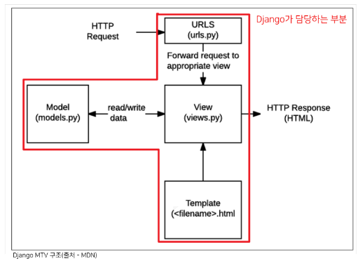

bㅠbㅠb# Design Pattern

> Design Pattern
- 자주 사용되는 구조를 일반화해서 하나의 공법으로 만들어 둔 것
- 소프트웨어적 관점 : 각기 다른 기능을 가진 다양한 응용 소프트웨어 개발 때 공통적인 설계 문제가 존재, 처리하는 해결책 사이에서도 공통점 발견 = 패턴

</br>

> 소프트웨어 디자인 패턴
- 클라이언트-서버 구조도 소프트웨어 디자인 패턴 중 하나
- Like 건축 공법
- 목적
  - 특정 문맥에서 공통적으로 발생하는 문제에 대해 재사용 가능한 해결책 제시
  - 발생하는 공통된 문제들을 해결하는데 형식화 된 가장 좋은 관행
- 장점
  - 복잡한 커뮤니케이션이 매우 간단해짐 : 다수의 엔지니어들이 일반화된 패턴으로 소프트웨어 개발을 할 수 있도록 한 규칙, 커뮤니케이션의 효율성을 높이는 기법


# Django's Design Pattern

- MTV 패턴 : MVC 디자인 패턴을 기반으로 조금 변형된 패턴

> MVC 소프트웨어 디자인 패턴
- Model - View - Controller의 준말
- 데이터 및 논리 제어를 구현하는데 널리 사용되는 소프트웨어 디자인 패턴
- 하나의 큰 프로그램을 세가지 역활로 구분한 개발 방법론

</br>

1. Model : 데이터와 관련된 로직을 관리
2. View : 레이아웃과 화면을 처리
3. Controller : 명령을 model과 view 부분으로 연결
  
</br>

> MVC 소프트웨어 디자인 패턴의 목적
- 관심사 분리
- 더 나은 업무의 분리와 향상된 관리를 제공
- 각 부분을 독립적으로 개발, 수정 용이
  - == 개발 효율성 및 유지보수가 쉬워짐
  - == 다수의 멤버로 개발하기 용이함

</br>

> MTV 디자인 패턴


- Model
  - MVC 패턴에서 Model의 역활에 해당
  - 데이터와 관련된 로직을 관리
  - 응용프로그램의 데이터 구조를 정의하고 데이터베이스의 기록을 관리
- Template
  - 레이아웃과 화면을 처리
  - 화면상의 사용자 인터페이스 구조와 레이아웃을 저으이
  - MVC 패턴에서 View의 역활에 해당
- View
  -  Model & Template과 관련한 로직을 처리해서 응답을 반환
  -  클라이언트의 요청에 대해 처리를 분기하는 역활
  -  동작 예시
     -  데이터가 필요하다면 model에 접근해서 데이터를 가져오고 
     -  가져온 데이터를 template로 보내 화면을 구성하고 
     -  구성된 화면을 응답으로 만들어 클라이언트에게 반환
  - MVC 패턴에서 Controller의 역활에 해당



</br>

> 정리
- Model : 데이터 관련
- Template : 화면 관련
- View : Model & Template 중간 처리 및 응답 반환

# Django Template
- 데이터 표현을 제어하는 도구이자 표현에 관련된 로직
- Django Template을 이용한 HTML 정적 부분과 동적 컨텐츠 삽입
- Template System의 기본 목표를 숙지

</br>

- Django Template System
  - 데이터 표현을 제어하는 도구이자 표현에 관련된 로직을 담당

</br>

> Django Template Language (DTL)
- Django template에서 사용하는 built-in template system
- 조건, 반복, 변수 치환, 필터 등의 기능을 제공
  - Python처럼 일부 프로그래밍 구조(if, for 등)를 사용할 수 있지만 이것은 **Python 코드로 실행되는 것이 아님**
  - Django 템플릿 시스템은 단순히 Python이 HTML에 포함된 것이 아니니 주의

</br>

> DTL Syntax
1. Variable
2. Filter
3. Tags
4. Comments

</br>

> Variable
```django
{{  variable  }}
```
- 변수명은 영어, 숫자와 밑줄(_)의 조합으로 구성될 수 있으나 밑줄로는 시작할 수 없음
  - 공백이나 구두점 문자 또한 사용할 수 없음
- dot(.)을 사용하여 변수 속성에 접근할 수 있음
- render()의 세번째 인자로 {'key':value}와 같이 딕셔너리 형태로 넘겨주며, 여기서 정의한 key에 해당하는 문자열이 template에서 사용 가능한 변수명이 됨

</br>

> Filters
```django
{{  variable|filter }}
```
- 표시할 변수를 수정할 때 사용
- 60개의 built-i template filters를 제공
- chained가 가능하며 일부 필터는 인자를 받기도 함

</br>

> Tags
```django


```
- 출력 텍스트를 만들거나, 반복 또는 논리를 수행하여 제어 흐름을 만드는 등 변수보다 복잡한 일들을 수행
- 일부 태그는 시작과 종료 태그가 필요
- 약 24개의 built-in template tags를 제공

</br>

> Comments
```django
<!-- 한 줄 주석(줄 바꿈 허용 X) -->
{# #}
<!-- 여러 줄 주석 -->


```
- Django template에서 라인의 주석을 표현하기 위해 사용

</br>

> DTL Syntax 실습
1. Variable
- context 데이터가 많아질 경우를 생각하면 다음과 같이 작성하는 것이 바람직
- context라는 이름은 다른 이름으로 사용 가능 **but 관행적 이름**


2. Filters


3. for


4. Comments


</br>

# Template inheritance

> 템플릿 상속
- 기본적으로 코드의 재사용성에 초점을 맞춤
- 사이트의 공통 요소를 포함하고, 하위 템플릿이 재정의(override) 할 수 있는 블록을 정의하는 기본 'skeleton' 템플릿을 만들 수 있음

> 템플릿 상속에 관련된 태그
> 