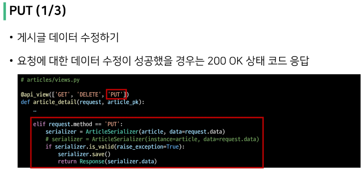
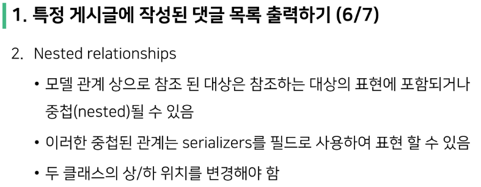
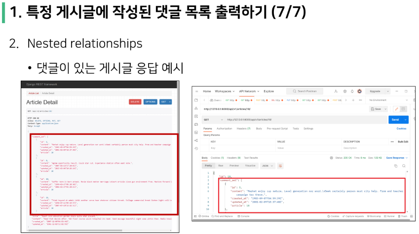

# HTTP
- HyperText Transfer Protocol
- HTML 문서와 같은 리소스(resource, 자원)들을 가져올 수 있도록 하는 프로토콜(규칙, 약속)
- 웹 상에서 컨텐츠를 전송하기 위한 약속
- 웹에서 이루어지는 모든 데이터 교환의 기초
- "클라이언트-서버 프로토콜"
- 클라이언트와 서버는 다음과 같은 개별적인 메시지 교환에 의해 통신
  - 요청(request) : 클라이언트에 의해 전송되는 메시지
  - 응답(response) : 서버에서 응답으로 전송되는 메시지

 

> HTTP 특징
- Stateless(무상태)
  - 동일한 연결(connection)에서 연속적으로 수행되는 두 요청 사이에 링크가 없음
  - 즉, 응답을 마치고 연결을 끊는 순간 클라이언트와 서버 간의 통신이 끝나며 상태 정보가 유지되지 않음

- 이는 특정 페이지와 일관되게 상호작용 하려는 사용자에게 문제가 될 수 있으며, (예를 들어 e-commerce에서 장바구니를 사용하는 경우) 이를 해결하기 위해 쿠키와 세션을 사용해 서버 상태를 요청과 연결하도록 함

 

> HTTP Request Methods
- 리소스에 대한 행위(수행하고자 하는 동작)를 정의
- 즉, 리소스에 대해 수행할 원하는 작업을 나타내는 메서드 모음을 정의
- HTTP verbs라고도 함
- HTTP Method 예시 : GET, POST, PUT, DELETE, ...

 

> 리소스(resource)
- HTTP 요청의 대상을 리소스(resource, 자원)

 

> 대표 HTTP Request Methods (CRUD)
1. GET (R)
   - 서버에 리소스의 표현을 요청
   - GET을 사용하는 요청은 데이터만 검색해야 함
2. POST (C)
   - 데이터를 지정된 리소스에 제출
   - 서버의 상태를 변경
3. PUT (U) (vs. PATCH)
   - 요청한 주소의 리소스를 수정
4. DELETE (D)
   - 지정된 리소스를 삭제

 

> HTTP response status codes
- 특정 HTTP 요청이 성공적으로 완료되었는지 여부를 나타냄
- 응답 중 기억해야할 것
  1. 정상 : Successful response (200~299)
  2. 클라이언트 잘못 : Client error response(400~499)
  3. 서버 잘못 : Server error response (500~599)

 

# Identifying resources on the Web
- 웹에서 리소스를 식별하는 방법에 대해 학습

> 웹에서의 리소스 식별
- HTTP 요청의 대상을 리소스(resource, 자원)라고 함
- 문서, 사진 또는 기타 어떤 것이든
- 각 리소스의 식별을 위해 URI로 식별

 

## URI

> Anchor (앵커)
- 하이퍼링크와 비슷한 기능을 하는 인터넷상의 다른 문서와 연결된 문자 혹은 그림

 

> URN
- Uniform Resource Name(통합 자원 이름)
- URL과 달리 자원의 위치에 영향을 받지 않는 유일한 이름 역활을 함(독립적 이름)
- URL의 단점을 극복하기 위해 등장했으며 자원이 어디에 위치한지 여부와 상관없이 이름만으로 자원을 식별
- 하지만 보편화 되어있지 않아 현재는 URL을 대부분 사용
- EX
  - ISBN (국제표준 도서번호)
  - ISAN (국제 표준 시청각 자료번호)

 

> 정리
- 웹에서의 리소스 식별
  - 자원의 식별자(URI)
    - 자원의 위치로 자원을 식별 = URL
    - 고유한 이름으로 자원을 식별 = URN

 

# 클라이언트와 서버
> 클라이언트-서버 구조
- 오늘날 우리가 사용하는 대부분의 웹 서비스는 클라이언트-서버 구조를 기반으로 동작
- 클라이언트와 서버 역시 하나의 컴퓨터이며 이들이 어떻게 상호작용하는지에 대한 간소화된 다이어그램

- 클라이언트
  - 웹 사용자의 인터넷에 연결된 장치
  - Chrome 또는 Firefox와 같은 웹 브라우저
  - 서비스르 요청하는 주체

- 서버
  - 웹 페이지, 사이트 또는 앱을 저장하는 컴퓨터
  - 클라이언트가 웹 페이지에 접근하려고 할 때 서버에서 클라이언트 컴퓨터로 웹 페이지 데이터를 응답해 사용자의 웹 브라우저에 표시됨
  - 요청에 대해 서비스를 응답하는 주체

- 상호작용 예시
  - 예를 들어, 우리가 Google 홈페이지에 접속한다는 것
  1. 결론적으로 인터넷에 연결된 전세계 어딘가에 있는 구글 컴퓨터에게 'Google 홈페이지.html' 파일을 달라고 요청하는 것
  2. 그러면 구글 컴퓨터는 우리의 요청을 받고 'Google 홈페이지.html' 파일을 인터넷을 통해서 우리 컴퓨터에게 응답해줌
  3. 그렇게 전달받은 Google 홈페이지.html 파일을 웹 브라우저가 우리가 볼 수 있도록 해석해주는 것
  - 여기서 'Google 홈페이지.html'을 달라고 요청한 컴퓨터, 웹 브라우저를 클라이언트라고 하고, 'Google 홈페이지.html' 파일을 제공한 컴퓨터, 프로그램을 서버라고 한다
  - 어떠한 자원(resource)를 달라고 요청(request)하는 쪽을 클라이언트라고 하고 자원을 제공해주는 쪽을 서버(server)라고 함

 

# REST API
> API
- Application Programming Interface
- 애플리케이션과 프로그래밍으로 소통하는 방법
  - 개발자가 복잡한 기능을 보다 쉽게 만들 수 있도록 프로그래밍 언어로 제공되는 구성
- API를 제공하는 애플리케이션과 다른 소프트웨어 및 하드웨어 등의 것들 사이의 간단한 계약(인터페이스)이라고 볼 수 있음

 

> Web API
- 웹 서버 또는 웹 브라우저를 위한 API
- 현재 웹 개발은 모든 것을 하나부터 열까지 직접 개발하기보다 여러 Open API를 활용하는 추세
- Third Party Open API 서비스 목록
  - Youtube API
  - Naver Papago API
  - Kakao Map API
- API은 다양한 타입의 데이터를 응답
  - HTML, XML, JSON 등

 

> Open API
- 개발자라면 누구나 사용할 수 있도록 공개된 API
- 개발자에게 사유 응용 소프트웨어나 웹 서비스의 프로그래밍적 권한을 제공

 

> REST
- Representational State Transfer
- API Server를 개발하기 위한 일종의 소프트웨어 설계 방법론
- REST 원리를 따르는 시스템을 RESTful하다고 부름
- REST의 기본 아이디어는 리소스 즉 자원
  - 자원을 정의하고 자원에 대한 주소를 지정하는 전반적인 방법을 서술

 

> REST에서 자원을 정의하고 주소를 지정하는 방법
1. 자원의 식별
   - URL
2. 자원의 행위
   - HTTP Method
3. 자원의 표현
   - 자원과 행위를 통해 궁극적으로 표현되는 (추상화된) 결과물
   - JSON으로 표현된 데이터를 제공

 

> JSON
- JSON is a lightweight data-interchange format
- JavaScript의 표기법을 따른 단순 문자열
- 파이썬의 dictionary, 자바스크랩트의 object처럼 C 계열의 언어가 갖고 있는 자료구조로 쉽게 변환할 수 있는 key-value 형태의 구조를 갖고 있음
- 사람이 읽고 쓰기 쉽게 기계가 파싱(해식&분석)하고 만들어내기 쉽기 때문에 현재 API에서 가장 많이 사용하는 데이터 타입

> REST 정리
- "자원을 정의하고 자원에 대한 주소를 지정하는 방법의 모음"
1. 자원을 식별 - URI
2. 자원에 대한 행위 - HTTP Methods
3. 자원을 표현 - JSON

- 설계 방법론을 지켰을 때 얻는 이득이 훨씬 큼
  - 그렇다고 지키지 않았다고 동작 여부에 큰 영향 없음
  - 방법론일 뿐 규칙이나 규약 X

 

# Response JSON
> 서버의 응답
- 지금까지 Django로 작성한 서버는 사용자에게 페이지(html)만 응답하고 있었음
- 서버는 페이지 뿐만 아니라 다양한 데이터 타입 응답 가능
  - 이제 JSON 데이터를 응답하는 서버로의 변환
  - JSON 데이터를 받아 화면을 구성하여 사용자에게 보여주는 것은 Front-end Framework가 담당할 예정
  - Front-end Framework는 Vue.js를 사용
  - Django는 더 이상 Template 부분에 대한 역활을 담당하지 않게 되며 Front-end와 Back-end가 분리되어 구성되게 됨

- 일단 JSON을 응답하는 Django 서버를 구성하는 법을 학습

## Response
> 개요
- 다양한 방법으로 JSON 데이터 응답해보기
  1. HTML 응답 (여태까지 사용한 방법, 이제는 Django Template는 더 이상 사용하지 않는다.)
  2. JsonResponse()를 사용한 JSON 응답
  3. Django Serializer를 사용한 JSON 응답
  4. Django REST framework를 사용한 JSON 응답

 

## Django REST framework - Single Model
> 개요
- 단일 모델의 data를 Serialization하여 JSON으로 변환하는 방법에 대한 학습

 

> 사전 준비
- Postman 설치 & 회우너가입
  - https://www.postman.com/downloads/
- Postman
  - API를 구축하고 사용하기 위한 플랫폼
  - API를 빠르게 만들 수 있는 여러 도구 및 기능을 제공

## ModelSerializer

## Build RESTful API - Article

 

## Django REST framework - N:1 Relation

> 개요
- N:1 관계에서의 모델 data를 Serialization하여 JSON으로 변환하는 방법 학습

.png)

## N:1 - 역참조 데이터 조회
> 개요
1. 특정 게시글에 작성된 댓글 목록 출력하기
  - 기존 필드 override
2. 특성 게시글에 작성된 댓글의 개수 출력하기
  - 새로운 필드 추가

## Django shortcuts functions

.png)

.png)

_작용_전후_비교.png)

> 사용하는 이유
- 클라이언트 입장에서 "서버에 오류가 발생하여 요청을 수행할 수 없다(500)"라는 원인이 정확하지 않은 에러를 마주하기 보다는, 서버가 적절한 예외 처리를 하고 클라이언트에게 올바른 에러를 전달하는 것 또한 중요한 요소

 

# Sertializer 활용하기

