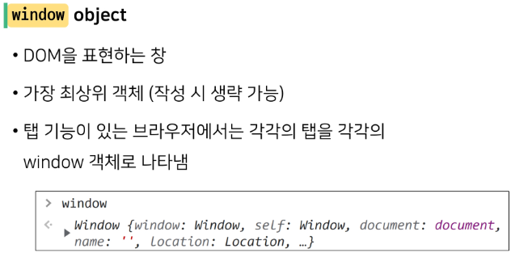

bbbbㅠbbㅠbbㅠb> 개요
- 브라우저에서의 JavaScript
  - JavaScript는 웹 페이지에서 다양한 기능을 구현하는 스크립트 언어
  - 정적인 정보만 보여주던 웹 페이지를 데이터가 주기적으로 갱신되거나, 사용자와 상호 작용을 하거나, 애니메이션 등이 동작하게 하는 것을 가능하게 함
- cf) 스크립트 언어(Script Language)
  - 기존에 존재하는 응용 소프트웨어를 제어하는 컴퓨터 프로그래밍 언어

 

> 웹 페이지에서의 JavaScript
- JavaScript는 프로그래밍 언어로서의 역활도 가능하지만 클라이언트 사이드 JavaScript 언어 위에 올라가있는 기능들은 더 다양함
- API라고 부르는 이 기능들은 JavaScript 코드에서 사용할 수 있는 것들을 더 무궁무진하게 만들어 줌
- 2개의 범주
  1. Brower APIs
  2. Third party APIs
     - 브라우저에 탑재되지 않은 API
     - 웹에서 직접 코드와 정보를 찾아야 함
     - Google map api, kakao login api 등

 

# DOM

> Browser APIs
- 웹 브라우저에 내장된 API로, 웹 브라우저가 현재 컴퓨터 환경에 관한 데이터를 제공하거나, 오디오를 재생하는 등 여러가지 유용하고 복잡한 일을 수행할 수 있게 함
- 종류
  - DOM
  - Geolocation API
  - WebGL 등

 

> 브라우저가 웹 페이지를 불러오는 과정
- 웹 페이지를 브라우저로 불러오면, 브라우저는 코드(HTML, CSS, JavaScript)를 실행환경(브라우저 탭)에서 실행
- JavaScript는 DOM API를 통해 HTML과 CSS를 동적으로 수정, 사용자 인터페이스를 업데이트하는 일에 가장 많이 쓰임

 

> DOM
- "문서 객체 모델 (Document Object Model)"
- 문서의 구조화된 표현을 제공하며 프로그래밍 언어가 DOM 구조에 접근할 수 있는 방법을 제공
  - 문서 구조, 스타일, 내용 등을 쉽게 변경할 수 있게 도움
  - HTML 콘텐츠를 추가, 제거, 변경하고, 동적으로 페이지에 스타일을 추가하는 등 HTML/CSS를 조작할 수 있음
- HTML 문서를 구조화 하여 각 요소를 객체(object)로 취급
- 단순한 속성 접근, 메서드 활용 뿐만 아니라 프로그래밍 언어적 특성을 활용한 조작이 가능함

 

- DOM은 문서를 논리 트리로 표현
- DOM 메서드를 사용하면 프로그래밍적으로 트리에 접근할 수 있고 이를 통해 문서의 구조, 스타일, 컨텐츠를 변경할 수 있음

- 웹 페이지는 일종의 문서(document)
- 이 문서는 웹 브라우저를 통해 그 내용이 해석되어 웹 브라우저 화면에 나타나거나 HTML 코드 자체로 나타나기도 함
- DOM은 동일한 문서를 표현하고, 저장하고, 조작하는 방법을 제공
- DOM은 웹 페이지의 객체 지향 표현
- JavaScript와 같은 스크립트 언어를 이용해서 DOM을 수정할 수 있음

## DOM 기본 구조
> DOM Tree
- DOM은 문서를 논리 트리로 표현
- DOM에서 모든 것은 Node
- 즉, HTML 요소, 속성, 텍스트 모든 것이 노드
- 각 노드는 부모, 자식 관계를 형성하고 이에 따라 상속 개념도 동일하게 적용됨

 

> Node
- DOM의 구성 요소 중 하나
- HTML 문서의 모든 요소를 나타냄

 

> DOM의 주요 객체
- document 단 하나다!

 

## DOM 조작
> 개요
- Document가 제공하는 기능을 사용해 웹 페이지 문서 조작하기
- DOM 조작 순서
  1. 선택 (Select)
  2. 조작 (Manipulation)
     - 생성, 추가, 삭제 등

 

> 선택 관련 메서드
- document.querySelector(selector)
  - 제공한 선택자와 일치하는 첫번째 element 한 개 선택해서 반환
- document.querySelectorAll(selector)
  - 제공한 선택자와 일치하는 여러 element를 선택해서 반환
  - 인자(문자열)로 받음
  - NodeList 반환

 

> NodeList
- DOM 메서드를 사용해 선택한 노드의 목록
- 배열과 유사한 구조
- Index로만 각 항목에 접근 가능
- 배열의 forEach 메서드 및 다양한 배열 메서드 사용 가능
- querySelectorAll()에 의해 반환되는 NodeList는 DOM의 변경사항을 실시간으로 반영하지 않음

 

> 조작 관련 메서드
- 생성
  - document.createElement(tagName)
    - 작성한 tagName의 HTML 요소를 생성하여 반환
- 입력
  - HTTPElement.innerText
    - 사람이 읽을 수 있는 요소만 남김
    - 최종적으로 스타일링이 적용된 모습으로 표현
- 추가
  - Node.appendChild()
    - 한 Node를 특정 부모 Node의 자식 NodeList 중 마지막 자식으로 삽입
    - 한번에 오직 하나의 Node만 추가
    - 추가된 Node 객체를 반환
- 삭제
  - Node.removeChild()
    - DOM에서 자식 Node를 제거
    - 제거된 Node 반환

 

> 속성 조회 및 설정
- Element.getAttribute(attributeName)
  - 해당 요소의 지정된 값(문자열)을 반환
  - 인자(attributeName)는 값을 얻고자 하는 속성의 이름
- Element.setAtrribute(name, value)
  - 지정된 요소의 값을 설정
  - 속성이 이미 존재하면 값을 갱신, 존재하지 않으면 지정된 이름과 값으로 새 속성을 추가

 

> 그 외 다양한 속성 조작 방법
- Element.setAttribute(name, value)
  - 해당 속성이 이미 존재하는 경우 갱신
  - 즉, 새로운 값을 추가 또는 수정이 아닌, 주어진 value로 새롭게 설정
  - 만약 기존 속성을 유지한 채로, 새로운 값을 추가하고자 한다면
- Element.classList, Element.style 등을 통해 직접적으로 해당 요소의 각 속성들을 제어 할 수 있음

 

> id는 하나의 key value만 가져야하며, class는 M:N 관계로 여러 개의 value를 가질 수 있다.
- 그러므로 classList로 넣고(add), 빼는(remove) 것이다.
- classList.value / className

cf) .style
- .style.color
- .style.font
