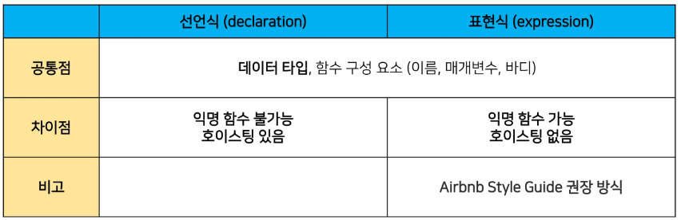

> JavaScript란?
- JavaScript는 클라이언트 측 웹(<span style='color:red'>브라우저</span>)에서 실행
- <span style='color:red'>쉽게 배울 수 있고</span> 강력한 스크립트 언어
- 웹 페이지가 <span style='color:red'>이벤트</span> 발생 시 어떻게 작동하는 지 <span style='color:red'>디자인 / 프로그래밍</span>
- <span style='color:red'>웹 페이지 동작을 제어</span>하는 데 사용


<br>

1. HTML에 변화를 줄 수 있다.
2. CSS에 변화를 줄 수 있다.
3. 백앤드에 변화를 줄 수 있다.

</br>

- HTML 문서의 컨텐츠를 동적으로 변경할 수 있는 언어
- Web이라는 공간에서 다양한 동작을 할 수 있게 된 기반
- 언어의 확장성 덕분에 큰 인기

## JavaScript Engine
> 개요
- JavaScript Engine은 자바스크립트 코드를 실행하는 프로그램 또는 인터프리터
- 대체적으로 웹 브라우저에서 사용

</br>

> 웹 브라우저의 역활
- URL을 통해 Web(WWW)을 탐색함
- HTML/CSS/JavaScript를 이해한 뒤 해석해서 사용자에게 하나의 화면으로 보여줌
- 웹 서비스 이용 시 클라이언트의 역활을 함
- 웹 페이지 코드를 이해하고, 보여주는 역활을 하는 것이 바로 웹 브라우저

</br>

> JavaScipt Engine
- HTML/CSS/JavaScript를 이해한 뒤 해석
  - JavaScript를 해석하는 것이 Engine의 역활
- 각 브라우저마다 자체 JavaScript Engine을 개발, 사용하고 있음
  - V8 - Chrome
  - SpiderMonkey - FireFox

- 대체적으로 웹 브라우저에서 사용
- 웹 브라우저 외에는 어떻게 할용?
  - Node.js : V8 엔진을 사용하여 서버 측에서 자바스크립트 코드를 실행 가능, 브라우저 조작 이외의 역활도 수행

</br>

## JavaScript 실행 환경 구성
> Web Browser로 실행하기
1. HTML 파일에 포함시키기
2. 외부 JavaScript 파일 사용하기
3. Web Browser에서 바로 입력하기
  


</br>

> 정리
- 웹 브라우저는 JavaScript를 해석하는 엔진을 가지고 있음
- 특히 Chrome의 V8의 경우 JavaScript를 번역하는 속도가 매우 빠름
  - 다른 개발에도 활용 가능
  - node.js, react.js, electron 등의 내부 엔진으로 사용됨
  - back-end, mobile, desktop app등을 모두 JavaScript로 개발이 가능해짐

</br>

## Before we start JavaScript
> EcmaScript
- Ecma International(전자 정보 통신 시스템 표준화 기구)이 ECMA-262 규격에 따라 정의하고 있는 표준화된 스크립트 프로그래밍 언어를 뜻함
- <span style='color:red'>JavaScript를 표준화</span>하기 위해 만들어짐
- JavaScript의 기본적인 문법, 데이터 타입, 객체 모델, 함수, 연산자 등을 정의
  - ES6+(2015년 이후) 정의된 내용을 토대로 진행
  
</br>

> 주석 
- 한 줄 주석(//)과 여러 줄(/* */) 주석
```JavaScript
// hello.js

// console.log('화면에 표시되지 않아요.')
```

```JavaScript
/* hello.js

여러 줄 주석 사용법 */
```

</br>

> 들여쓰기와 코드 블럭
- JavaScript는 2칸 들여쓰기 사용
- 블럭(block)은 if, for, 함수에서 <span style='color:red'>중괄호 {}</span>내부를 말함
- 즉, 중괄호 {}를 사용해 코드 블럭을 구분

```JavaScript
if (isClean){ // 중괄호를 사용해서 코드 블럭 구분
  console.log('clean')  // 2칸 들여쓰기 
}
```

</br>

> 코드 스타일 가이드
- 회사마다 코드 스타일 가이드 존재
  - Airbnb JavaScript Style Guide (진행에 쓸 것)
  - Google JavaScript Style Guide
  - JavaScript Standard Style

</br>

> 세미콜론(semicolon)
- 자바스크립트는 세미콜론을 선택적으로 사용 가능
- 세미콜론이 없으면 ASI에 의해 자동으로 세미콜론이 삽입됨
  - ASI(Automatic Semicolon Insertion, 자동 세미콜론 삽입 규칙)
- TC39(ECMAScript 기술 위원회)는 세미콜론 사용을 권장
- JavaScript 개발자는 세미콜론 사용 반대

# JavaScript 기초 문법
## 변수와 식별자
> 식별자 정의와 특징
- 식별자(identifier)는 변수를 구분할 수 있는 변수명을 말함
- 식별자는 반드시 문자, 달러($) 또는 밑줄(_)로 시작
- 대소문자를 구분하며, 클래스명 외에는 모두 소문자로 시작
- 예약어 사용 불가능
  - 예약어 예시: for, if, function 등

</br>

- 카멜 케이스(camelCase)
  - 변수, 객체, 함수에 사용

```JavaScript
// 변수
let dog
let variableName

// 객체
const userInfo = { name:'Tom', age:20 }

// 함수
function add() {}
function getName() {}
```

- 파스칼 케이스(Pascal Case)
  - 클래스, 생성자에 사용

```JavaScript
// 클래스
class User {
  constructor(options){
    this.name = options.name
  }
}
```

- 대문자 스네이크 케이스(SNAKE_CASE)
  - 상수(constants)에 사용
  - 상수: 개발자의 의도와 상관없이 변경될 가능이 없는 값을 의미

```JavaScript
// 값이 바뀌지 않을 상수
const API_KEY = 'my-key'
const PI = Math.PI

// 재할당이 일어나지 않는 변수
const NUMBERS = [1,2,3]
```

</br>

> 변수 선언 키워드
- Python과 다르게 JavaScript는 변수를 선언하는 키워드가 정해져 있음
1. let
   - 블록 스코프 지역 변수를 선언 (추가로 동시에 값을 초기화)
2. const
   - 블록 스코프 읽기 전용 상수를 선언 (추가로 동시에 값을 초기화)
3. var
   - 변수를 선언 (추가로 동시에 값을 초기화)

</br>

> [참고] 선언, 할당, 초기화
- 선언(Declaration)
  - 변수를 생성하는 행위 또는 시점
- 할당(Assignment)
  - 선언된 변수에 값을 저장하는 행위 또는 시점
- 초기화(Initialization)
  - 선언된 변수에 <span style='color:red'>처음으로</span> 값을 저장하는 행위 또는 시점

```JavaScript
let foo // 선언
console.log(foo)  // undefined

foo = 11  // 할당
console.log(foo)  // 11

let bar = 0 // 선언 + 할당
console.log(bar)  // 0
```

</br>

> 변수 선언 키워드 - let
- let
  - 재할당 가능 & 재선언 불가능

```JavaScript
let number = 10 // 1. 선언 및 초기값 할당
number = 20 // 2. 재할당
```

```JavaScript
let number = 10 // 1. 선언 및 초기값 할당
let number = 20 // 2. 재선언 불가능
```
  - <span style='color:red'>블록 스코프</span>를 갖는 지역 변수를 선언, 선언과 동시에 원하는 값으로 초기화 할 수 있음

</br>

> 변수 선언 키워드 - const
- const
  - 재할당 불가능 & 재선언 불가능

```JavaScript
const number = 10 // 1. 선언 및 초기값 할당
number = 20 // 2. 재할당 불가능
```

```JavaScript
const number = 10 // 1. 선언 및 초기값 할당
const number = 20 // 2. 재선언 불가능
```

  - 선언 시 반드시 초기값을 설정 해야 하며, 이후 값 변경이 불가능
  - let과 동일하게 <span style='color:red'>블럭 스코프</span>를 가짐

</br>


</br>

> 변수 선언 키워드 - var
- var
  - 재할당 가능 & 재선언 가능
  - ES6 이전에 변수를 선언할 때 사용되던 키워드
  - <span style='color:red'>"호이스팅"</span>되는 특성으로 인해 예기치 못한 문제 발생 가능
    - 따라서 ES6 이후부터는 var 대신 <span style='color:red'>const와 let을 사용하는 것을 권장</span>
  - 함수 스코프(function scope)를 가짐   
<span style='color:red'>※ 변수 선언 시 var, const, let 키워드 중 하나를 사용하지 않으면 자동으로 var로 선언됨</span>

</br>


</br>

> 호이스팅 (hoisting)
- 변수를 선언 이전에 참조할 수 있는 현상
- var로 선언된 변수는 선언 이전에 참조할 수 있으며,  이러한 현상을 호이스팅이라 함
- 변수 선언 이전의 위치에서 접근 시 undefined를 반환

```JavaScript
console.log(name) // undefined => 선언 이전에 참조

var name = '홍길동' // 선언
```

```JavaScript
// 위 코드를 암묵적으로 아래와 같이 이해함
var name // undefined로 초기화
console.log(name)

var name = '홍길동'
```


- NaN : Not a Number, 이지만 사실상 number로 취급!


- Template Literal : 정말 중요!
- 백틱(`${}`)


- null : 값이 없는 것, 정상적인 상황
- undefined : 값을 안 넣은 것, 비정상적인 상황
- 설계 실수가 아니다.

```JavaScript
const instance = {
  name : 'haha',
  age : 20,
  region : null
}

console.log(instance.name)  // haha
console.log(instance.age) // 20
console.log(instance.region)  // null
console.log(instance.area) // undefined
```


- 진짜 설계 실수 
  - null 
    - 의미론적 : primitive
    - 구현 : object (type of null = object)

- Boolean
  - Python : 대문자
  - JavaScript : 소문자

- Object는 항상 True!

- 동등 연산자 절대 기억도 하지마셈!
- 일치 연산자(===) : 무조건 3개만 쓴다!
- 삼항 연산자 : 생각보다 많이 쓴다. 왜냐하면 코드 가독성 때문

- for ~ in vs. for ~ of
  - for ~ in : 객체를 순회 & property를 출력

  ```JavaScript
  const lst = {'a', 'b', 'c'}

  for (let i in lst){
    console.log(i)
  }

  0
  1
  2
  ```

  - for ~ of : iterable을 순회(object는 객체이므로 iterable이 아니다.)

  ```JavaScript
  const lst = {'a', 'b', 'c'}

  for (let i of lst){
    console.log(i)
  }

  a
  b
  c
  ```

> Optional Chaining

```JavaScript
const a = obj.b?.value ?? 'http404' // ?? : 앞에 것이 null이나 undefined 면 뒤에 것을 가져가
 
const obj = {
  a:1
}

console.log(obj.a) // 1
console.log(obj.b) // undefined
console.log(obj.a.b) // undefined
                     // undefined
console.log(obj.a.value) // obj.a까지 존재
console.log(obj.b.value)  // obj까지 존재
// 터져버림
console.log(obj.b?.value) // ?. 뒤에는 다 무시해버림 
// undefined
```

```JavaScript
let a = 3
console.log(a, 1)

function func(){
  console.log(a, 2)
  a = 5
  console.log(a, 3)
}
func()
console.log(a, 4)

3 1
3 2
5 3
5 4
```

```JavaScript
let a = 3
console.log(a, 1)

function func(){
  // console.log(a, 2)
  let a = 5
  console.log(a, 3)
}
func()
console.log(a, 4)

3 1
5 3
3 4
```

# 함수

> 개요
- 참조 타입 중 하나로써 function 타입에 속함
- JavaScript에서 함수를 정의하는 방법은 주로 2가지로 구분
  - 함수 선언식 (function declaration)
  - 함수 표현식 (function expression)

</br>

> 함수 선언식 (Function declaration)
- 일반적인 프로그래밍 언어의 함수 정의 방식

```JavaScript
function 함수명() {
  // do something
}
```

```JavaScript
function add(num1, num2) {
  return num1 + num2
}

add(2, 7) // 9
```

</br>

> 함수 표현식 
- 표현식 내에서 함수를 정의하는 방식
- 함수 표현식은 함수의 이름을 생략한 익명 함수(function 뒤에 함수명이 없으므로)로 정의 가능
- 표현된 변수에 따라 성질이 변함 (const의 경우 호스팅 불가, var의 경우 호스팅이 가능하나 function 사용 불가 because var의 initial 할당은 undefined)

```JavaScript
변수키워드 함수명 = function () {
  // do something
}
```

```JavaScript
const sub = function (num1, num2) {
  return num1 - num2
}

sub(7, 2) // 5
```

- 표현식에서 함수 이름을 명시하는 것도 가능
- 다만 이 경우 함수 이름은 호출에 사용 되지 못하고 디버깅 용도로 사용
  - 가능한 경우 : 내부에서 call이 되는 재귀함수

```JavaScript
const mySub = function namedSub(num1, num2) {
  return num1 - num2
}

mySub(1, 2) // -1
namedSub(1, 2) // ReferenceError: namedSub is not defined
```

</br>

> 기본 인자 (Default arguments)
- 인자 작성 시 '=' 문자 뒤 기본 인자 선언 가능

```JavaScript
// 'Anonymous' : 아무것도 안 넣은, 빈 값을 넣을 때 사용
const greeting = function (name = 'Anonymous') {
  return `Hi ${name}`
}

greeting() // Hi Anonymous
```

</br>

> 매개변수와 인자의 개수 불일치 허용
- 매개변수보다 인자의 개수가 많을 경우

```JavaScript
const noArgs = function () { // 인자 0개
  return 0
}

noArgs(1, 2, 3) // 0 : 인자를 3개를 넣어도 에러 X

const twoArgs = function (arg1, arg2) {
  return [arg1, arg2]
}

twoArgs(1, 2, 3) // [1, 2] : 에러 X but 2개까지만 출력
```

```JavaScript
// 매개변수보다 인자의 개수가 적을 경우 (매개변수와 인자의 불일치 허용)
const threeArgs = function (arg1, arg2, arg3) {
  return [arg1, arg2, arg3]
}

console.log(threeArgs()) // [ undefined, undefined, undefined ]
console.log(threeArgs(1)) // [ 1, undefined, undefined ]
console.log(threeArgs(2, 3)) // [ 2, 3, undefined ]
```

</br>

> Spread syntax(...)
- "전개 구문"
- 전개 구문을 사용하면 배열이나 문자열과 같이 반복 가능한 객체를 배열의 경우는 요소, 함수의 경우는 인자를 확장할 수 있음
  1. 배열과의 사용
  2. 함수와의 사용 (Rest parameters)

1. 배열과의 사용 (배열 복사)

```JavaScript
let parts = ['어깨', '무릎']
let lyrics = ['머리', ...parts, '발']
console.log(lyrics)
// ['머리', '어깨', '무릎', '발]
```

2. 함수와의 사용 (Rest parameters)
   - 정해지지 않은 수의 매개변수를 배열로 받을 수 있음

```JavaScript
function func(a, b, ...theArgs) {
  //
}
```

```JavaScript
const restOpr = function (arg1, arg2, ...restArgs) {
  return [arg1, arg2, restArgs]
}

restOpr(1, 2, 3, 4, 5) // [1, 2, [3,4, 5]]
restOpr(1, 2) // [1, 2, []] 
```

</br>

## 선언식과 표현식

> 함수의 타입
- 선언식 함수와 표현식 함수 모두 타입은 function으로 동일

```JavaScript
// 함수 표현식
const sum = function (args) {}

// 함수 선언식
function sub(args) {}

console.log(typeof sum) // function
console.log(typeof sub) // function
```

</br>

> 호이스팅 - 선언식
- 함수 선언식으로 정의한 함수는 var로 정의한 변수처럼 호이스팅이 발생
- 즉, 함수 호출 이후에 선언해도 동작함

```JavaScript
sum(2, 7) // 9
function sum (num1, num2) {
  return num1 + num2
}
```

</br>

> 호이스팅 - 표현식
- 반면 함수 표현식으로 선언한 함수는 함수 정의 전에 호출 시 에러 발생
- 함수 표현식으로 정의된 함수는 변수로 평가되어 변수의 scope 규칙을 따름

```JavaScript
sug(7, 2) // Uncaught ReferenceError: Cannot access 'sub' before initialization
function sub (num1, num2) {
  return num1 - num2
}
```

> 선언식과 표현식 정리
- 가장 대표적인 차이는 <span style='color:red'>호이스팅의 유무</span>



## Arrow Function
- "함수를 비교적 간결하게 정의할 수 있는 문법"
- function 키워드와 중괄호를 이용한 구문을 짧게 사용하기 위해 탄생
1. function 키워드 생략 가능
2. 함수의 매개변수가 하나뿐이라면 매개변수 '()' 생략 가능
3. 함수의 내용이 한 줄이라면 '{}'와 'return'도 생략 가능
- ===함수 표현식에서만 사용 가능
- 화살표 함수는 항상 익명 함수

```JavaScript
const arrow1 = function (name) {
  return `hello, ${name}`
}

// 1. function 키워드 삭제
const arrow1 = (name) {
  return `hello, ${name}`
}

// 2. 인자가 1개일 경우에만 () 생략 가능
const arrow1 = name {
  return `hello, ${name}`
}

// 3. 함수 바디가 return을 포함한 표현식 1개일 경우에 {} & return 삭제 가능
const arrow4 = name => `hello, ${name}`
```

```JavaScript
// 1. 인자가 없다면? () or _로 표시 가능
let noArgs = () => `No args`
noArgs = _ => 'No args'

// 2-1. object를 return 한다면
let returnObject = () => { return {key: 'value'} } 
// return을 명시적으로 붙여준다.]

// 2-2. return을 적지 않으려면 괄호를 붙여야 함
returnObject = () => ({ key: 'value' })
```

> this
- Object.Method
- Method로 실행이 될 때, 바로 앞에 있는 Object == this
- 파이썬의 self == JavaScript의 this
  - 파이썬의 Class == JavaScript의 Object
- 함수 method를 call 할 때 발현

```JavaScript
const dog = {
  name : '초코',
  bark(){
    console.log(this.name)

    function bark2(){
      console.log(this.name)
      console.log(this)
    }
    bark2()

  }
}

dog.bark() 
// Method(bark())가 call 됬을 때
// . 앞에 있는 dog = this
// bark2()의 .(생략) 앞에 undefined가 있으면 에러가 나왔겠지
// 즉, 앞에는 global(window)


// 초코
// undefined
// global
```

</br>

> bark2의 this == dog로 하는 방법

1. 변수 할당
```JavaScript
const dog = {
  name : '초코',
  bark(){
    console.log(this.name)
    const _this = this

    function bark2(){
      console.log(_this)
    }
    bark2()
    
  }
}
```

2. bind() 사용
```JavaScript
const dog = {
  name : '초코',
  bark(){
    console.log(this.name)

    function bark2(){
      console.log(_this)
    }
    bark2().bind(this)
    
  }
}
```

3. 화살표 함수
```JavaScript
const dog = {
  name : '초코',
  bark(){
    console.log(this.name)
    // 이거 자체가 함수
    // 선언식으론 사용 불가
    // 같은 라인에서 쓰는 Object를 그대로 가져온다.
    cont bark2 = () => {
      console.log(_this)
    }
    bark2()
  }
}
```

```JavaScript
fucntion getThis() {
  console.log(this)
}

getThis()
// global

const obj1 = {
  name : 'obj1',
  getThis : getThis
}

obj1.getThis()
// obj1

const obj3 = {
  obj4 = {
    name : 'obj4',
    getThis : getThis
  }
}

obj3.obj4.getThis()
// obj4
```

</br>

> this INDEX
1. 전역 문맥에서의 this
2. 함수 문맥에서의 this
   - 단순 호출
   - Method (객체의 메서드로서)
   - Nested

</br>

> 전역 문맥에서의 this
- 브라우저의 전역 객체인 window를 가리킴
  - 전역객체는 모든 객체의 유일한 최상위 객체를 의미

```JavaScript
console.log(this) // window
```

</br>

> 함수 문맥에서의 this
- 함수의 this 키워드는 다른 언어와 조금 다르게 동작
  - this의 값은 함수를 호출한 방법에 의해 결정됨
  - 함수 내부에서 this의 값은 함수를 호출한 방법에 의해 좌우됨

1. 단순 호출
   - 전역 객체를 가리킴
   - 브라우저에서 전역은 window

```JavaScript
const myFunc = function() {
  console.log(this)
}

//브라우저
myFunc() // window
```

</br>

2. Method(Function in Object, 객체의 메서드로서)
   - 메서드로 선언하고 호출한다면, 객체의 메서드이므로 해당 객체가 바인딩

```JavaScript
const myObj = {
  data : 1, 
  myFunc () {
    console.log(this) // myObj
    console.log(this.data) // 1
  }
}

myObj.myFunc() // myObj
```

</br>

3. Nested (Function 키워드)
- forEach의 콜백 함수에서의 this가 메서드의 객체를 가리키지 못하고 전역 객체 window를 가리킴
- 단순 호출 방식으로 사용되었기 때문
- 이를 해결하기 위해 등장한 함수 표현식이 바로 "화살표 함수"

```JavaScript
const myObj = {
  numbers: [1],
  myFunc() {
    console.log(this) // myObj
    this.numbers.forEach(function (num){
      console.log(num) // 1
      console.log(this) // window
    }
    )
  }
}
```

- 이전에 일반 function 키워드와 달리 메서드의 객체를 잘 가리킴
- 화살표 함수에서 this는 자신을 감싼 정적 범위
- 자동으로 한 단계 상위의 scope의 context를 바인딩

```JavaScript
const myObj = {
  numbers: [1],
  myFunc() {
    console.log(this) // myObj
    this.numbers.forEach((num) => {
      console.log(num) // 1
      console.log(this) // myObj
    }
    )
  }
}
```

</br>

> 화살표 함수
- 화살표 함수는 호출의 위치와 상관없이 상위 스코프를 가리킴(Lexical scope this)
- Lexical scope
  - 함수를 어디서 호출하는지가 아니라 <span style='color:red'>어디에 선언</span>하였는지에 따라 결정
  - Static scope라고도 하며 대부분의 프로그래밍 언어에서 따르는 방식
- 따라서 함수 내의 함수 상황에서 화살표 함수를 쓰는 것을 권장

</br>

> Lexical scope

```JavaScript
let x = 1 // global

function first() {
  let x = 10
  second()
}

function second() {
  console.log(x)
}

first() // 1
second() // 1
```

# Array와 Object
> 개요
- JavaScript의 데이터 타입 중 참조 타입(reference)에 해당 하는 타입은 Array와 Object이며, 객체라고도 말함
- 객체는 속성들의 모음(collection)

## 배열 (Array)
- 키와 속성들을 담고 있는 참조 타입의 객체
- 순서를 보장하는 특징
- 주로 대괄호([])를 이용하여 생성
- 0을 포함한 양의 정수 인덱스로 특정 값에 접근
- 배열의 길이는 array.length 형태로 접근 가능
  - 배열의 마지막 원소는 array.length-1로 접근

```JavaScript
const numbers = [1, 2, 3, 4, 5]

console.log(numbers[0]) // 1
console.log(numbers[-1]) // undefined
console.log(numbers.length) // 5

console.log(numbers.[numbers.length - 1]) // 5
```

## 배열 메서드 기초


- array.reverse()
  - 원본 배열 요소들의 순서를 반대로 정렬

```JavaScript
const numbers = [1, 2, 3, 4, 5]

numbers.reverse()
console.log(numbers) // [5, 4, 3, 2, 1]
```

- array.push()
  - 배열의 가장 뒤에 요소 추가
- array.pop()
  - 배열의 마지막 요소 제거

```JavaScript
const numbers = [1, 2, 3, 4, 5]

numbers.push(100)
console.log(numbers) // [1, 2, 3, 4, 5, 100]

console.log(numbers.pop()) // 100
console.log(numbers) // [1, 2, 3, 4, 5]
```

- array.includes(value)
  - 배열에 특정 값(value)이 존재하는지 판별 후 true 또는 false 반환

```JavaScript
const numbers = [1, 2, 3, 4, 5]

console.log(numbers.includes(1)) // true

console.log(numbers.includes(100)) // false
```

- array.indexOf(value)
  - 배열에 특정 값이 존재하는지 확인 후 가장 첫 번째로 찾은 요소의 인덱스 반환
  - 만약 해당 값이 없을 경우 -1 반환

```JavaScript
const numbers = [1, 2, 3, 4, 5]

console.log(numbers.indexOf(3)) // 2

console.log(numbers.indexOf(100)) // -1
```

## 콜백 함수(Callback Function)
- <span style='color:red'>다른 함수의 인자로 전달되는 함수</span>
- Argument(인자)로 function(함수)가 들어간다.

```JavaScript
const numbers = [1, 2, 3]
numbers.forEach(function (num) {
  conssole.log(num ** 2)
})
// 1
// 4
// 9
```

- forEach 메서드에 callBackFunc 함수를 인자로 넘겨 numbers 배열의 각 요소를 callBackFunc 함수의 인자로 사용

```JavaScript
const callBackFunction = function (num) {
  console.log(num ** 2)
}

const numbers = [1, 2, 3]
numbers.forEach(callBackFunction)
// 1
// 4
// 9
```

## 배열 메서드 심화
> Array Helper Methods
- 배열을 순회하며 특정 로직을 수행하는 메서드
- 메서드 호출 시 인자로 callback 함수를 받는 것이 특징


> array.forEach(callback(element[, index[, array]]))

```JavaScript
array.forEach(function (element, index, array){
  // do something
})
```
- 인자로 주어지는 함수(콜백 함수)를 배열의 각 요소에 대해 한 번씩 실행
  - 콜백 함수는 3가지 매개변수로 구성
    1. element: 배열의 요소
    2. index: 배열 요소의 인덱스
    3. array: 배열 자체
  - 반환 값(return) 없음

```JavaScript
// 일단 사용
const colors = ['red', 'blue', 'green']

printFunc = function (color) {
  console.log(color)
}

colors.forEach(printFunc)

// red
// blue
// green
```

```JavaScript
// 함수 정의를 인자로 넣기
color.forEach(function (color) {
  console.log(color)
})
```

```JavaScript
// 화살표 함수 적용
color.forEach((color) => {
  return console.log(color)
})
```

</br>

> array.map(callback(element[, index[, array]]))

```JavaScript
array.map(function (element, index, array){
  // do something
})
```

- 배열의 각 요소에 대해 콜백 함수를 한 번씩 실행
- 콜백 함수의 반환 값을 요소로 하는 새로운 배열 반환
- 기존 배열 전체를 다른 형태로 바꿀 때 유용
  - forEach + return 

```JavaScript
// 일단 사용
const numbers = [1, 2, 3]

// 함수 정의 (표현식)
const doubleFunc = function (number) {
  return number * 2
}

// 함수를 다른 함수의 인자로 넣기(콜백 함수)
const doubleNumbers = numbers.map(doubleFunc)
console.log(doubleNumbers) // [2, 4, 6]
```

```JavaScript
// 함수 정의를 인자로 넣기
const doubleNumbers = numbers.map(function (number){
  return number * 2
})
console.log(doubleNumbers) // [2, 4, 6]
```

```JavaScript
// 화살표 함수 적용
const doubleNumbers = numbers.map((number) => {
  return number * 2
})
console.log(doubleNumbers) // [2, 4, 6]
```

</br>

> array.filter(callback(element[, index[, array]]))

```JavaScript
array.filter(function (element, index, array){
  // do something
})
```

- 배열의 각 요소에 대해 콜백 함수를 한 번씩 실행
- 콜백 함수의 반환 값이 true인 요소들만 모아서 새로운 배열 반환
- 기존 배열의 요소들을 필터링할 때 유용

```JavaScript
const products = [
  { name: 'cucumber', type: 'vegetable'},
  { name: 'banana', type: 'fruit'},
  { name: 'carrot', type: 'vegetable'},
  { name: 'apple', type: 'fruit'},
]

// 함수 정의
const fruitFilter = function (product) {
  return product.type === 'fruit'
}

// 콜백으로 넘기고
const fruits = products.filter(fruitFilter)
console.log(fruits)

// [ { name: 'banana', type: 'fruit'}, { name: 'apple', type: 'fruit'}]
```

```JavaScript
// 함수 정의를 인자
const fruits = products.filter(function (product) {
  return product.type === 'fruit'
})
console.log(fruits)
```

```JavaScript
// 화살표 함수 적용
const fruits = products.filter( (product) => {
  return product.type === 'fruit'
})
console.log(fruits)
```

> array.reduce(callback(acc, element, [index[, array]])[, initialValue])

```JavaScript
array.reduce(function (acc, element, index, array){
  // do something
}, initialValue)
```

- 인자로 주어지는 함수(콜백 함수)를 배열의 각 요소에 대해 한 번씩 실행해서, 하나의 결과 값을 반환
- 배열을 하나의 값으로 계산하는 동작이 필요할 때 사용(총합, 평균 등)
- map, filter 등 여러 배열 메서드 동작을 대부분 대체할 수 있음
- reduce 메서드의 주요 매개변수
  - acc 
    - 이전 callback 함수의 반환 값이 누적되는 변수
    - initialValue(optional)
      - 최초 callback 함수 호출 시 acc에 할당되는 값, default 값은 배열의 첫 번째 값
- reduce의 첫번째 매개변수인 콜백함수의 첫번째 매개변수(acc)는 누적된 값(전 단계까지의 결과)
- reduce의 두번째 매개변수인 initialValue는 누적될 값의 초기값, 지정하지 않을 시 첫번째 요소의 값이 됨

```JavaScript
const test = [90, 90, 80, 77]

// 총합
const sum = tests.reduce(function (total,x) {
  return total + x
}, 0) // 337

// 화살표 함수
const sum = tests.reduce((total, x) => total + x, 0)
console.log(sum) // 337

// 평균
const sum = tests.reduce((total, x) => total + x, 0) / tests.length
console.log(sum) // 84.25
```


</br>

> array.find(callback(element[, index[, array]]))

```JavaScript
array.find(function (element, index, array){
  // do something
})
```

- 배열의 각 요소에 대해 콜백 함수를 한 번씩 실행
- 콜백 함수의 반환 값이 true면, 조건을 만족하는 첫번째 요소를 반환
- 찾는 값이 배열에 없으면 undefined 반환
- 