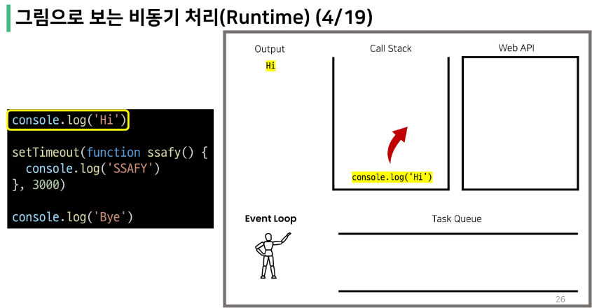
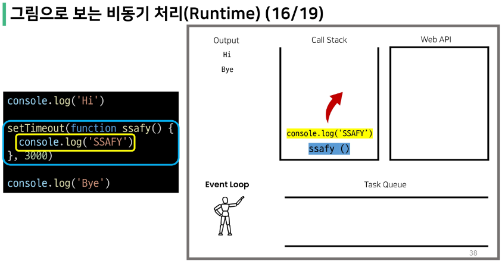

# 동기(Synchronous)
- 모든 일을 <span style='color:red'> 순서대로 하나씩 </span> 처리하는 것
- 순서대로 처리한다 == 이전 작업이 끝나면 다음 작업을 시작한다
- 우리가 작성했던 Python 코드가 모두 동기식
- 요청과 응답을 동기식으로 처리하면
  - 요청을 보내고 응답이 올때까지 기다렸다가 다음 로직을 처리

</br>

> 웹에서의 동기 경험하기
```html
<body>
  <button>버튼</button> 
  <script>
    const btn = document.querySelector('button')
    btn.addEventListener('click', () => {
      // alert가 끝날 때까지 대기
      alert('you clicked me!')
      const pElem = document.createElement('p')
      pElem.innerText = 'p Element'
      document.body.appendChild(pElem)
    })
  </script>
</body>
```


# 비동기(Asynchronous)
- 작업을 시작한 후 <span style='color:red'> 결과를 기다리지 않고 </span>  다음 작업을 처리하는 것 (병렬적 수행)
- 시간이 필요한 작업들은 요청을 보낸 뒤 응답이 빨리 오는 작업부터 처리
- Ex) Gmail에서 메일 전송을 누르면 목록 화면으로 전환되지만, 실제로 메일을 보내는 작업은 병렬적으로 뒤에서 처리됨

```JavaScript
function slowRequest(callBack) {
  console.log('1. 오래 걸리는 작업 시작 ...')
  setTimeout(function () {  
    callBack()
  }, 3000)
}

function myCallBack() {
  console.log('2. 콜백함수 실행됨')
}

slowRequest(myCallBack)
console.log('3. 다른 작업 실행')

// 출력결과
// 1. 오래 걸리는 작업 시작
// 3. 다른 작업 실행
// 2. 콜백함수 실행
```

</br>

> 비동기(Asynchronous)를 사용하는 이유
- <span style='color:red'> 사용자 경험 </span>
  - 예를 들어 아주 큰 데이터를 불러온 뒤 실행되는 앱이 있을 때, 동기로 처리한다면 데이터를 모두 불러온 뒤에야 앱의 실행 로직이 수행
  - 사용자들은 마지 앱이 멈춘 것과 같은 경험을 겪게 됨
  - 즉, 동기식 처리는 특정 로직이 실행되는 동안 다른 로직 실행을 차단하기 때문에 마치 프로그램이 응답하지 않는 듯한 사용자 경험을 만들게 됨
  - <span style='color:red'> 비동기로 처리한다면 먼저 처리되는 부분부터 보여줄 수 있으므로, </span> 사용자 경험 측면에서 긍정적 효과를 볼 수 있다.
  - 많은 웹 기능이 비동기 로직을 사용해서 구현되어 있는 이유
  
</br>

# JavaScript의 비동기 처리
> Single Thread 언어, JavaScript
- 그러면 응답이 먼저 오는 순서대로가 아닌, 아예 여러 작업을 동시에 처리할 순 없나?
  - <span style='color:red'>JavaScript는 한 번에 하나의 일만 수행할 수 있는 Single Thread 언어로, </span> 동시에 여러 작업을 처리할 수 없음.
  - 즉, JavaScript는 하나의 작업을 요청한 순서대로 처리할 수 밖에 없다. 그러면 Single Thread인 JavaScript가 비동기 처리하는 방법은?

- cf) Thread : 작업을 처리할 때 실제로 작업을 수행하는 주체, multi-thread라면 업무를 수행할 수 있는 주체가 여러 개라는 의미

</br>

> JavaScript Runtime
- JavaScript 자체는 Single Thread이므로 비동기 처리를 할 수 있도록 도와주는 환경이 필요
- "런타임(Runtime)": 특정 언어가 동작할 수 있는 환경
- JavaScript에서 <span style='color:red'> 비동기와 관련한 작업은 브라우저 또는 Node 환경에서 처리</span>
- 브라우저 환경에서의 비동기 동작은 크게 아래의 요소들로 구성
  1. JavaScrip Engine의 <span style='color:red'>Call Stack</span>
  2. <span style='color:red'>Web API</span>
  3. <span style='color:red'>Task </span>Queue
  4. <span style='color:red'>Event Loop </span>

</br>

> 비동기 처리 동작 방식
- 브라우저 환경에서의 JavaScript의 비동기는 아래와 같이 처리된다.
1. 모든 작업은 <span style='color:red'> Call Stack </span>(LIFO)으로 들어간 후 처리된다.
2. 오래 걸리는 작업이 Call Stack으로 들어오면 <span style='color:red'> Web API </span>로 보내 별도로 처리하도록 한다.
3. Web API에서 처리가 끝난 작업들은 곧바로 Call Stack으로 들어가지 못하고 <span style='color:red'> Task Queue </span>(FIFO)에 순서대로 들어간다.
4. <span style='color:red'> Event Loop </span>가 Call Stack이 비어 있는 것을 계속 체크하고 Call Stack이 빈다면 Task Queue에서 가장 오래된 (가장 앞에 있는) 작업을 Call Stack으로 보낸다.

</br>

1. Call Stack
   - 요청이 들어올 때 마다 순차적으로 처리하는 Stack(LIFO)
   - 기본적인 JavaScript의 Single Thread 작업 처리
2. Web API
   - JavaScript 엔진이 아닌 브라우저에서 제공하는 runtime 환경
   - 시간이 소요되는 작업을 처리(setTimeout, DOM Event, AJAX 요청 등)
3. Task Queue
   - 비동기 처리된 Callback 함수가 대기하는 Queue(FIFO)
4. Event Loop
   - Call Stack과 Task Queue를 지속적으로 모니터링
   - Call Stack이 비어 있는 지 확인 후 비엉 있다면 Task Queue에서 대기 중인 오래된 작업을 Call Stack으로 Push








```JavaScript
[1, 2, 3, 4].forEach((num) => {
    console.log(num)
    
    setTimeout(()=> {
        console.log(num)
    },(4-num)*1000)
})

<!-- 1
2
3
4
undefined
4
3
2
1 -->
```


</br>

# Axios
- JavaScript의 HTTP 웹 통신을 위한 라이브러리
- 확장 가능한 인터페이스와 쉽게 사용할 수 있는 비동기 통신 기능을 제공
- node 환경은 npm을 이용해서 설치 후 사요할 수 있고, browser 환경은 CDN을 이용해서 사용할 수 있음

## Axios 기본구조

> Axios 사용해보기

```html
<script src="https://cdn.jsdelivr.net/npm/axios/dist/axios.min.js"></script>
<script>
  axios.get('요청할 URL')
  .then(성공하면 수행할 콜백함수)
  .catch(실패하면 수행할 콜백함수)
</script>
```

- get, post 등 여러 method 사용 가능
- then을 이용해서 성공하면 수행할 로직을 작성
- catch를 이용해서 실패하면 수행할 로직을 작성
- finally를 이용해서 무조건 수행

</br>

# Callback과 Promise
- 비동기를 지원하는 try & catch

</br>

> 비동기 처리의 단점
- 비동기 처리의 핵심은 Web API로 들어오는 순서가 아닌, <span style='color:red'> 작업이 완료되는 순서에 따라 처리 </span>
- 단점 : 개발자 입장에서 코드의 실행 순서가 불명확 == 실행 결과를 예상하면서 코드를 작성할 수 없음
  - 콜백 함수 이용

## 콜백 함수(Callback Function)
> 콜백 지옥(Callback Hell)
- 콜백 함수는 연쇄적으로 발생하는 비동기 작업을 순차적으로 동작할 수 있게 함
- 보통 어떤 기능의 실행 결과를 받아서 다른 기능을 수행하기 위해 많이 사용
  - 비슷한 패턴이 계속 발생
  - 코드의 가독성을 해치고
  - 유지 보수가 어려워짐


## 프로미스(Promise)
- Callback Hell 문제를 해결하기 위해 등장한 비동기 처리를 위한 객체
- <span style='color:red'>비동기 작업의 완료 또는 실패를 나타내는 객체</span>
- Promise 기반의 클라이언트가 <span style='color:red'>Axios</span> 라이브러리
- 3가지 상태
  - 동작 진행 중 
  - 동작 완료
    - 성공 : .then()
    - 실패 : .catch()

</br>

> then & catch
- then(callback)
  - 요청한 작업이 성공하면 callback 실행
  - callback은 이전 작업의 성공 결과를 인자로 전달 받음
- catch(callback)
  - then()이 하나라도 실패하면 callback 실행
  - callback은 이전 작업의 실패 객체를 인자로 전달 받음
- then과 catch 모두 항상 promise 객체를 반환
- 즉, 계속해서 chaining 가능
- <span style='color:red'> axios로 처리한 비동기 로직이 항상 promise 객체를 반환 </span> 

```javascript
axios.get('요청할 URL') // Promise 객체 return
  .then(성공하면 수행할 1번 콜백함수)
  .then(1번 콜백함수가 성공하면 수행할 2번 콜백함수)
  .then(2번 콜백함수가 성공하면 수행할 3번 콜백함수)
  ...
  .catch(실패하면 수행할 콜백함수)
```

> 비동기 콜백 vs Promise

```javascript
// 기존의 콜백 함수 작성 방식
work1(function (){
  // 첫번째 작업 ...
  work2(result1, function (result2){
    // 두번째 작업 ...
    work3(result2, function (result3){
      console.log('최종결과 :' + result3)
    })
  })
})
```

```javascript
// promise 방식
work1()
  .then((result1) => {
    // work2
    return result2
  })
  .then((result2) => {
    // work3
    return result3
  })
  .catch((error) => {
    // error handling
  })
```
- Promise 방식은 비동기 처리를 마치 일반적인 위에서 아래로 적는 방식처럼 작성 가능

</br>

> Promise가 보장하는 것(vs 비동기 콜백)
- 비동기 콜백 작성 스타일과 달리 Promise가 보장하는 특징
1. callback 함수는 JavaScript의 Event Loop가 현재 실행 중인 Call Stack을 완료하기 이전에는 절대 호출되지 않음
   - Promise callback 함수는 Event Queue에 배치되는 엄격한 순서로 호출됨
2. 비동기 작업이 성공하거나 실패한 뒤에 .then() 메서드를 이용하여 추가한 경우에도 1번과 똑같이 동작
3. .then()을 여러번 사용하여 여러 개의 callback 함수를 추가할 수 있음 (Chaining)
   - 각각의 callback은 주어진 순서대로 하나하나 실행
   - Chaining은 Promise의 가장 뛰어난 장점