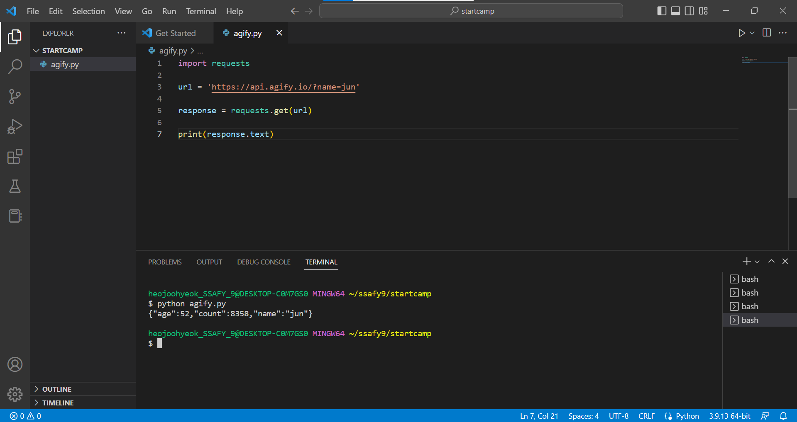
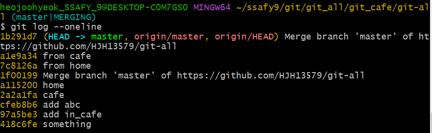
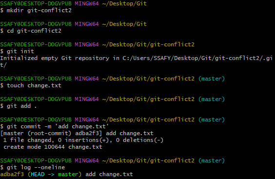

# Git 사용법
## Git startcamp for 기본 세팅
---
1. 시작파일 위치 찾기 및 생성  

Git Bash에서 'start .' 작성하면 


다음과 같이 C드라이브에 있는 'heojoohyeok_SSAFY_9'라는 사용자가 사용하는 모든 정보가 있는, 가장 기본이 되는 위치(홈 디렉토리)로 보내줍니다. 

앞으로 여기에 모든 Python 연습 및 파일 생성을 할 예정입니다. 

여기에 'ssafy9'라는 파일을 만들고, 그 안에 스타트캠프 동안 진행될 연습을 위한 파일 'startcamp'를 만듭시다.


  

</br>

1. 'STARTCAMP'에서 우클릭으로 'Code(으)로 열기'로 Visual Studio Code 을 열어봅시다.


주소 한 번 확인하고, requests 다운 받으러 갑시다.  

</br>

3. Terminal에서 'pip install requests'를 치면


다음과 같이 requests가 다운이 됩니다. 이로인해 저희는 이제 requests를 쓸 수 있게 됩니다.

4. Request Library

이제 라이브러리에게 요청을 해서 정보를 받아봅시다.

https://agify.io/

이름으로 나이를 유추해주는 사이트입니다.


​
여기서 요구하는 url 형식에 맞춰서 정보를 받아오는게 목표입니다.  

이때 저기서 요구하는 주소의 형식을 맞춰 주는 것이 중요합니다!

파일명 : 'agify.py'



<b><span style="color:white; background-color:red; font-size:120%">※ 반드시 저장을 하고 실행을 해야합니다! (파일명 옆에 표시가 ●이면 저장이 안 된 상태인거고, X이면 저장이 된 겁니다.) 저장(Ctrl+s)의 습관화 필수!</span></b>

response. text로 받아서 age, count, name을 모두 받아왔습니다. 그럼 다음엔 이 중 이름만 받아옵시다.

5. Request only Name


response.json()['name']으로 json으로 된 정보 중 name만 받아서 'jun'이라는 결과만 받아왔습니다.

</br>

6. Open API

무료 API를 의미합니다. 대표적으로 카카오, 네이버 등이 있으며, 뭘 만드는데 좋은 roadmap가 될 것 같습니다.

cf) 유료 API들은 로그인을 필수로 하며, 횟수 제한을 위해 API와 함께 key나 token을 발급해 횟수 제한 등을 관리합니다.

</br>

​<span style="color:red; font-size:150%">7. API 사용의 핵심은 API 문서를 읽고 URL을 만든다!</span>

</br>
</br>


## Git이란?
---
※ Git : 분산 버전 관리 프로그램

- 관리 : 어떤 일의 사무, 시설이나 물건의 유지, 개량
- 프로그램 : 컴퓨터에서 실행 될 때 특정 작업을 수행
- 비전 관리 : 컴퓨터 소프트웨어의 특정 상태를 관리하는 업무

---

<가정 1>  
뭐가 최신 버전이야? => 파일에 날짜와 시간을 적어봐!!!  
ex)  
마케팅관리_레포트_완성  
마케팅관리_레포트_최종  
마케팅관리_레포트_진짜최종  
마케팅관리_레포트_진짜_마지막  
마케팅관리_레포트_마지막  

---  
마케팅관리_레포트_230108_0905  
마케팅관리_레포트_230110_1105  
마케팅관리_레포트_230111_1605  
마케팅관리_레포트_230112_1805  

<가정 2>  
레포트가 엄청 사이즈가 클 때 => 변경사항을 기록하는 파일을 만들어봐!!!  
ex) 오타 수정, 레퍼런스 수정  
마케팅관리_레포트_230108_0905  
마케팅관리_변경사항_230108_1030  
마케팅관리_레포트_230110_1105  
마케팅관리_변경사항_230110_1812  
마케팅관리_레포트_230111_1605  
마케팅관리_변경사항_230111_0905  
마케팅관리_레포트_230112_1805  
마케팅관리_변경사항_230111_2145  

---
마케팅관리_변경사항_230108_1030   
마케팅관리_변경사항_230110_1812  
마케팅관리_변경사항_230111_0905  
마케팅관리_변경사항_230111_2145  
마케팅관리_레포트_230112_1805  

1. 코드의 `히스토리`를 관리하는 도구
2. `개발되어온 과정` 파악 가능
3. 이전 버전과의 `변경 사항 비교 및 분석`  

</br>

cf) Github, Gitlab.... : Git 기반의 저장소 서비스를 제공하는 서버

</br>

## GUI & CLI
---
- GUI(Graphic User Interface) : `그래픽`을 통해 사용자와 컴퓨터가 상호 작용하는 방식
- CLI(Command Line Interface) : `명령어`를 통해 사용자와 컴퓨터가 상호 작용하는 방식


Why CLI?
- GUI는 사용하기 쉽지만 단계가 많고 컴퓨터 성능을 더 많이 소모
- 수많은 서버/개발 시스템이 CLI를 통한 조작 환경 제공

경로
- 절대 경로(" "+나의 위치) : 루트 디렉토리부터 목적 지점까지 거치는 모든 경로를 전부 작성한 것
- 상대 경로(나의 위치를 바탕으로) : 현재 작업하고 있는 디렉토리를 기준으로 계산된 상대적 위치를 작성한 것
  
  
## CLI 실습
---

실습 들어가기 전에 명령어 좀 알고 갑시다.

[명령어]
- touch : 생성 명령어, 만드는 명령어  
- start : 여는 명령어
- mkdir : 파일을 만드는 명령어
- ls : 현재 작업 중인 디렉토리의 폴더/파일 목록을 보여주는 명령어  
cf) / : 디렉토리 표시
- cd : change directory, 경로를 바꾸는 명령어
- rm : 파일을 삭제하는 명령어
- -a : all 이라는 표시로, 현 파일과 직접적으로 연결된 파일들을 모두 표시하는 명령어
- -m : message라는 표시로, 보통 메세지를 필수로 요구하는 commit을 위해 쓴다.
- -u : 레포의 브랜치를 항상 추적하도록 설정하는 명령어 (뒤에 실습과 함께 더 자세한 설명)
- -r : 강제하겠다, 오류 상관없이 지우겠다.
- clear : 초기화
- ctrl + l : 위치를 밑으로
- ctrl + c : 타이핑 치고 있는 거 취소


이제 실습을 시작해봅시다.  

먼저 홈 디렉토리를 열어봅시다.

```git bash
start .
```

' .'은 내 현재 위치를 뜻합니다.  

참고로 여기서 '~'은 홈 디렉토리를 뜻합니다.  
  
이제 종류별로 만들어봅시다.

```git bash
touch a.txt 
touch b.py
```

이러면 a라는 이름의 텍스트와 b라는 이름의 파이썬을 만든 겁니다.

이제 만든 것들을 열어봅시다.

```git bash
start a.txt
start b.py
```

텍스트 파일은 제대로 열리는데, 파이썬은 실행만 되고 바로 꺼지지 않나요? 

```git bash
code b.py
```

이렇게 하면 Code로 열리긴 하는데 Code 옆에 보시면 알겠지만 위치가 없어서 코드가 꼬일 가능성이 있습니다. 

차라리

```git bash
code .
```

이렇게 하면 현재 위치의 python을 위치가 포함되게 엽니다.

cf) 사실 terminal로 명령어로 여는 것을 제일 권장합니다.

이제 폴더를 만들어봅시다.

```git bash
mkdir some_folder/
```

이제 만든 것들이 잘 만들어졌는지 확인해봅시다.

ls를 쳐보면 다음과 같이 확인할 수 있습니다.


이제 'some_folder' 안으로 들어가봅시다.

```git bash
cd some_folder/
```

> Tip) Git Bash도 tab로 자동완성이 됩니다!


현재 저희가 위치한 'some_folder'와 연결된 파일들을 확인해봅시다.

```git bash
ls -a
```

이렇게 하면 다음과 같은 결과를 얻을 수 있습니다.


이때, './'은 현재 디렉토리, '../'은 현재 위치의 상위 디렉토리를 의미합니다.

그럼 현재 위치의 상위 디렉토리인 'cli'폴더로 이동해볼까요?

```git bash
cd ..
```


다시 'cli'폴더로 돌아온 것을 볼 수 있습니다.

이제 파일 하나를 지워봅시다.

```git bash
rm a.txt
```

잘 지워졌는지 'ls'를 통해 확인해볼 수 있습니다.


폴더를 지워볼까요?

```git bash
rm some_folder/
```


근데 말을 안 듣습니다. 이게 디렉토리니까 안 지울거라고 개기는게(?) 아니라 'directory인데 진짜 지울꺼야? 정말?'라고 확인하는 느낌에 가깝습니다. 

그럼 우린 단호하게 가면 됩니다.

```git bash
rm -r some_folder/
```

'ls'로 확인해보면 잘 지워진 것을 알 수 있습니다.


</br>

## 마크다운(Markdown)
---
- 마크 업 : 태그를 이용하여 문서의 구조를 나타내는 것
- 마크 다운: 텍스트 기반의 가벼운 마크업 언어, 문서의 구조와 내용을 같이 쉽고 빠르게 적고자 탄생

</br>

> 마크 다운은 Github 문서의 시작과 끝!

Github에서는 Readme.md가 항상 들어가 있는 것을 볼 수 있으며, TIL(Today I Learned)을 자주 볼 수 있습니다. 이게 다 마크 다운이죠.  

티스토리나 벨로그도 마크다운 기반의 블로그입니다(네이버 블로그는 아닙니다!).

</br>

> 마크 다운은 개발 문서의 시작과 끝!
- 대부분의 웹 에디터에서 지원
- Jupyter Notebook, Notion 등

</br>

> Markdown 실습

- markdown 만들기

'startcamp'파일 안에 'markdown'파일을 만들어봅시다.

```git bash
cd startcamp/
mkdir markdown/
cd markdown/
code . 
```

Code의 Extensions 중 markdown을 검색하면 여러 개가 뜨는데, 'Markdown All in'을 다운 받으시면 됩니다. 


이제 Terminal에

```
touch pratice.md
```

를 쳐서 연습용 md를 만듭시다.

돋보기를 클릭하면 Preview를 볼 수 있습니다.


이제 마크다운 명령어 및 실습을 보여드려야하는데......사실 지금 이것도 마크다운으로 작성 중이라, 사진으로 보여드리는게 더 나을 것 같네요.


보통은 깔끔한 정리를 위해 markdown 파일 안에 'assets'라는 파일을 만들고 image 등을 저장합니다.

</br>

---
## Git 실습
---

- Repository : 특정 디렉토리를 버전 관리하는 저장소, 즉 Git를 위한 Working Directory를 지정해주는 것이다.

이번에도 실습 들어가기 전에 명령어들 좀 알고 갑시다.

[명령어]
- git init : 깃 레포 만들기
- git add {파일 이름} : staging area에 추가
- git commit -m '{message}' : 커밋(기록) 남기기
- git status : 현 상태/상황 확인
- git log : 커밋 확인
	git log --oneline : 커밋 한 줄로 확인
- git remote add origin (url) : 원격 연결
- git remote -v : 원격 연결된 주소 확인
- git push origin master : 업로드
	git push -u origin.name(name)
- git config --global user.name {name}
- git config --global user.email {email}
- git clone {url} : 깃허브에 있는 깃 새로 가져오기
- git pull origin master : 이미 연결된 상태에서 당겨오기
- git commit --amend
  - 커밋 수정
  - VIM 에디터가 나옴
    - i => isert 모드
    - esc => 모드 나가기
    - :wq => 저장 후 나가기
- .gitignore
  - git에서 관리하지 않는 파일/폴더의 모음
  - gitignore.io 사용


```git bash
cd ssafy9/
mkdir git/
cd git/
mkdir git_basic/
cd git_basic/
git init
```


파일 옆에 `(master)` 표시가 생긴 것으로 Git Repository로 지정된 것을 알 수 있습니다.

'git_basic' 열어보시면 빈 폴더처럼 보이는데, '보기' - '숨긴 항목 표기'를 통해 숨겨있는 폴더를 볼 수 있습니다. 

'ls'를 통해서도 볼 수 있습니다. 


'.git/'이 숨겨진 폴더이며, 파일 앞의 '.'은 숨긴 폴더라는 의미입니다.

```git bash
touch new.txt

start .

git add new.txt

git commit -m 'some message'
```


이렇게 에러가 띄는데, 본인 확인이 필요하다는 겁니다.  

본인 정보를 입력해줍시다.  

```git bash
git config --global user.name heojoohyeok

git config --global user.email hjhssafy9@gmail.com
```

User의 이름과 이메일을 등록해주는 겁니다.

```git bash
git config --global -l
```

이걸로 현재 등록된 User 정보를 확인할 수 있습니다.


```git bash
git commit -m 'some message'
```

'some message라는 이름으로 변경사항이 발견됐습니다.'라고 뜹니다.

'git log'로 변경사항 내용을 확인할 수 있습니다.

```git bash
git log
```


개념적으로 더 확실히 하고 갑시다.

```git bash
touch next.txt

git add next.txt

git commit -m 'add next.txt'
```

실제 폴더에는 .git/가 존재하며,  

변경사항은 commit 안에 있고,  

staging area은 휴지통 역활을 하는 것이며,  

'git add'는 working directory에 있는 것을 staging area로 옮겨 git가 그 파일을 트랙킹할 수 있도록 하는 것이며,  

'git commit'은 staging area에서 commit으로 옮기는 것으로, 의미 있는 변화, 작업이 완료된 상태에 대해 기록하는 것입니다.

더 해봅시다.

```git bash
touch a.txt

touch b.txt

git add a.txt

git commit -m 'add a.txt'
```

a만 깃으로 관리하기 때문에, 'git add'할 때 staging area에 있다가, 'git commit' 이후 commit으로 이동합니다.

중간 중간에 상태를 확인하고 싶으시면 'git status'로 확인하실 수 있습니다.

```git bash
git status
```

이제 github로 올려볼까요?

```git bash
cd ..

mkdir git_status

cd git_status
```

아직 git status은 git으로 관리가 되고 있지 않으니

```git bash
git init

touch new.txt

git status
```

'No commits yet'으로 보아하니, 아직 new.txt은 git 안으로 안 들어왔습니다. 

```git bash
git add .

git status

git commit -m 'add new text'
```

- 'git add .' : 내 위치에 있는 모든 것을 staging area로 옮기겠다, 다수를 이동 시킬 때

- git status : 실제 폴더, working directory, staging area에 위치

- git commit -m 'add new txt' : '-m'은 message로, 뒤에는 설명

> add는 working directory에 있는 변경 사항을 옮기는 거고 (부분 or 전체)

> commit은 staging area에 있는 모든 사항을 옮기는 거다. (선택 X)

</br>

> If staging area에 아무것도 없는데 commit하면?

```git bash
touch next.txt
```

'new.txt'는 실제 폴더, workig directory에,  

'next.txt'는 실제 폴더에 위치해 있는 상태입니다.

```git bash
git commit -m 'a'
```
하면 'nothing added to commit but untracked files present(use "git add" to track)'라고 뜹니다.


'git log'를 통해 'add new.txt'라는 변경 상황을 확인할 수 있습니다.

</br>

> 만약 new.txt를 수정하면?

'start new.txt' 후 텍스트 내용을 수정 후 저장하면

'git status' 시 'modified:   new.txt'라는 빨간 문구를 볼 수 있습니다.  

'new.txt'가 수정되었다는 것이죠.  


'git add .' 후  

'git status' 시 'modified: new.txt'와 'new file: next.txt'라는 초록 문구를 볼 수 있습니다.


이제 untracked file이었던 'next.txt'와 변경된 'new.txt'까지 staging area로 옮겨진 겁니다.  

이제 'git commit'합시다.

```git bash
git commit -m 'update new.txt and add next.txt'
```

2개의 파일 변경과 1개의 추가 사항을 확인되었다는 내용이 뜹니다.  

확인을 위해 'git status'을 해도 'nothing to commit, working tree clean'라고 commit할 것이 없으며, 잘 작동한다고 합니다.

'git log'를 통해 변경 사항들을 확인할 수 있습니다.


> cf) git log --oneline : 변경사항을 한 줄로 보고싶다.

</br>

이제 Github에 올릴 준비를 해봅시다. 

git 주소 복사 후  

```git bash
git remote add origin [우클릭 + Paste] or [shift + insert]
```

이 문장 해석부터 해봅시다.  

remote (원격에다) add (더해 놓을거야) origin(변수, 별명, 다수의 사이트 구분을 위한, 뒤에 올 주소)  

이제 원격으로 연결된 주소가 제대로 입력 됬는지 확인해봅시다.

```git bash
git remote -v
```


```git bash
git push origin master
```

이 문장도 해석 들어갑니다.  

git push(업로드) origin(Github에) master(commit을)  

이 후 팝업창이 뜨면, 기존에 가입해 뒀던 Github로 로그인하시면 계정 연동이 됩니다.  

'git_status'폴더 안에 있던 'new.txt'와 'next.txt'도 Github에 보내진 것을 확인할 수 있습니다.

</br>

> cf) git 주소 수정 시  
> git remote remove origin

</br>

이제 변경사항을 만들고, add하고, commit하고, push까지 해봅시다.

```git bash
touch last_change.txt

git add .

git commit -m 'last_change'

git push origin master
```

Github 확인하시면 'last_change.txt'가 추가된 것을 확인할 수 있습니다.

</br>

이제 Readme.md를 만들어봅시다.  

Github의 Readme.md 생성하기 버튼을 누르면 Local의 순위가 밀려버립니다.  

최대한 현재 작업한 Local의 순위가 수평하게 유지하는 것이 중요합니다.

```git bash
touch README.md

start README.md

git add .

git commit -m 'add readme.md'

git push -u origin master

git push
```

> cf) 빈폴더는 add가 안 된다. 그래서 더미 파일을 만들어서 add 한다.  
> touch .gitkeep

</br>

<b><span style="color:white; background-color:red; font-size:120%"> ※ 주의 </span></b>  
<b><span style="color:white; background-color:red; font-size:120%"> 1. 홈 디렉토리에서 깃을 만들지 마라.  
2. 깃을 중첩해서 사용하지 않는다. (깃 안의 깃을 만들지 않는다.)</span></b>

</br>

---
## Git clone 실습
---

본격적으로 실습 들어가기 전에 명령어 2개 좀 뜯어보고 갑시다.

```git bash
git remote add origin url
```
- 'origin' 이라는 별명에 'url'을 넣어서 원격으로 더할거라는 의미입니다.

```git bash
git push -u origin master
```
- '-u'는 Github의 origin이라는 레포의 master라는 브랜치를 항상 추적하도록 설정
- 한 번 해놓으면 'git push', 'git pull'만 쳐도 전송, 가져오기 가능

</br>

```git bash
mkdir git_clone
cd git_clone
```
<b><span style="color:white; background-color:red; font-size:120%"> ※ 주의 : 이때 clone을 해 올 새로 만든 폴더는 아무것도 없는 깨끗한 상태여야 합니다!!!!</span></b>

</br>

이제 
```git bash
git clone [github url]
```
하면 다음과 같이 받아옵니다.


'ls'하면 Github 레포 이름인 'Git-pract/'이 뜹니다.

'cd Git-pract/'로 'Git-pract' 파일로 가서  
'ls'로 안에 내용물을 보면  
'last_change.txt', 'new.txt', 'next.txt'가 잘 들어와 있는 것을 알 수 있습니다.

'git remote -v' 해보면 자동으로 연결되어 있음을 확인해 볼 수 있습니다.


</br>

</br>

---
## [학교 - Github - 집 순으로 전부 같은 상태인데, 이제 집에서 새로운 파일을 만들어서 Github로 올리면 학교만 다른 상태일 때]
---
집에서 쓰고 있는 파일이 'Git-pract', 학교에서 쓰고 있는 파일이 'git_status'라고 합시다.

지금 있는 'Git-pract' 파일 안에 그대로 'other.txt'를 만들어 push 해봅시다.

```git bash
touch other.txt
git add .
git commit -m 'add other'
git push origin master
```


이제 'git_status'와 'Git_pract'에게 'git log --oneline'으로 한 줄로 뭐가 있는지 봅시다.


'git_status'만 'other.txt'가 없네요. pull로 가져옵시다.

```git bash
git pull origin master
```

그리고 'other.txt'가 잘 들어왔는지 확인해봅시다.

```git bash
ls
git log --oneline
```


잘 들어왔네요.

---
</br>

똑같은 연습 한 번 더 해봅시다. 학습은 반복에서 이루어지니까요.

깃허브에 'git-all' 레포를 만들고,  
'git' 파일 안에 'git_all' 파일을 만들어서,  
안에 'git_home' 파일을 만든 후,  
안에 'something.txt'를 만들고, 깃허브에 올려봅시다.  
또 git_all 안에 git_cafe 파일을 만들고,  
'something.txt'를 가져옵시다

```git bash
mkdir git_home

cd git_home

# git_home

git init

touch something.txt

git remote add origin [git-all url]

git remote -v # 주소 확인용

git add .

git commit -m 'something'

git push -u origin master
```


```git bash
cd ..

mkdir git_cafe

cd git_cafe

# git_cafe

git clone [git-all url]

ls -a 
```


이제 'git_cafe'에서 'in_cafe.txt' 만들어서 github에 push하고 집에서 pull 합시다.

```git bash
touch in_cafe.txt

git add .

git commit -m 'add in_cafe'

git push -u origin master
```

이제 'git_home'에서 'git pull'하면 됩니다.

</br>

---
## commit 고치기 & 변경 시키기
---
혹시라도 우리가 올리지 말아야할 개인정보 같은 것을 실수로 commit 시켜버리거나,  
commit의 message 내용을 잘못 입력했으면 어떻게 할까요?  
  
참고로 commit을 할려면 message(-m 뒤의 ' ')은 필수로 입력해줘야하며,  
로그(log)로 기록으로 남기 때문에 팀 단위로 일하거나 수정사항 등 로그 등으로 확인하는 일이 많아 그냥 넘어갈 일이 아닙니다.


```git bash
touch abc.txt

git add.

git commit -m 'add aaaa'
```
지금처럼 'git commit -m 'add abc''라고 해야할 것을 'git commit -m 'add aaaa'라고 써버렸다고 합시다.  
이 상태 그대로 push 해버리면 충돌이 일어납니다.

일단 'git log --oneline'으로 상태를 살펴봅시다.


......망했습니다.

수정합시다.  

```git bash
git commit --amend
```
VIM 에디터 모드로 진입합니다.


i를 누르면 아래에 '-- INSERT --'가 띄면서 수정이 가능해집니다.

'add aaaa'를 'add abc'로 수정합시다.

commit 메세지 내용도 추가 가능합니다.  

'add abc' 밑에 enter로 간격을 둔 후 'This is content of commit message'라고 메세지 내용 추가해봅시다.

'Esc'로 수정 모드 탈출 후  

':wq'로 저장 후 VIM 에디터 모드를 탈출합시다.  

참고로 ':q'가 탈출, 'w'가 저장 명령어입니다.  

':q!'하면 강제로 탈출할 수 있습니다.


</br>

---
## 무시 기능
---
개인정보가 들어있거나, DB같은 용량이 큰 파일들, key같은 경우는 무시함으로서 실수로라도 어디로 push되지 않게 해야합니다.

</br>

```git bash
# git
mkdir git_ignore

cd git_ignore

git init

touch main.txt

touch secret.txt # 이 텍스트 파일을 무시할 겁니다.

git add main.txt

git status
```


```git bash
git commit -m 'add main'

git status
```


우리가 원하는 건 'secret.txt'가 무시 받는 것인데, 자꾸 컴퓨터는 track하려고 합니다.  

무시하라고 명령합시다.

```git bash
touch .gitignore
```
<b><span style="color:white; background-color:red; font-size:120%"> ※ 주의 : READ.md와 같은 고유명사. 반드시 똑같이 타이핑 할 것!!! </span></b>

</br>

'ls -a'로 '.gitignore'가 생긴 것을 볼 수 있습니다.

'start .gitignore'로 열어봅시다.  

메모장으로 여시면 됩니다.

메모장에 secret.txt를 치고 저장하면,  

'git status'로 확인하면 전과 달리 secret.txt를 track 안 하는 것을 볼 수 있습니다.


> Tip) [itignore.io](https://www.toptal.com/developers/gitignore/)
에서 환경을 설정해주면(Windows, Python, VisualStudioCode 등등), 무시하면 되는 파일들을 명시해줍시다. (*: 모든)

<span style="color:white; background-color:red"> ※ 주의 : ignore은 관리 들어가기(로컬 저장소(git) 안으로 진입) 전에 처리가 가능하지, 한 번 관리가 들어가면 ignore 명령해도 계속 인식이 됩니다. 

</br>

---
## [집, 카페가 둘 다 다른데 푸쉬하면?]
---
'git log --oneline'을 통해 확인해보면, 지금 'git-all' 레포랑 'git_cafe'는 같고, 'git_home'은 'abc.txt'가 더 있습니다.

```git bash
# git_cafe
touch cafe.txt
git add .
git commit -m 'cafe'
git push

# git_home
touch home.txt
git add .
git commit -m 'home'
git push
```


error 밑의 hint를 읽어보면 push하기 전에 'git pull'하라고 합니다.  

시키는데로 'git pull' 해봅시다.  

VIM 에디터 모드가 뜨는데, 그대로 저장(:wq)하고 나갑시다.

이제 'git push'하고, 'git_cafe'에서 'git pull'하면,  

집, 레포, 카페가 모두 같은 상태가 됩니다.

> cf) git log --oneline --graph : 브랜치 작업할 대나 흐름을 볼 때 사용


</br>

---
## [양쪽에 같은 파일이 존재하는데, 내용이 서로 다른 경우(Conflict) 문제 해결 방법]
---
'git_home'와 'git_cafe' git bash에

```git bash
git log --oneline -3
```
3줄만 보자는 의미입니다.  

주소를 확인하기 위해서입니다.


일단 'git_home'의 'home.txt' 텍스트에 'changed in home!!'하고 저장하고 커밋합시다.

```git bash
# git_home
start home.txt

# changed in home!!

git add .

git commit -m 'from home'
```

'git_cafe'의 'home.txt'에도 똑같이 해줍시다.

```git bash
# git_cafe
start home.txt

# changed in cafe!!

git add .

git commit -m 'from cafe'
```


이제 먼저 'git_home'의 git bash에서 'git push'를 합시다.  

문제 없습니다.

이제 다음에 'git_cafe'의 git bash에서 'git push'를 합시다.


에러가 뜹니다.  

시키는데로 'git pull' 해봅시다.


문제 없이 돌아가는 것처럼 보이는데,  

사실 'CONFLICT'가 일어나서 'merging'이 뜬 겁니다.

'git status' 한번 봅시다.


'both modified', 즉 양쪽에서 'home.txt'가 변경되었다는 의미입니다.  

Code에서 해결하기 편하니 Code로 가죠.  

'code .'

Visual Studio Code로 가면 자동으로 'git_cafe' 파일의 'home.txt' 파일이 붉게 물들면서 느낌표 표시가ㅏ 뜹니다.  

클릭해서 들어가면


이렇게 뜹니다. 

위에 선택지 중에 본인이 의도한 것을 고르시고,  

Terminal에서 'git add .'로 합쳐주고 나서 'git status'를 보면 다음과 같이 뜹니다.


이 상태에서 'git commit'을 입력하면 경로를 남기기 위해 VIM이 뜨고, 그대로 저장(:wq)하고 'git push'하면 됩니다.

</br>

---
## [과거로 돌아가기 & 복구하기]
---
- 보통은 skeleton 코드를 얻기 위해 씁니다.
- skeleton 코드를 채워가며 학습하는 거죠.

'git log --oneline'하면 다음과 같이 주소값을 받아올 수 있습니다.  



이 중 가장 밑에 있는 놈으로 갑시다.

```git bash
git reset --hard [주소값]

git status

git log --oneline
```


복구하려면 새로 pull 받아도 되고, 미리 복사해둬도 되고, 'git reflog' 써도 됩니다.  

> cf) reset은 쓰지 맙시다. skeleton 코드 생성 전용이라고 생각하면 됩니다. 팀 프로젝트 때 쓰면 욕 먹습니다. 차라리 revert를 쓰세요.

cf) https://lab.ssafy.com/groups/s09/a01


</br>

# Git branch & merge

## Git branch
- '나뭇가지'
- 여러 갈래로 작업 공간을 나누어 독립적으로 작업할 수 있도록 도와주는 Git 도구


> 장점
1. 브랜치는 독립 공간을 형성하기 때문에 원본(master)에 대해 안전함
2. 하나의 작업은 하나의 브랜치로 나누어 진행되므로 체계적인 개발이 가능함
3. Git은 브랜치 만드는 속도가 굉장히 빠르고, 적은 용량을 소모


이 상태에서 

```git
git branch new
```

하면 'new'라는 이름의 새로운 브랜치에 'a.txt'가 있는 상태를 만드는 것이다.

```git 
git switch new
```

'master' 브랜치에서 'new' 브랜치로 이동하는 명령어

그럼 (master)에서 (new)로 바귑니다.

이 상태로 'new.txt'를 만들고 'add .'와 commit을 하면 별개의 브랜치로 진행이 되는 겁니다. 설사 이름이 같은 'a.txt'로 작업을 하더라도 안의 내용물은 다를 수 있는거죠.


'master' 브랜치로 다시 가서 'master.txt'를 만들고 add와 commit까지 해줍시다.


상태를 보면 다음과 같습니다.


이제 'master'와 'new'를 병합시켜 봅시다.

좀 더 큰 브랜치를 정하고(실습에선 master로)

```git 
git switch master

git merge new
```

merge를 하면 다음과 같이 뜹니다.


- 'i'를 누르면 내용수정 가능
- ':wq'를 입력하면 저장 후 나가기 가능

상태 확인하려면

```git
git log --online
git log --online --all -- graph
```


'master'에 'new'를 병합시켰으니, 이제 'new'는 필요가 없으니, 삭제해야합니다.

```git 
git branch

git branch -d new
```


지금까지 했던 merge가 '3 way merge'였습니다. 


그럼 이제 'fast-forward merge'를 해봅시다. 간단하게 분화된 경로를 그대로 따라가도록 하는 겁니다.


마지막 merge인 'Conflict merge'를 해봅시다.




# Git workflow
> 개요
- Branch와 원격 저장소를 이용해 협업을 하는 두 가지 방법
  1.  원격 저장소 소유권이 있는 경우 : Shared repository model
  2.  원격 저장소 소유권이 없는 경우 : Fork & Pull model

