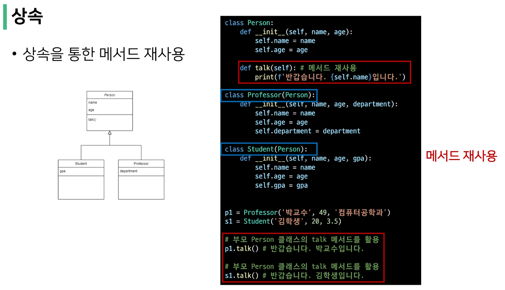

# 객체 지향 프로그래밍(Object_Oriented Programming, OOP)
- 컴퓨터 프로그래밍의 패러다임 중 하나
- 컴퓨터 프로그래밍을 <b><span style="color:red">명령어의 목록으로 보는 시각으로 벗어나 여러개의 독립된 단위</b></span>
- <b><span style="color:skyblue">"객체"</b></span>들의 모임
- 각각의 객체는 <b><span style="color:skyblue">메시지</b></span>를 주고받고,  <b><span style="color:skyblue">데이터</b></span>를 처리

</br>

## 절차 지향 프로그래밍
- 프로그램 전체가 유기적인 흐름으로 연결
- 기능 중심의 프로그램
- 순서가 정해져 있으므로 실행이 빠름


- 하드웨어의 발전으로 소프트웨어도 커지고 복잡한 설계가 요구됨
- 하드웨어의 발전 속도를 소프트웨어의 발전 속도가 따라가지 못함 = 소프트웨어 위치(Software Crisis)
  


- 절차 지향 방법론의 생산성 저하
- '절차' 대신 핵심인 '데이터'를 중심
- 데이터를 중심으로 절차를 도입, 조립하는 방식 = OOP

</br>

## 객체 지향 프로그래밍
- 프로그램을 여러 개의 독립된 객체들과 그 객체 간의 상호작용으로 파악하는 프로그래밍 방법
- 절차 지향 프로그래밍을 포함하는 프로그래밍


```python
class Person: # 사람이라는 객체

  def __init__(self, name, gender): # 기능 1
    self.name = name
    self.gender = gender

  def greeting(self): # 기능 2
    print(f'안녕하세요, {self.name}입니다.')

jimin = Person('지민', '남')
jimin.greeting() # 안녕하세요, 지민입니다.

jieun = Person('아이유', '여')
jieun.greeting() # 안녕하세요, 아이유입니다.
```

</br>

> 객체 지향의 장점
- 객체는 잘 만들어놓으면 계속해서 재사용 가능
- 객체는 그 자체로 데이터와 행동이 정의됨(독립적) == 개발자가 내부 구조를 몰라도 그냥 가져다가 다른 객체와 조립하면서 개발이 가능
- 객체 단위로 모듈화시켜 개발할 수 있으므로 많은 인원이 참여하는 대규모 소프트웨어 개발 가능
- 개발 용이성, 유지 보수 편의성, 신뢰성 바탕
- 생산성 대폭 증가

</br>

> 객체 지향의 단점
- 설계 시 많은 노력과 시간이 필요
  - 다양한 객체들의 상호 작용 구조를 만들기 위해 많은 시간과 노력이 필요
- 실행 속도가 상대적으로 느림
  - 절차 지향 프로그래밍이 컴퓨터 처리구조와 비슷해서 실행 속도가 빠름


</br>

## OOP 기초

> 객체 
- <b><span style="color:red">클래스에서 정의한 것을 토대로 메모리(실제 저장공간)에 할당된 것</b></span>
- 프로그램에서 사용되는 데이터 또는 식별자에 의해 참조되는 공간
- 변수, 자료 구조, 함수 또는 메서드


- <b><span style="color:skyblue">속성</b></span>과 <b><span style="color:skyblue">행동</b></span>으로 구성된 모든 것

- 클래스로 만든 객체 = 인스턴스


- 객체의 특징
  - 타입(type) : 어떤 연산자(operator)와 조작(method)이 가능한가?
  - 속성(attribute) : 어떤 상태(데이터)를 가지는가?
  - 조작법(method) : 어떤 행위(함수)를 할 수 있는가?

</br>

※ 어떤 데이터가 무슨 데이터 타입인지 확인하는 함수 = type()

```python
age = 20
print(type(age))

# <class 'int'>
```

> - 우리가 사용하는 모든 자료형(데이터 타입)은 class로 이루어져 있다!   
> - 'age'는 'int' 클래스의 인스턴스  
> - 'int'라는 class를 이용해서 '20'이라는 인스턴스를 사용하는 것이다!
> - 붕어빵틀 = 'int'라는 클래스
> - 붕어빵 =  '20'

</br>

> 함수와 class의 차이
- 함수 : 기능만 하고 끝
- class : 데이터 & 함수

</br>

> 파이썬은 모든 것이 <b><span style="color:skyblue">객체(object) == 파이썬의 모든 것엔 속성과 행동이 존재</b></span>

</br>

ex) 
- [3, 2, 1].sort() : 리스트.정렬() == 객체.행동()  
- "banana".upper() : 문자열.대문자로() == 객체.행동()
- [1, 2, 3], [1], [], ['hi'] : 모두 리스트 타입(클래스)의 객체
- "", 'hi', '파이썬' : 모두 문자열 타입(클래스)의 객체

</br>

> ※ 하나의 객체(object)는 특정 타입의 인스턴스(instance)이다.

</br>

```python
class Aiden:
  pass

aiden = Aiden()

print(type(aiden))

# <class Aiden>
```

</br>

## OOP 문법

> 기본 문법
- 클래스 정의(== 나만의 type(붕어빵틀) 만들기)
- 인스턴스 생성
- 매서드 호출
- 속성 접근

```python
class MyClass:
  pass

my_instance = Myclass() # 인스턴스 생성, '()'로 'my_instance'라는 인스턴스 생성한다.

my_instance.my_method()  # 메서드 호출

my_instance.my_attribute # 속성 접근
```

</br>

> 클래스 & 인스턴스
- 클래스 : 객체들의 분류 / 설계도 (class)
- 인스턴스 : 하나하나의 실체 / 예 (instance)

```python
class Person
  pass

print(type(Person)) # <class 'type'>, 붕어빵틀을 만드는 틀, 기계

person1 = Person()

print(isinstance(person1, Person)) # True
print(type(person1)) # <class '__main__.Person>
```

</br>

> 객체 비교하기
- ==
  - 동등한(equal)
  - 변수가 참조하는 객체가 동등한(내용이 같은) 경우 True
  - 두 객체가 같아 보이지만 실제로 동일한 대상을 가리키고 있다고 확인해 준 것은 아님(= 주소가 다를 수 있음)
- is
  - 동일한(identical)
  - 두 변수가 동일한 객체를 가리키는 경우(= 주소가 같을 경우) True

```python
a = [1, 2, 3]
b = [1, 2, 3]

print(a == b, a is b) # True False

a = [1, 2, 3]
b = a

print(a == b, a is b) # True True
```

</br>

> 속성
- 특정 데이터(변수) 타입 / 클래스의 객체들이 가지게 될 상태/데이터를 의미
- 클래스 변수 / 인스턴스 변수가 존재

```python
class Person:
  blood_color = 'red' # 클래스 변수
  population = 100 # 클래스 변수

  def __init__(self):
    self.name = name # 인스턴스 변수(self.)

person1 = Person('지민')
print(person1.name) # 지민
```

</br>

> 인스턴스와 클래스 간의 이름 공간(namespace)
- 클래스를 정의하면, 클래스와 해당하는 이름 공간 생성
- 인스턴스를 만들면, 인스턴스 객체가 생성되고 이름 공간 생성
- 인스턴스에서 특정 속성에 접근하면, 인스턴스-클래스 순으로 탐색

```python
# Person 정의
class Person:
  name = 'unknown' # 클래스 변수

  def talk(self):
    print(self.name) # 인스턴스 변수

p1 = Person() # p1에는 name이 없다 
p1.talk() # unknown, self.name으로 갔는데, 인스턴스 안에 'name'이 없어서 클래스로 가서 가져온다.

# p2 인스턴스 변수 설정 전/후
p2 = Person()
p2.talk() # unknown
p2.name = 'Kim' # 인스턴스 변수가 정의됨
p2.talk() # Kim

print(Person.name)
print(p1.name)
print(p2.name) # Kim, Person 클래스의 값이 Kim으로 변경된 것이 아닌, p2 인스턴스의 이름 공간에 name이 Kim으로 된 것.
```

</br>

> 인스턴스 변수
- 인스턴스 변수
  - 인스턴스가 개인적으로 가지고 있는 속성(attribute)
  - 각 인스턴스들의 고유한 변수
- 생성자 메서드(__init__)에서 self.<name>으로정의
- 인스턴스가 생성된 이후 <instance>.<name>으로 접근 및 할당

```python
class Person:
  
  def __init__(self, name): # '__init__' : 고유 명령어, Person이라는 클라스를 생성할 때, 인스턴스 변수 정의
    self.name = name

john = Person('john') # '()' 인스턴스를  생성할 때, 값을 넣어줄테니, name값을 받아서 'self.name'이라는 인스턴스 변수에 할당해줘.
john.name = 'John Kim' # " '' " 변수 재할당, 수정
print(john.name) # John Kim
```

</br>

> 클래스 변수
- 한 클래스의 모든 인스턴스가 공유하는 값을 의미
- 같은 클래스의 인스턴스들은 같은 값을 갖게 됨
- 예) 특정 사이트의 User 수 등은 클래스 변수를 사용해야 함
- 클래스 선언 내부에서 정의
- <classname>.<name>으로 접근 및 할당

</br>

> 클래스 변수 활용
- 클래스 변수를 변경할 때는 항상 클래스.클래스변수 형식으로 변경

```python
# 사용자 수 count
class Person:
  count = 0
  # 인스턴스 변수 설정
  def __init__(self, name):
    self.name = name
    Person.count += 1

person1 = Person('아이유')
person1 = Person('이찬혁')

print(Person.count)
```


```python
class Circle():
  pi = 3.14 # 클래스 변수 정의

  def __init__(self, r):
    self.r = r # 인스턴스 변수

c1 = Circle(5)
c2 = Circle(10)

print(Circle.pi) # 3.14
print(c1.pi) # 3.14
print(c2.pi) # 3.14

Circle.pi = 5 # 클래스 변수 변경
print(Circle.pi) # 5
print(c1.pi) # 5
print(c2.pi) # 5

c2.pi = 5 # 클래스 변수 변경
print(Circle.pi) # 3.14 (클래스 변수)
print(c1.pi) # 3.14 (클래스 변수)
print(c2.pi) # 5 (새로운 인스턴스 변수가 생성됨)
```

</br>

## OOP 메서드

> 메서드
-  특정 데이터 타입/클래스의 객체에 공통적으로 적용 가능한 행위(함수)

```python
class Person:
  
  def talk(self):
    print('안녕')
  
  def eat(self, food):
    print(f'{food}를 냠냠')

person1 = Person()
person1.talk() # 안녕
person1.eat('피자') # 피자를 냠냠
person1.eat('치킨') # 치킨를 냠냠
```

</br>

> 메서드 종류
- 인스턴스 메서드
- 클래스 메서드
- 정적 메서드

</br>

## 인스턴스 메서드
- 인스턴스 변수를 사용하거나, 인스턴스 변수에 값을 설정하는 메서드
- 클래스 내부에 정의되는 메서드의 기본
- 호출 시, 첫번째 인자로 인스턴스 자기자신(self)이 자동으로 전달됨

```python
class Myclass:

  def instance_method(self, arg1, ...):

my_instance = Myclass()
my_instance.instance_method(...)
```

</br>

> self
-  인스턴스 자기자신
-  파이썬에서 인스턴스 메서드는 호출 시 첫번째 인자로 인스턴스 자신이 전달되게 설계
   -  매개변수 이름으로 self를 첫 번째 인자로 정의
   -  파이썬의 암묵적인 규칙(self)

</br>

> 매직 메서드 / 스페셜 메서드
- Double underscore(__)가 있는 메서드는 특수한 동작을 위해 만들어진 메서드
- <b><span style="color:red">특정 상황에 자동으로 불리는 메서드</b></span>
ex) __str__(self), __len__(self), __lt__(self, other), __le__(self, other), __eq__(self, other), __gt__(self, other), __ge__(self, other), __ne__(self, other)
- 객체의 특수 조작 행위를 지정(함수, 연산자 등)
  - __str__ : 이 객체를 문자열로 표현하면 어떻게 표현할지를 지정
    - print 함수 등에서 객체를 출력하면 자동으로 호출되는 메서드
  - __gt__ : 부등호 연산자 (>, greater than)

> 생성자(constructor) 메서드
-  인스턴스 객체가 생성될 때 자동으로 호출되는 메서드
-  인스턴스 변수들의 초기값을 설정
   -  인스턴스 생성
   -  __init___메서드 자동 호출

```python
class Person:

  def __init__(self):
    print('인스턴스가 생성되었습니다.')

person1 = Person() # 인스턴스가 생성되었습니다.
```

```python
class Person:

  def __init__(self, name):
    print('인스턴스가 생성되었습니다.{name}')

person1 = Person('지민') # 인스턴스가 생성되었습니다. 지민
```

```python
class Circle:

  def __init__(self, r):
    self.r = r

  def area(self):
    return 3.14 * self.r * self.r

  def __str__(self):
    return f'[원] radius: {self.r}'

  def __gt__(self, other):
    return self.r > other.r

c1 = Circle(10)
c2 = Circle(1)

print(c1) # [원] radius: 10 
print(c2) # [원] radius: 1
print(c1 > c2) # True
print(c1 < c2) # False
```

</br>

## 클래스 메서드
- 클래스가 사용할 메서드
- @classmethod 데코레이터를 사용하여 정의
- 호출시, 첫번째 인자로 컬래스(cls)가 전달됨

```python
class MyClass:

  @classmethod
  def class_method(cls, arg1, ...):

MyClass.class_method(...)
```

```python
class Person:
  count = 0 # 클래스 변수

  def __init__(self, name): # 인스턴스 변수 설정
    slef.name = name
    Person.count += 1

  @classmethod # 밑에 올 함수는 클래스 변수만으로 사용되는 함수이다! 인스턴스 변수 사용 X
  def number_of_population(cls):
    print(f'인구수는 {cls.count}입니다.')

person1 = Person('아이유')
person2 = Person('이찬혁')

Person.number_of_population()
person1.number_of_population()
person2.number_of_population()
```

> 데코레이터
- 함수를 어떤 함수로 꾸며서 새로운 기능을 부여
- @데코레이터(함수명) 형태로 함수 위에 작성
- 순서대로 적용 되기 때문에 작성 순서가 중요

```python
def ko_hello(name):
  print(f'안녕하세요, {name}님!')

def en_hello(name):
  print(f'안녕하세요, {name}님!')

def add_emoji(name, func):
  func(name)
  print('^~^//')

add_emoji('aiden', ko_hello)
add_emoji('aiden', en_hello)

def emoji_decorator(func):
  def wrapper(name):
    func(name)
    print('^~^//')

  return wrapper # 'wrapper'함수 자체를 리턴

new_func = emoji_decorator(ko_hello)
new_func('aiden')

(emoji_decorator(ko_hello))('aiden')
```

```python
def emoji_decorator(func):
  def wrapper(name):
    func(name)
    print('^~^//')
  
  return wrapper # 'wrapper'함수 자체를 리턴

@emoji_decorator
def ko_hello(name):
  print(f'안녕하세요, {name}님!')

@emoji_decorator
def en_hello(name):
  print(f'안녕하세요, {name}님!')


ko_hello('aiden')
en_hello('aiden')
```

</br>

> 클래스 메서드와 인스턴스 메서드
- 클래스 메서드 -> 클래스 변수 사용, 인스턴스 변수 사용 불가능
- 인스턴스 메서드 -> 인스턴스 변수, 클라스 변수 둘 다 사용 가능

</br>

> 스태틱 메서드
- 인스턴스 변수, 클래스 변수를 전혀 사용하지 않는 메서드
- 속성을 다루지 않고 단지 기능(행동)만을 하는 메서드를 정의할 때 사용
- 일반 함수처럼 작동 but 클래스의 이름 공간에 귀속
  - 주로 해당 클래스로 한정하는 용도
- 근데 왜 메서드 안에? 개념적 위치 : 이 클래스와 연관이 있는 함수라는 의미
- 클래스 : 독립적인 개체, 그 자체로 완벽해야
- @staticmethod 데코레이터 사용하여 정의

```python
class MyClass:

  @staticmethod
  def static_method(arg1, ...)

MyClass.static_method(...)
```

```python
class Person:
  count = 0 # 클래식 변수
  def __init__(self, name): # 인스턴스 변수 설정
    self.name = name
    Person.count += 1

  @staticmethod
  def check_rich(money): # 스태틱은 cls, self 사용 X
    return money > 10000

person1 = Person('아이유')
person2 = Person('이찬혁')
print(Person.check_rich(100000)) # True 스태틱은 클래스로 접근 가능
print(person1.check_rich(100000)) # True 스태틱은 인스턴스로 접근 가능

```

</br>

> 메서드 정리
- 인스턴스 메서드 : 메서드를 호출한 인스턴스를 의미하는 self 매개 변수를 통해 인스턴스를 조작
- 클래스 메서드 : 클래스를 의미하는 cls 매개 변수를 통해 클래스를 조작
- 스태틱 메서드 : 클래스 변수나 인스턴스 변수를 사용하지 않는 경우 사용
  - 객체 상태나 클래스 상태를 수정할 수 없음

```python
class MyClass:

  def method(self):
    return 'instance method', self

  @classmethod
  def classmethod(cls):
    return 'class method', cls
  
  @staticmethod
  def staticmethod():
    return 'static method'

# 인스턴스 메서드를 호출한 결과

obj = MyClass()

print(obj.method()) # ('instance method', <__main__.MyClass at ~>)

print(MyClass.method(obj)) # ('instance method', <__main__.MyClass at ~>)

# 클라스 자체에서 각 메서드를 호출하는 경우
# 인스턴스 메서드는 호출할 수 없음

print(MyClass.classmethod()) # ('class method', __main__.MyClass)

print(MyClass.staticmethod()) # static method

MyClass.method() # method() missing 1 required positional argument: 'self'

# 인스턴스는 클래스와 스태택 메서드 모두 접근할 수 있음

print(obj.classmethod()) # ('class method', <class '__main__.MyClass'>)

print(MyClass.classmethod()) # ('class method', <class '__main__.MyClass'>)

print(obj.staticmethod()) # static method
```

</br>

## Practice

※ 추상화 : 중요한 것을 뽑아서 사용 = 공통점을 통한 분류, 동작

ex) 정육점
-  가격
-  원산지
-  종류

```python
class Pig: (클래스)
  # 가격(변수) -> 클래스 변수(공통적으로 같은 가격일 때) / 다른 가격일 때 인스턴스 변수
  # 종류(변수) -> 가격과 같이 가기 때문에 같은 변수
  # 재고량(변수) -> 창고에서 꺼내서 쓸때 클래스 변수 / 다른 고기 당 다른 재고량일 대 인스턴스 변수

  # 주문이 들어왔을 때의 가격(메서드)

  belly_price = 1000 # 클래스 변수

  def __init__(self):
    self.stock = 100

a_pig = Pig()
b_pig = Pig()

print(a_pig.stock) # 100
print(b_pig.stock) # 100
```

```python
class Pig:
  belly_price = 1000 # 클래스 변수

  def __init__(self, stock):
    self.stock = stock
    

  # 주문이 들어왔을 때의 가격 

  def order_price(self, amount):
    if self.stock > amount:
      return Pig.belly_price * amount # 클래스 안에 있는 변수라고 명시해줘야 한다.
      return self.belly_price * amount # self는 class 안에 있는 모든 정보를 가지고 있다.
    else:
      return "재고가 없어요."
      return f"재고가 {self.stock}만큼 있습니다"
    #   없다고 말해준다.
    # 재고가 있으면 가격을 주고
    # 재고가 없으면 재고가 없다고 말해주고 싶습니다.

  def order(self, amount, money):
    price = self.order_price(amount)

    if price <= money:
      # 돼지의 재고가 줄어듬
      # 거스름돈을 받게 됨
      self.stock = self.stock - amount
      change = money - price
      return change
    else:
      return '못삼'


a_pig = Pig(90)
b_pig = Pig(150)

b_pig.belly_price = 500

print(a_pig.order_price(50))
print(a_pig.order_price(150))

print(a_pig.order(50, 10000000)) # 99500000
print(a.pig.stock) # 40
```

```python
class Pig:
  belly_price = 1000 

  def __init__(self, stock): 
    self.stock = stock
    

  @classmethod
  def func(cls):
    print(cls.belly_price)

a_pig = Pig(90)
b_pig = Pig(150)

print(a_pig.belly_price) # 1000
print(b_pig.belly_price) # 1000

# 클래스 변수는 인스턴스 변수를 가져올 수 없고, 인스턴스 변수는 클래스 변수를 변경할 수 없다.

b_pig.belly_price = 500 # b_pig는 클래스 변수랑 인스턴스 변수 모두 가지고 있다.
# b_pig의 인스턴스 변수가 생기는 거다.

print(a_pig.belly_price) # 1000
print(b_pig.belly_price) # 500
```

```python
# b 돼지의 가격이 20% 할인됨
# b 돼지에서 원래 가격도 접근 가능함
# b 돼지를 50만큼 샀을 때, 원래 가격, 할인된 가격 둘 다 반환.

# @staticmethod
# def func(cls, *args):
#   pass

# 1. 동작 여부
# 2. 재사용이 가능한지, 읽기 쉬운지
# 3. 비효율적이지는 않을지

class Pig:

  def __init__(self, stock, price):
    self.stock = stock
    self.price = price


  def for_sale(self, amount):

    sale_price = self.price * amount * 0.8

    self.stock = self.stock - amount

    return sale_price, self.stock

  @classmethod
  def original_price(self, amount):

    origin_price = self.price * amount
  
    return origin_price


b_pig = Pig(100, 1000)

print(b_pig.for_sale(50))
print(b_pig.original_price(50))
```

</br>

---

## 객체지향의 핵심 4가지
- 추상화 : 핵심이 되는 부분만 추리기
- 상속 : 코드의 재사용성을 높이면서, 기능을 확장
- 다형성 : 각자의 특성에 따라서 다른 결과 만들기
- 캡슐화 : 데이터를 보호

</br>

### 상속
- 두 클래스 사이 부모 - 자식 관계를 정립하는 것
- 클래스는 상속이 가능함
  - 모든 파이썬 클래스는 object를 상속 받음

```python
class ChildClass(ParentClass):
  pass
```

- 하위 클래스는 상위 클래스에 정의된 속성, 행동, 관계 및 제약 조건을 모두 상속 받음
- 부모클래스의 속성, 메서드가 자식 클래스에 상속되어, 코드 재사용성이 높아짐.



</br>

> 상속 관련 함수와 메서드
- isinstance(object, classinfo)
  - classinfo의 instance거나 subclass*인 경우 True

```python
class Person:
  pass

class Professor:
  pass

class Student:
  pass

# 인스턴스 생성
p1 = Professor()
s1 = Student()

print(isinstance(p1, Person)) # False
print(isinstance(s1, Person)) # False
```

```python
class Person:
  pass

class Professor(Person):
  pass

class Student(Person):
  pass

# 인스턴스 생성
p1 = Professor()
s1 = Student()

print(isinstance(p1, Person)) # True
print(isinstance(s1, Person)) # True
```

</br>

- issubclass(class, classinfo)
  - class가 classinfo의 subclass면 True
  - classinfo의 모든 항목을 검사

```python
class Person:
  pass

class Professor(Person):
  pass

class Student(Person):
  pass

# 인스턴스 생성
p1 = Professor()
s1 = Student()

print(issubclass(bool, int)) # True
print(issubclass(float, int)) # False
print(issubclass(Professor, Person)) # True
print(issubclass(Professor, (Person, Student))) # True
```

</br>

> super()
- 자식클래스에서 부모클래스를 사용하고 싶은 경우

```python
class Person:
  def __init__(self, name, age, number, email):
    self.name = name
    self.age = age
    self.number = number
    self.email = email

class Student(Person):
  def __init__(self, name, age, number, email, student_id):
    # Person 클래스
    super().__init__(name, age, number, email)
    self.student_id = student_id
```

</br>

> 상속 정리
- 파이썬의 모든 클래스는 object로부터 상속됨
- 부모 클래스의 모든 요소(속성, 메서드)가 상속됨
- super()를 통해 부모 클래스의 요소를 호출할 수 있음
- 메서드 오버라이딩을 통해 자식 클래스에서 재정의 가능함
- 상속관계에서의 이름 공간은 인스턴스, 자식 클래스, 부모 클래스 순으로 탐색

</br>

> 다중 상속
- 두 개 이상의 클래스를 상속 받는 경우
- 상속 받은 모든 클래스의 요소를 활용 가능함
-  <b><span style="color:yellow">중복된 속성이나 메서드가 있는 경우 상속 순서에 의해 결정됨</b></span>

```python
class Person:
  def __init__(self, name):
    self.name = name
  
  def greeting(self):
    return f'안녕, {self.name}'

class Mom(Person):
  gene = 'XX'

  def swim(self):
    return '엄마가 수영'

class Dad(Person):
  gene = 'XY'

  def walk(self):
    return '아빠가 걷기'

class FirstChild(Dad, Mom):
  def swim(self):
    return '첫째가 수영'
  
  def cry(self):
    return '첫째가 응애'

baby1 = FirstChild('아가') # FirstChild에 '아가'라는 str 넣기, str을 받는 생성자 코드는 Person에 존재, 생성자 코드가 Person 클래스에서 받아옴
print(baby1.cry()) # 첫째가 응애, 상위클래스(Mom, Dad)에 cry 식별자가 없으니 그대로 FirstChild의 cry
print(baby1.swim()) # 첫째가 수영, swim 식별자는 Mom, FirstChild에 존재, 상속 순서(내 인스턴스 먼저), FirstChild의 swim 
print(baby1.walk()) # 아빠가 걷기, Dad 클래스에서만 walk 식별자가 있으니 Dad의 walk
print(baby1.gene) # XY, FirstChild의 식별자에 gene 존재 X, 상속순서(Dad, Mom), Dad의 gene 먼저
```

</br>

> 상속 관련 함수와 메서드
- mro 메서드 ()
  - 해당 인스턴스의 클래스가 어떤 부모 클래스를 가지는지 확인하는 메서드
  - 기존의 인스턴스 -> 클래스 순으로 이름 공간을 탐색하는 과정에서 상속 관계에 있으면 인스턴스 -> 자식 클래스 -> 부모 클래스로 확장

```python
print(FirstChild.mro())
# [<class '__main__.FirstChild'>, <class '__main__.Dad'>, <class '__main__.Mom'>, <class '__main__.Person'>, <class 'object'>]
```

</br>

### 다형성
- 동일한 메시지에 대해 다른 방식으로 응답할 수 있음

> 메서드 오버라이딩
- 상속받은 메서드를 재정의
  - 클래스 상속 시, 부모 클래스에서 정의한 메서드를 자식 클래스에서 변경
  - 부모 클래스의 메서드 이름과 기본 기능은 그대로 사용 but 특정 기능을 바꾸고 싶을 때 사용
  - 상속받은 클래스에서 같은 이름의 메서드로 덮어씀
  - 부모 클래스의 메서드를 실행시키고 싶은 경우 super를 활용

```python
class Person:
  def __init__(self, name):
    self.name  = name

  def talk(self):
    print(f'반갑습니다. {self.name}입니다.')

# 자식 클래스 - Professor
class Professor(Person):
  def talk(self):
    print(f'{self.name}일세.') # 상속받은 클래스에서 같은 이름의 메서도로 덮어씀

# 자식 클래스 - Student
class Student(Person):
  def talk(self):
    super().talk()
    print(f'저는 학생입니다.') # super로 부모 클래스의 메서드 실행

p1 = Professor('김교수')
p1.talk() # 김교수일세.

s1 = Student('이학생')
s1.talk()

# 반갑습니다. 이학생입니다.
# 저는 학생입니다.
```

</br>

### 캡슐화
- 객체의 일부 구현 내용에 대해 외부로부터의 직접적인 액세스 차단

</br>

> 접근 제어자 종류
- Public Access Modifier : 모두 가능
- Protected Access Modifier : 상속 관계에서만 가능
- Private Access Modifier : 나만 가능

</br>

> Public Member
- 언더바 없이 시작하는 메서드나 속성
- 어디서나 호출이 가능, 하위 클래스 override 허용
- 일반적으로 작성되는 메서드와 속성의 대다수를 차지

```python
class Person:
  def __init__(self, name, age):
    self.name = name
    self.age = 30

# Person 클래스의 인스턴스인 p1은 이름(name)과 나이(age) 모두 접근 가능합니다.
p1 = Person('김싸피', 30)
print(p1.name) # 김싸피
print(p1.age) # 30
```

</br>
 
> Protected Member (개념적으로만 존재)
- 언더바 1개로 시작하는 메서드나 속성
- 암묵적 규칙에 의해 부모 클래스 내부와 자식 클래스에서만 호출 가능
- 하위 클래스 override 허용
- 강의 다시 듣기

```python
class Person:
  def __init__(self, name, age):
    self.name = name
    self._age = age
  
  # 바로 접근하지 않고 self._age를 리턴해주는 메서드를 만들자! (중간에 검증 logic 등 logic 삽입 가능)
  def age_age(self):
    return self._age

  # self._age를 변경하고 싶을 때
  def set_age(age):
    self._age = age
    return self._age

# 인스턴스를 만들고 get_age 메서드를 활용하여 호출할 수 있습니다.
p1 = Person('김싸피', 30)
print(p1,get_age()) # 30

# _age에 직접 접근하여도 확인이 가능하나, 암묵적 금기
print(p1._age) # 30
print(p1._age) = 25 # 25
```

</br>

> Private Access Modifier
- 언더바 2개로 시작하는 메서드나 속성
- 본 클래스 내부에서만 사용이 가능
- 하위클래스 상속 및 호출 불가능 (오류)
- 외부 호출 불가능 (오류)

```python
class Person:
  def __init__(self, name, age):
    self.name = name
    self.__age = age

  def age_age(self): # Public 메서드이기 때문에 접근 가능
    return self.__age

# 인스턴스를 만들고 get_age 메서드를 활용하여 호출할 수 있습니다.
p1 = Person('김싸피', 30)
print(p1,get_age()) # 30

# __age에 직접 접근이 불가능합니다.
print(p1._age) # AttributeError: 'Person' object has no attribute '__age'
```

</br>

> getter 메서드 & setter 메서드
- 변수에 접근할 수 있는 메서드를 별도로 생성
  - getter 메서드 : 변수의 값을 읽는 메서드
    - @property 데코레이터 사용
  - setter 메서드 : 변수의 값을 설정하는 성격의 메서드
    - @변수.setter 사용

```python
# setter : 할당
# getter : 불러오기
class Person:

  def __init__(self, age):
    self._age = age # 'age'를 setter & getter로 사용한다. '_age' 대신에 'age'라는 변수를 쓰고 싶다.

  @property
  def age(self): # Person에서 '_age'를 'age'에 할당, 반환
    # print(f'~{self.age}~')
    return self._age
  
  @age.setter # 저장
  def age(self, new_age):
    # self._age = new_age (+ 1)
    if new_age <= 19:
      raise ValueError('Too Young For SSAFY')
      return

    self._age = new_age

# 인스턴스를 만들어서 나이에 접근하면 정상적으로 출력
p1 = Person(20)
print(p1.age) # 20

# p1 인스턴스의 나이를 다른 값으로 바꿔도 정상적으로 반영
p1.age = 33
print(p1.age) # 33

# setter 함수에는 "나이가 19살 이하면 안된다는" 조건문이 하나 걸려 있습니다. 
# 따라서 나이를 19살 이하인 값으로 변경하게 되면 오류가 발생한다.
p1.age = 19
print(p1.age) # ValueError: Too Young For SSAFY
```

```python
class Person:

  def __init__(self):
    self._age = 0

  def get_age(self): # getter
    print('getter 호출')
    return self._age
  
  def set_age(self, age): # setter
    print('setter 호출')
    self._age = age

  age = property(get_age, set_age) # Public

  p1 = Person()
  # p1._age = 25 : 이거 안 됨
  # print(p1._age) : 이거도 안 됨

  p1.set_age(25)
  print(p1.get_age()) # 25
  # 근데 조금만 더 편하게 쓰고 싶다면

  p1.age = 25
  print(p1.age)
  # setter 호출
  # getter 호출
  # 25
  # 조금만 더 편하게 쓸려면
```

```python
class Person:

  def __init__(self):
    self._age = 0

  @property # 내부적으로는 getter와
  def age(self): # getter
    print('getter 호출')
    return self._age
  
  @age.setter # setter가 호출됨
  def age(self, age): # setter
    print('setter 호출')
    self._age = age

  p1 = Person()
  p1.age = 25 # 외부적으로는 p1에 'age'라는 public 변수가 있는 것처럼 코딩 가능
  print(p1.age)
  # setter 호출
  # getter 호출
  # 25
```

```Python
class Meat:
  def __init__(self, stock):
        self.stock = stock

  # 주문이 들어왔을 때의 가격 -> 메서드
  def order_price(self, amount):
    if self.stock >= amount:
      return self.belly_price * amount

    else:
      return "재고가 없어요."
      # return f"재고가 {self.stock}만큼 있습니다"
        

  def order(self, amount, money):
        
    price = self.order_price(amount)
    if price <= money:
      self.stock = self.stock - amount
      change = money - price
      return change
    else: 
      return '못삼'

class Pig(Meat):
  price = 1000
class Cow(Meat):
  price = 10000
```

```python
# setter : 할당
# getter : 불러오기
class Person:

  def __init__(self, age):
    self._age = age # 'age'를 setter & getter로 사용한다. '_age' 대신에 'age'라는 변수를 쓰고 싶다.

  @property
  def age(self): # Person에서 '_age'를 'age'에 할당, 반환
    print(f'나이 : {self.age}')
    return self._age
  
  @age.setter # 저장
  def age(self, new_age):
    self._age = new_age + 1

  @property
  def birth_year(self):
    return self.birth_year
  
  @birth_year.setter
  def birth_year(self, new_age):
    pass


p1 = Person()
p1.age = 30
print(p1.age) 

# 나이: 31
# 31
```