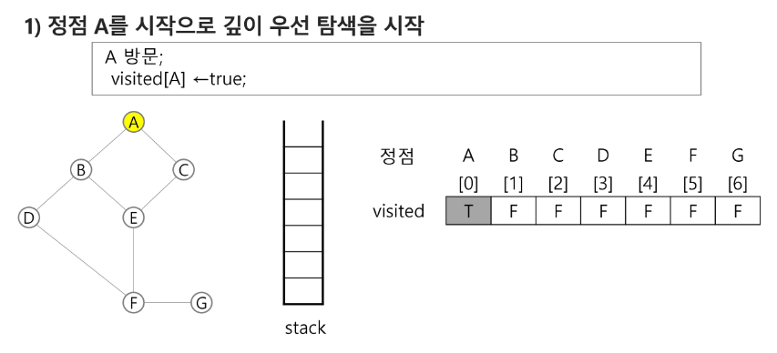
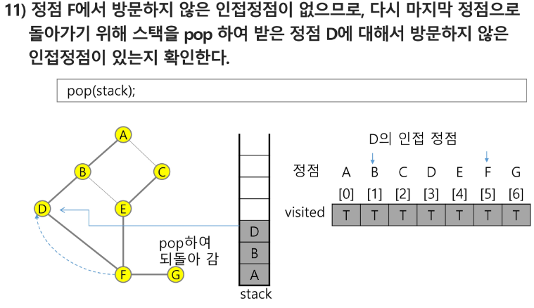
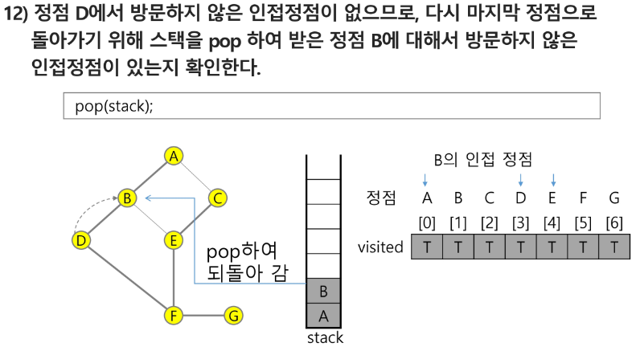

# 스택

> 스택(stack)의 특성
- 물건을 쌓아 올리듯 자료를 쌓아 올린 형태의 자료구조이다.
- 스택에 저장된 자료는 선형 구조를 갖는다.
  - 선형 구조: 자료 간의 관계가 1대1의 관계를 갖는다.
  - 비선형 구조: 자료 간의 관계가 1대N의 관계를 갖는다. (ex. 트리)
- 스택에 자료를 삽입하거나 스택에서 자료를 꺼낼 수 있다.
- 마지막에 삽입한 자료를 가장 먼저 꺼낸다. 
- 후입 선출(LIFO, Last-In-First-Out)
  - 예를 들어 스택에 1,2,3 순으로 자료를 삽입한 후 꺼내면 역순으로 3,2,1 순으로 꺼낼 수 있다.

</br>

> 스택을 프로그램에서 구현하기 위해서 필요한 자료구조와 연산
- 자료구조: 자료를 선형을 저장할 저장소
   -  배열을 사용할 수 있다.
   -  저장소 자체를 스택이라 부르기도 한다.
   -  스택에서 마지막 삽입된 원소의 위치를 top(or 스택 포인터, sp)이라 부른다.
- 연산
  - 삽입: 저장소에 자료를 저장한다. 보통 push라고 부른다.
  - 삭제: 저장소에서 자료를 꺼낸다. 꺼낸 자료는 삽입한 자료의 역순으로 꺼낸다. 보통 pop이라고 부른다.
  - 스택이 공백인지 아닌지를 확인하는 연산. isEmpty
  - 스택의 top에 있는 item(원소)를 반환하는 연산. peek

</br>

> 스택의 삽입/삭제 과정
- 빈 스택에 원소 A, B, C를 차례로 삽입 후 한 번 삭제하는 연산과정


</br>

> 스택의 push 알고리즘
- append 메소드를 통해 리스트의 마지막에 데이터를 삽입

```python
def push(item):
  s.append(item)  # 느림
```

```python
def push(item, size):
  global top
  top += 1
  if top == size:
    print('overflow!')
  else:
    stack[top] = item
  
size = 10
stack = [0] * size
top = -1

push(10, size)
top += 1  # push(20)
stack[top] = 20 
```

</br>

> 스택의 pop 알고리즘

```python
def pop():
  if len(s) == 0:
    # underflow
    return
  else:
    return s.pop()
```

```python
def pop():
  global top
  if top == -1:
    print('underflow')
    return 0
  else:
    top -= 1
    return stack[top+1]

print(pop())
```

```python
# 더 짧은 코드
if top > -1:  #pop()
  top -= 1
  print(stack[top+1])
```

</br>

```python
# 실습

stack = [0] * 3
top = -1

top += 1  # push(10)
stack[top] = 10

top += 1  # push(20)
stack[top] = 20

top += 1  # push(30)
stack[top] = 30

if top > -1:
  top -= 1
  print(stack[top + 1])

if top > -1:
  top -= 1
  print(stack[top + 1])

if top > -1:
  top -= 1
  print(stack[top + 1])

# 30
# 20
# 10
```

</br>

> 스택 구현 고려 사항
- 1차원 배열을 사용하여 구현할 경우 구현이 용이하다는 장점
- 스택의 크기를 변형하기가 어렵다는 단점
- 이를 해결하기 위한 방법으로 저장소를 동적으로 할당하여 스택을 구현하는 방법
- 동적 연결리스트를 이용하여 구현하는 방법을 의미
- 구현이 복잡하다는 단점이 있지만 메모리를 효율적으로 사용한다는 장점
- 스택의 동적 구현은 생략

</br>

# 재귀호출
- 자기 자신을 호출하여 순환 수행되는 것
- 함수에서 실행해야 하는 작업의 특성에 따라 일반적인 호출방식보다 재귀호출방식을 사용하여 함수를 만들면 프로그램의 크기를 줄이고 간단하게 작성


</br>

> 피보나치 수열
- 0, 1로 시작하고 이전의 두 수 합을 다음 항으로 하는 수열
- 피보나치 수열의 i번 째 값을 계산하는 함수 F
  - F(0) = 0, F(1)= 1
  - F(i)= F(i-1) + F(i-2) for i >= 2

```python
# 피보나치 수를 구하는 재귀함수
def fibo(n):
  if n < 2:
    return n
  else:
    return fibo(n - 1) + fibo(n - 2)
```

- 문제점 : "엄청난 중복 호출이 존재"


</br>

# Memoization
- 컴퓨터 프로그램을 실행할 때 이전에 계산한 값을 메모리에 저장해서 매번 다시 계산하지 않도록 하여 전체적인 실행속도를 빠르게 하는 기술
- 동적 계획법의 핵심이 되는 기술


- 피보나치 함수 fibo(n)의 값을 계산하자마자 저장하면, 실행시간을 O(n)으로 줄일 수 있다.

```python
# Memoization 방법을 적용한 피보나치 알고리즘
# memo를 위한 배열을 할당하고, 모두 0으로 초기화 한다.
# memo[0]을 0으로 memo[1]는 1로 초기화 한다.

df fibol(n):
  global memo
  if n >= 2 and memo[n] == 0:
    memo[n] = (fibo1(n - 1) + fibo1(n - 2))
  return memo[n]

memo = [0] * (n + 1)
memo[0] = 0
memo[1] = 1
```

</br>

# DP(Dynamic Programming)
- 동적 계획(Dynamic Programming) 알고리즘은 그리디 알고리즘과 같이 <span style="color:red">최적화 문제</span>를 해결하는 알고리즘
- 동적 계획 알고리즘은 먼저 입력 크기가 작은 부분 문제들을 모두 해결한 후에 그 해들을 이용하여 보다 큰 크기의 부분 문제들을 해결하여, 최종적으로 원래 주어진 입력의 문제를 해결하는 알고리즘

> 피보나치 수 DP 적용
- 피보나치 수는 부분 문제의 답으로부터 본 문제의 답을 얻을 수 있으므로 최적 부분 구조로 이루어져 있다.
1. 문제를 부분 문제로 분할한다.
   - Fibonacci(n) 함수는 Fibonacci(n-1)과 Fibonacci(n-2)의 합
   - Fibonacci(n-1)은 Fibonacci(n-2)와 Fibonacci(n-3)의 합
   - Fibonacci(2)는 Fibonacci(1)과 Fibonacci(0)의 합
   - Fibonacci(n)은 Fibonacci(n-1), Fibonacci(n-2), ... Fibonacci(2), Fibonacci(1), Fibonacci(0)의 부분집합으로 나뉜다.
2. 부분 문제로 나누는 일을 끝냈으면 가장 작은 부분 문제부터 해를 구한다.
3. 그 결과는 테이블에 저장하고, 테이블에 저장된 부분 문제의 해를 이용하여 상위 문제의 해를 구한다.


```python
# 피보나치 수 DP 적용 알고리즘
def fibo2(n):
  f = [0] * (n + 1)
  f[0] = 0
  f[1] = 1
  for i in range(2, n + 1):
    f[i] = f[i - 1] + f[i - 2]

  return f[n]
```

```python
# A의 모든 원소에 접근하여 복사는 B
def f(i, k):
  if i == k:
    print(B)
    return
  else:
    B[i] = A[i]
    f(i + 1, k)

A = [10, 20, 30]
B = [0] * 30
f(0, 3)
# [10, 20, 30]

A = [i for i in range(1000)]
B = [0] * 1000
f(0, 1000)
# Error : 너무 깊게 들어갔다
```

</br>

# DFS(깊이우선탐색)

- 비선형 구조인 그래프 구조는 그래프로 표현된 모든 자료를 빠짐없이 검색하는 것이 중요함
- 두 가지 방법
  - 깊이 우선 탐색(Depth First Search, DFS)
  - 너비 우선 탐색(Breadth First Search, BFS)
- 시작 정점의 한 방향으로 갈 수 있는 경로가 있는 곳까지 깊이 탐색해 가다가 더 이상 갈 곳이 없게 되면, 가장 마지막에 만났던 갈림길 간선이 있는 정점으로 되돌아와서 다른 방향의 정점으로 탐색을 계속 반복하여 결국 모든 정점을 방문하는 순회 방법
- 가장 마지막에 만났던 갈림길의 정점으로 되돌아가서 다시 깊이 우선 탐색을 반복해야 하므로 후입선출 구조의 스택 사용

</br>

> DFS 알고리즘
1. 시작 정점 v를 결정하여 방문한다.
2. 정점 v에 인접한 정점 중에서
  1) 방문하지 않은 정점 w가 있으면, 정점 v를 스택에 push하고 정점 w를 방문한다. 그리고 w를 v로 하여 다시 2.를 반복한다.
  2) 방문하지 않은 정점이 없으면, 탐색의 방향을 바꾸기 위해서 스택을 pop하여 받은 가장 마지막 방문 정점을 v로 하여 다시 2.를 반복한다.
3. 스택이 공백이 될 때까지 2.를 반복

```python
visited[], stack[] 초기화
DFS(v)
  시작점 v 방문;
  visited[v] <- true;
  while {
    if (v의 인접 정점 중 방문 안 한 정점 w가 있으면)
      push(v);
      v <- w; (w에 방문)
      visited[w] <- true;
    else
      if (스택이 비어 있지 않으면)
        v <- pop(stack);
      else
        break
  }
end DFS()
```










```python
# 그래프 저장 필요
'''
7, 8
1 2 1 3 2 4 2 5 4 6 5 6 6 7 3 7
'''
V, E = map(int, input().split())
arr = list(map(int, input().split()))
adjM = [[0]*(V+1) for _ in range(V+1)] # 인접행렬 (저장 방식)
adjL = [[] for _ in range(V+1)] # 인접리스트 (저장 방식)
for _ in range(E):
  v1, v2 = arr[i*2], arr[i*2 + 1]
  adjM[v1][v2] = 1
  adjM[v2][v1] = 1

  adjL[v1].append(v2)
  adjL[v2].append(v1)
```

</br>

## 계산기1
- 문자열로 된 계산식이 주어질 때, 스택을 이용하여 이 계산식의 값을 계산할 수 있다.
- 문자열 수식 계산의 일반적 방법
  - step1. 중위 표기법의 수식을 후위 표기법으로 변경(스택 이용)
  - setp2. 후위 표기법의 수식을 스택을 이용하여 계산

</br>

> ※ 중위 표기법(infix notation) : 연산자를 피연산자의 가운데 표기하는 방법 (ex. A+B)  
> ※ 후위 표기법(postfix notation) : 연산자를 피연산자 뒤에 표기하는 방법 (ex. AB+)

 </br>

 - step1. 중위표기식의 후위표기식 변환 방법1
   - 수식의 각 연산자에 대해서 우선순위에 따라 괄호를 사용하여 다시 표현한다.
   - 각 연산자를 그에 대응하는 오른쪽 괄호의 뒤로 이동시킨다.
   - 괄호를 제거한다.


</br>

   1. 입력 받은 중위 표기식에서 토큰을 읽는다.
   2. 토큰이 피연산자이면 토큰을 출력
   3. 토큰이 연산자(괄호포함)일 때, 이 토큰이 스택의 top에 저장되어 있는 연산자보다 우선순위가 높으면 스택에 push, 그렇지 않다면 스택 top의 연산자의 우선순위가 토큰의 우선순위보다 작을 때까지 스택에서 pop한 후 토큰의 연산자를 push. 만약 top에 연산자가 없으면 push
   4. 토큰이 오른쪽 괄호 ')'이면 스택 top에 왼쪽 괄호 '('가 올 때까지 스택에 pop 연산을 수행하고 pop한 연산자를 출력한다. 왼쪽 괄호를 만나면 pop만 하고 출력하지는 않는다.
   5. 중위 표기식에 더 읽을 것이 없다면 중지, 더 읽을 것이 있다면 1부터 다시 반복
   6. 스택에 남아 있는 연산자를 모두 pop하여 출력
      -  스택 밖의 왼쪽 괄호는 우선 순위가 가장 높으며, 스택 안의 왼쪽 괄호는 우선 순위가 가장 낮다.


</br>

# 백트래킹
- 백트래킹(Backtracking) 기법은 해를 찾는 도중에 '막히면' (즉, 해가 아니면) 되돌아가서 다시 해를 찾아 가는 기법
- 백트래킹 기법은 최적화(optimization) 문제와 결정(decision) 문제를 해결할 수 있다.
- 결정 문제: 문제의 조건을 만족하는 해가 존재하는지의 여부를 'yes' 또는 'no'로 답하는 문제
  - 미로 찾기
  - n-Queen 문제
  - Map coloring
  - 부분 집합의 합(Subset Sum) 문제 등

</br>

> 미로 찾기
- 아래 그림과 같이 입구와 출구가 주어진 미로에서 입구부터 출구까지의 경로를 찾는 묹
- 이동할 수 있는 방향은 4방향으로 제한


```python
# 2개를 감안해서 재귀함수 2번 
def f(i, k, key)
  if i == k:  # 하나의 부분집합 완성
    # print(bit)
    s = 0  
    for j in range(k):
      if bit[j]:
        # print(A[j], end = ' ')
        s += A[j] # 부분집합의 합
    if s == key: # 합이 key와 같은 부분집합을 출력
      for j in range(k):
        if bit[j]:
          print(A[j], end = ' ')
      print()
    # print(bit, s)

  else:
    bit[i] = 1:  # A[i]에서 할일
    f(i+1, k, key)
    bit[i] = 0:
    f(i+1, k, key)

A = [1, 2, 3, 4, 5, 6, 7, 8, 9, 10]
N = len(A)
bit = [0]*N
f(0, N, key)
key = 10
```

```python
# 2개를 감안해서 재귀함수 2번 
def f(i, k, key)
  if i == k:  # 하나의 부분집합 완성
    s = 0  
    for j in range(k):
      if bit[j]:
        s += A[j] # 부분집합의 합
    
    if s == key:
      return 1
    else:
      return 0

  else:
    bit[i] = 1:  # A[i]에서 할일
    if f(i+1, k, key):
      return 1
    bit[i] = 0:
    if f(i+1, k, key):
      return 1
    return 0

A = [1, 2, 3, 4, 5, 6, 7, 8, 9, 10]
N = len(A)
bit = [0]*N
key = 10
f(0, N, key)
```

```python
def f(i, k, s, t):  # i: 원소, k: 집합의 크기, s: i-1까지 고려된 합, t: 목표(찾고자 하는 합)
  global cnt
  if i == k:
    if s == t:
      cnt += 1
      # for j in range(k):  # 부분집합 성분 check용
      #   if bit[j]:
      #     print(A[j], end=' ')
      # print()
    return
  else:
    bit[i] = 1
    f(i+1, k, s+A[i], t)  # A[i] 포함
    bit[i] = 0
    f(i+1, k, s, t) # A[i] 미포함

A = [1, 2, 3, 4, 5, 6, 7, 8, 9, 10]
N = len(A)
bit = [0]*N
key = 10
cnt = 0

f(0, N, 0, key)
print(cnt)  # 합이 key인 부분집합의 수
```

```python
def f(i, k, s, t):
  global cnt
  global fcnt
  fcnt += 1
  if s > t: # 백트래킹: 이미 목표치를 초과할 경우
    return
  elif s == t:  # 마지막 원소까지 가지도 전에 목표치에 도달할 경우
    cnt += 1
    return
  elif i == k:  # 마지막 원소까지 도달 -> 남은 원소를 고려할 필요가 없는 경우가 된다.
    return
  else:
    bit[i] = 1
    f(i+1, k, s+A[i], t)  # A[i] 포함
    bit[i] = 0
    f(i+1, k, s, t) # A[i] 미포함

A = [i for i in range(1, N+1)]

key = 55
cnt = 0
bit = [0]*N

f(0, N, 0, key)
print(fcnt)
```

```python
def f(i, k):
  if i == k:
    print(p)
  else:
    for j in range(i, k): # 오른쪽하고만 교환(왼쪽과 교환하지 않기 위해 i(자기자신)부터 시작)
      p[i], p[j] = p[j], p[i]
      # p[i] 결정, p[i]와 관련된 작업 가능
      f(i+1, k)
      p[i], p[j] = p[j], p[i]

p = [1, 2, 3]
```