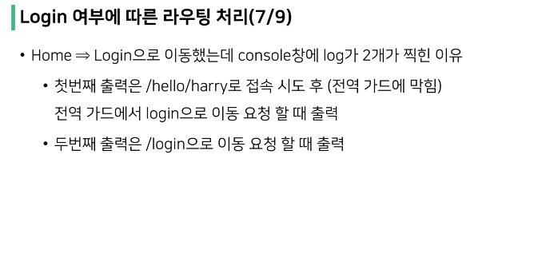
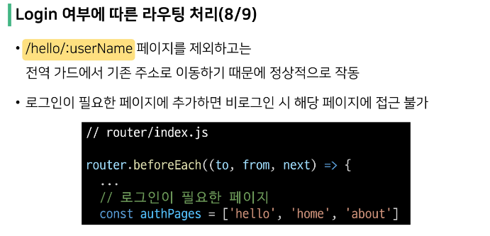

# Navigation Guard
- Vue router를 통해 특정 URL에 접근할 때 다른 url로 redirect를 하거나 해당 URL로의 접근을 막는 방법
  - ex) 사용자의 인증 정보가 없으면 특정 페이지에 접근하지 못하게 함

 

> 네비게이션 가드의 종류
- 전역 가드 : 어플리케이션 전역에서 동작
- 라우터 가드 : 특정 URL에서만 동작
- 컴포넌트 가드 : 라우터 컴포넌트 안에 정의

## 전역 가드

> Global Before Guard
- 다른 url 주소로 이동할 때 항상 실행
- router/index.js에 router.beforeEach()를 사용하여 설정
- 콜백 함수의 값으로 다음과 같이 3개의 인자를 받음
  - to : 이동할 URL 정보가 담긴 Route 객체
  - from : 현재 URL 정보가 담긴 Route 객체
  - next : 지정한 URL로 이동하기 위해 호출하는 함수
    - 콜백 함수 내부에서 반드시 한 번만 호출되어야 함
    - 기본적으로 to에 해당하는 URL로 이동
- URL이 변경되어 화면이 전환되기 전 router.beforeEach()가 호출됨
  - 화면이 전환되지 않고 대기 상태가 됨
- 변경된 URL로 라우팅하기 위해서는 next()를 호풀해줘야 함
  -  next()가 호출되기 전까지 화면이 전환되지 않음 

## 라우터 가드
- 전체 route가 아닌 특정 route에 대해서만 가드를 성정하고 싶을 때 사용
- beforeEnter()
  - 