# Vue

> 사전 준비
- VSCode Vetur extension 설치 : 문법 하이라이팅, 자동완성, 디버깅 기능 제공
- Chrome Vue devtools extension 설치 및 설정 : 크롬 브라우저 개발자 도구에서 vue 디버깅 기능 제공

## Front-end Development

> 개요
- Front-end 개발은 Web App 또는 Web Site의 UI/UX를 제작하고 관리하는 과정
- Front-end 프레임워크와 라이브러리(React, Angular, Vue.js)를 사용하여 개발 효율성을 높이고, Web App의 복잡성을 관리
- Front-end 개발에 사용되는 주요 기술은 HTML, CSS, JavaScript

</br>

> Web App
- 웹 브라우저에서 실행되는 어플리케이션 소프트웨어
- 개발자 도구 > 디바이스 모드
- 웹 페이지가 그대로 보이는 것이 아닌 디바이스에 설치된 App처럼 보이는 것
- 웹 페이지가 디바이스에 맞는 적절한 UX/UI로 표현되는 형태

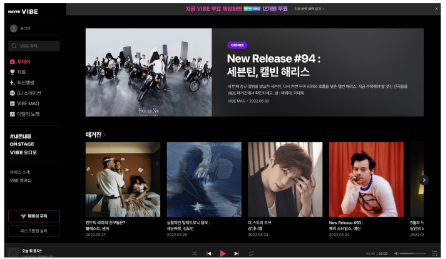

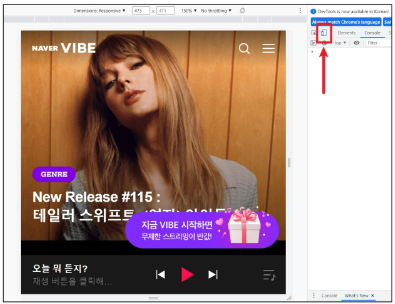

</br>

> SPA (Single Page Application)
- Web App과 함께 자주 등장할 용서 SPA
- 이전까지는 사용자의 요청에 대해 적절한 페이지 별 template을 반환
- SPA는 서버에서 최초 1장의 HTML만 전달받아 모든 요청에 대응하는 방식
  - 어떻게 한 페이지로 모든 요청에 대응 할 수 있을까?
  - CSR(Client Side Rendereing) 방식으로 요청을 처리하기 때문

</br>

> SSR (Server Side Rendering)
- 기존의 요청 처리 방식은 SSR
- Server가 사용자의 요청에 적합한 HTML을 렌더링하여 제공하는 방식
- 전달 받은 새 문서를 보여주기 위해 브라우저는 새로고침을 진행
- 모든 것이 다 동작 X (사용자 눈에 화면은 보임) -> JS가 나중
  - JS를 바디(body)의 가장 마지막에 넣는 이유

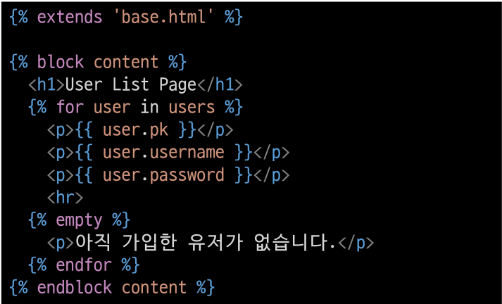

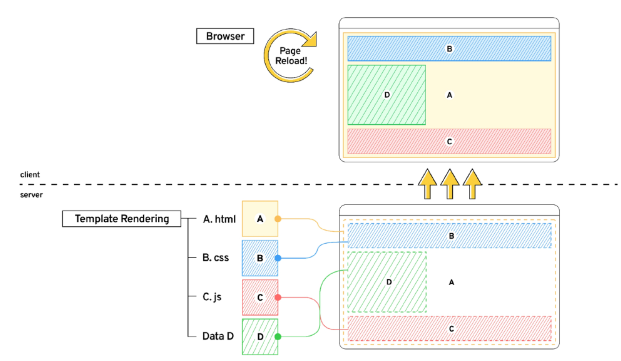

</br>

> CSR (Client Side Rendering)
- 최초 한 장의 HTML을 받아오는 것은 동일
  - 단, server로부터 최초로 받아오는 문서는 빈 html 문서

```html
<body>
  <noscript>
    <strong>We're sorry but ...</strong>
  </noscript>
  <div id="app"></div>
  <!-- built files will be auto injected -->
</body>
```

- 각 요청에 대한 대응을 JavaScript를 사용하여 필요한 부분만 다시 렌더링
1. 필요한 페이지를 서버에 AJAX로 요청
2. 서버는 화면을 그리기 위해 필요한 데이터를 JSON 방식으로 전달
3. JSON 데이터를 JavaScript로 처리, DOM 트리에 반영(렌더링)

```html
<body>
  <script>
    axios.get(
      HOST_URL,
      {
        headers:{
          Authorization: `Token ${key}`
        }
      }
    )
    .then(res => {
      this.todos = res.data
    })
    .catch(err => console.log(err))
  </script>
</body>
```

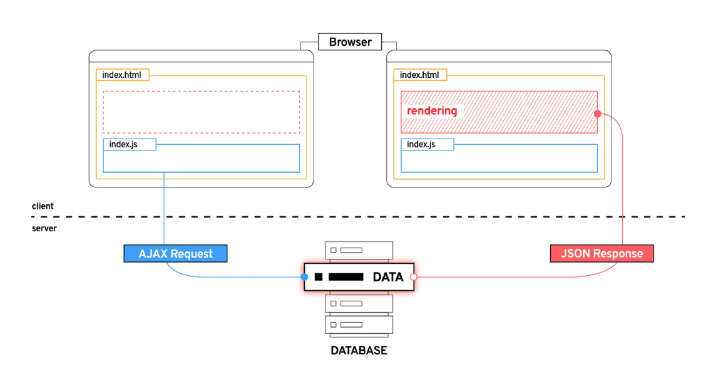

</br>

> CSR 방식의 장점
1. 모든 HTML 페이지를 서버로부터 받아서 표시하지 않아도 됨
  == 클라이언트 - 서버간 통신 즉, 트래픽 감소
  == 트래픽이 감소한다 = 응답 속도가 빨라진다
2. 매번 새 문서를 받아 새로고침하는 것이 아니라 필요한 부분만 고쳐 나가므로 각 요청이 끊김없이 진행
   - SNS에서 추천을 누를 때 마다 첫 페이지로 돌아간다 == Bad App
   - 요청이 자연스럽게 진행이 된다 = UX 향상
3. BE와 FE의 작업 영역을 명확히 분리 할 수 있음
   - 각자 맡은 역활을 명확히 분리한다 = 협업 용이

</br>

> CSR 방식의 단점
1. 첫 구동 시 필요한 데이터가 많으면 많을수록 최초 작동 시작까지 오랜 시간이 소요
2. 모바일에 설치된 Web-App을 실행하게 되면 잠깐의 로딩 시간이 필요
3. 검색 엔진 최적화(SEO, Search Engine Optimization)가 어려움
   - 서버가 제공하는 것은 텅 빈 HTML
   - 내용을 채우는 것은 AJAX 요청으로 얻은 JSON 데이터로 클라이언트(브라우저)가 진행
4. 대체적으로 HTML에 작성된 내용을 기반으로 하는 검색 엔진에 빈 HTML을 공유하는 SPA 서비스가 노출되기는 어려움

</br>

> CSR vs SSR
- CSR
  - 최초 렌더링 빠름 
  - UX(유저 친화적)
  - 서버의 cost가 작음
- SSR
  - 완전한 상호작용
  - seo 최적화 쉬움
  - 유저의 환경에 영향이 적음
- SPA 서비스에서도 SSR을 지원하는 Framework이 발전하고 있음
  - Vue의 Nuxt.js
  - React의 Next.js
  - Angular Universal 등

</br>

> 여러가지 Front-end Framework
- Front-end Framework == HTML + CSS + JS
  - 더 편하게 작업하기 위한 툴
  - React, Angular, Svelte, Vue 등

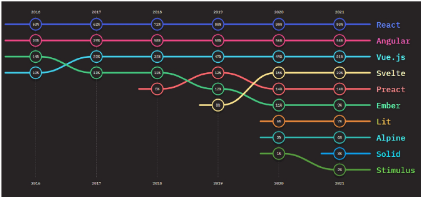

</br>

## Vue
- Easy
- 입문자가 시작하기 좋은 Framework
- 매우 직관적인 구조

```vue
<template>
  <!-- HTML -->
  <div>
    <p>Hello :)</p>
  </div>
</template>

<script>
  // JavaScript
</script>

<style>
  /* CSS */
  p {
    color: black;
  }
</style>
```

</br>

> Vue 없이 코드 작성하기
- 입력 받은 값을 name 뒤에 출력하기

```html
<!DOCTYPE html>
<html lang="en">
  ...
  <body>
    <div id="app">
      <p id="name">name : </p>
      <input id="inputName" type="text">
    </div>

    <script>
      // Code Here
    </script>
      
  </body>
</html>
```

1. input tag 선택
2. P tag 선택
3. addEventListener 추가

```html
<body>
  <div id="app">
    <p id="name">name :</p>
    <input id="inputName" type="text">
  </div>
    
  <script>
    const name = document.querySelector('#name')
    const input = document.querySelector('input')

    input.addEventListener('input', function (event) {
      ...
    })
 </script>    
</body>
```

- 입력 받은 데이터를 p tag에 추가하려면
- 기존에 가지고 있었던 text도 신경 써야한다.
  - data를 관리하기 위한 추가 작업 필요

```html
<body>
  <script>
    input.addEventListener('input', function (event) {
      name.innerText = 'name: ' + event.target.value
    })
 </script>    
</body>
```

</br>

> Vue CDN
- Vue로 작업하기 위해 CDN 필요
- Django == Python Web Framework
  - pip install
- Vue === JS Front-end Framework
  - Bootstrap에서 사용하였던 CDN 방식 제공
  - npm 활용은 추후에 진행 예정

</br>

> Vue로 코드 작성하기
- 입력 받은 값을 name 뒤에 출력하기

```html
<!DOCTYPE html>
<html lang="en">
...
<body>
  <div id="app">
    <p id="name">name : </p>
    <input id="inputName" type="text">
  </div>
  
  <script src="https://cdn.jsdelivr.net/npm/vue@2/dist/vue.js"></script>
  <script>
    // CODE HERE 
  </script>
</body>
</html>
```

1. Vue CDN 가져오기
2. Vue instance 생성
   - Vue instance - 1개의 Object
   - 미리 정해진 속성명을 가진 Object
3. <span style="color:red"> el, data </span> 설정
   - data에 관리할 속성 정의
4. 선언적 렌더링 {{}}
   - Vue data를 화면에 렌더링
5. input tag에 <span style="color:red"> v-model </span> 작성
   - input에 값 입력 -> Vue data 반영
   - Vue data -> DOM 반영

```html
<body>
  <div id="app">
    <p id="name">name : {{ message }}</p>
    <input id="inputName" type="text" v-model="message">
  </div>
  
  <script src="https://cdn.jsdelivr.net/npm/vue/dist/vue.js"></script>
  <script>
    // CODE HERE
    const app = new Vue({
      el: '#app',
      data: {
        message: '',
      },
    })
  </script>
</body>
```

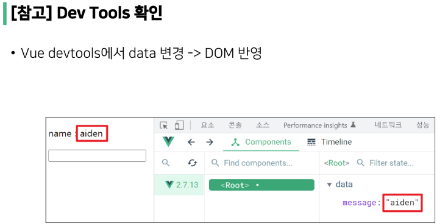

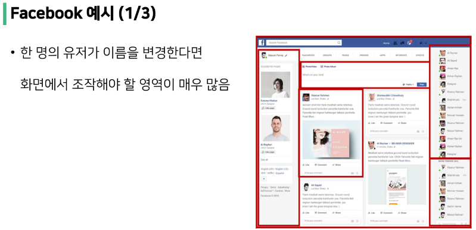

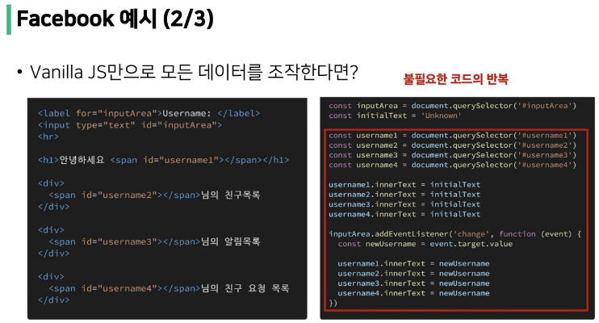

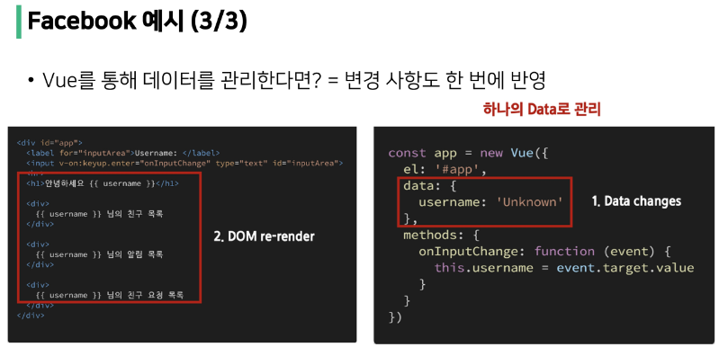

</br>

## Vue2 vs Vue3
> Vue3
- Vue 프레임워크의 기본 버전이 3버전으로 전환
- 대체적인 설정들이 Vue3을 기본으로 적용되어 있음
  - 공식문서, CDN, npm 등

> Vue2
- 여전히 Vue2 많이 사용
- 문법에서의 큰 변화로 인한 Vue2 - Vue3 간의 낮은 호완성
- 사용된 기간이 긴 만큼 상대적으로 많은 문서의 양, 참고자료, 질문/답변

</br>

## Vue instance

> MVVM Pattern
- 소프트웨어 아키텍처 패턴의 일종
- 마크업 언어로 구현하는 그래픽 사용자 인터페이스(view)의 개발을 Back-end(model)로부터 분리시켜 view가 어느 특정한 모델 플랫폼에 종속되지 않도록 함

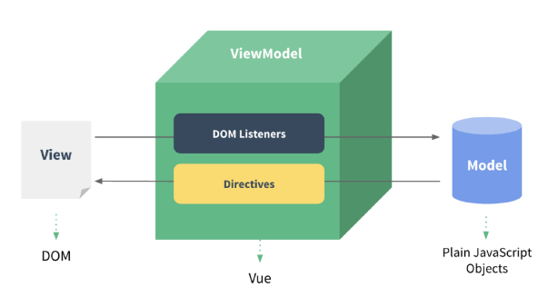

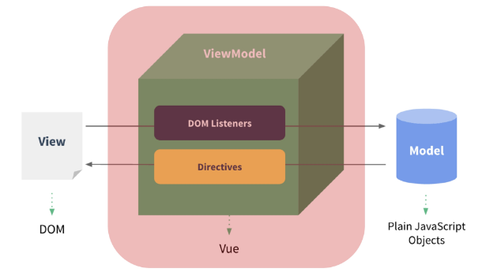

- View - 우리 눈에 보이는 부분 = DOM
- Model - 실제 데이터 = JSON
- View Model(Vue)
  - View를 위한 Model
  - View와 연결(binding)되어 Action을 주고 받음
  - Model이 변경되면 View Model도 변경되고 바인딩된 View도 변경됨
  - View에서 사용자가 데이터를 변경하면 View Model의 데이터가 변경되고 바인딩된 다른 View도 변경됨

</br>

> 정리
- MVC 패턴에서 Controller를 제외하고 View Model을 넣은 패턴
- View는 Model을 모르고, Model도 View를 모른다. == DOM은 Data를 모른다, Data도 DOM을 모른다. (독립성 증가, 적은 의존성)
- View에서 데이터를 변경하면 View Model의 데이터가 변경되고, 연관된 다른 View도 함께 변경된다.

</br>

> Vue instance
1. Vue CDN 가져오기
2. new 연산자를 사용한 생성자 함수 호출
  - vue instance 생성
3. 인스턴스 출력 및 확인

```html
<!DOCTYPE html>
<html lang="en">
<head>
  ...
</head>
<body>
  <!-- Vue CDN -->
  <script src="https://cdn.jsdelivr.net/npm/vue@2/dist/vue.js"></script>
  <script>
    // Code Here
    const vm = new Vue()
    console.log(vm)
  </script>
</body>
</html>
```

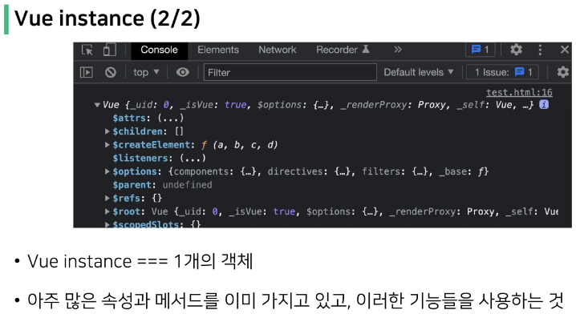

</br>

> el (element)
- Vue instance와 DOM을 mount(연결)하는 옵션
  - View와 Model을 연결하는 역활
  - HTML id 혹은 class와 마운트 가능
- Vue instance와 연결되지 않은 DOM 외부는 Vue의 영향을 받지 않음
  - Vue 속성 및 메서드 사용 불가
- 새로운 Vue instance 생성
- 생성자 함수 첫번째 인자로 <span style="color:red"> Object </span> 작성
- el 옵션에 <span style="color:red"> #app </span> 작성 = DOM 연결
- 인스턴스 출력

```html
<div id="app"></div>
...
<script>
  // const vm = new Vue()
  // console.log(vm)

  const app = new Vue({
    el: '#app'
  })
  console.log(app)
</script>
```

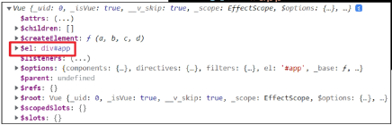

- Vue와 연결되지 않은 div 생성
  - 두 div 모두에 {{ message }} 작성
  - 결과 확인
- message 속성이 정의 되지 않았다는 경고와
- {{ message }}가 그대로 출력되는 차이

```html
<div id="app">
  {{ message }}
</div>
<div>
  {{ message }}
</div>
<script src="https://cdn.jsdelivr.net/npm/vue@2/dist/vue.js"></script>
<script>
  const app = new Vue({
    el: '#app'
  })
  console.log(app)
</script>
```

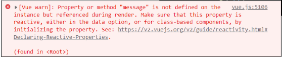

</br>


> data 
- Vue instance의 <span style="color:red"> 데이터 객체 </span> 혹은 <span style="color:red"> 인스턴스 속성 </span>
- 데이터 객체는 반드시 기본 객체 <span style="color:red"> {} (Object) </span> 여야 함
- 객체 내부의 아이템들은 value로 모든 타입의 객체를 가질 수 있음
- 정의 된 속성은 <span style="color:red"> interpolation {{}} </span>를 통해 view에 렌더링 가능

</br>

- Vue instance에 data 객체 추가
- data 객체에 message 값 추가
- 결과 확인
- 추가된 객체의 각 값들은 this.message 형태로 접근 가능
  
</br>

> methods
- Vue instance의 method들을 정의하는 곳
- methods 객체 정의
  - 객체 내 print method 정의
  - print method 실행 시 Vue instance의 data 내 message 출력
- 콘솔창에서 app.print() 실행

```html
<script>
  const app = new Vue({
    el: '#app',
    data: {
      message: 'Hello, Vue!'
    },
    methods: {
      print: function() {
        console.log(this.message)
      },
    }
  })
</script>
```

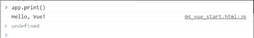

- method를 호출하여 data 변경 가능
  - 객체 내 bye method 정의
  - print method 실행 시 Vue instance의 data 내 message 변경
- 콘솔창에서 app.bye() 실행
  - DOM에 바로 변경된 결과 반영
  - Vue의 강력한 반응성(reactivity)

```html
<script>
  const app = new Vue({
    el: '#app',
    data: {
      message: 'Hello, Vue!'
    },
    methods: {
      ...
      bye: function() {
        this.message = 'Bye, Vue!'
      },
    }
  })
</script>
```

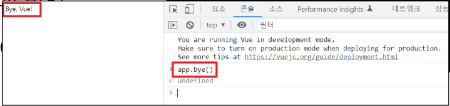

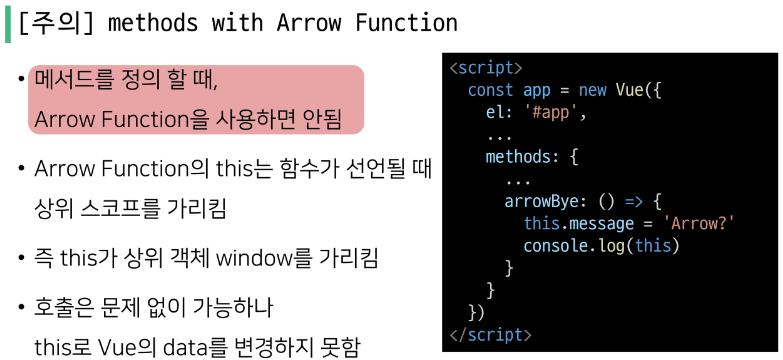

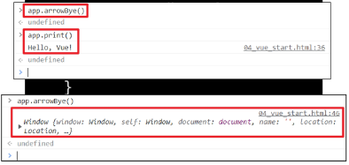