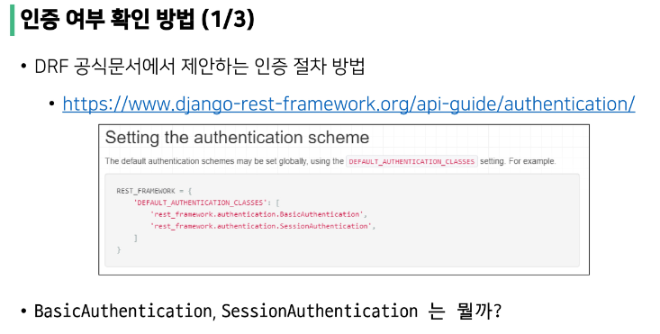
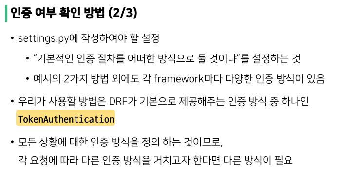
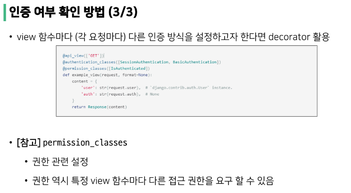
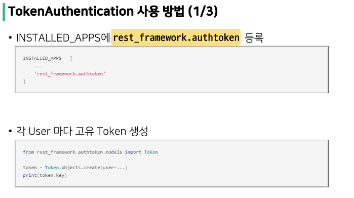
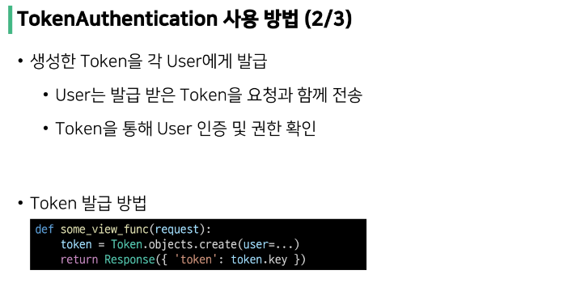
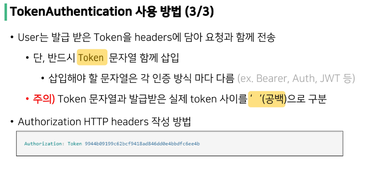

# DRF Auth System

## Authentication & Authorization

> Authentication - 인증, 입증
- 자신이라고 주장하는 사용자가 누구인지 확인하는 행위
- 모든 보안 프로세스의 첫번째 단계
- 내가 누구인지 확인하는 과정
- 401 Unauthorized
  - 비록 HTTP 표준에서는 '미승인(unauthorized)'이라 명시하지만, 의미상 이 응답은 '비인증(unauthenticated)'을 의미

 

> Authorization - 권한 부여, 허가
- 사용자에게 특정 리소스 또는 기능에 대한 액세스 권한을 부여하는 과정(절차)
- 보안 환경에서 권한 부여는 항상 인증이 먼저 필요함
  - 사용자는 조직에 대한 액세스 권한을 부여 받기 전에 먼저 자신의 ID가 진짜인지 먼저 확인해야 함
- 서류의 등급, 웹 페이지에서 글을 조회 & 삭제 & 수정 할 수 있는 방법, 제한 구역
  - 인증이 되었어도 모든 권한을 부여 받는 것은 아님
- 403 Forbidden
  - 401과 다른 점은 서버는 클라이언트가 누구인지 알고 있음

 

> Authentication and authorization work together
- 회원가입 후, 로그인 시 서비스를 이용 할 수 있는 권한 생성
  - 인증 이후에 권한이 따라오는 경우가 많음
- 단, 모든 인증을 거쳐도 권한이 동일하게 부여되는 것은 아님
  - Django에서는 로그인을 했어도 다른 사람의 글까지 수정 / 삭제가 가능하진 않음
- 세션, 토큰, 제3자를 활용하는 등의 다양한 인증 방식 존재
  
## authentication determined

> 다양한 인증 방식
- BasicAuthentication
  - 가장 기본적인 수준의 인증 방식
  - 테스트에 적합
  - HTTP, 쿠키
- SessionAuthentication
  - Django에서 사용하였던 session 기반의 인증 시스템
  - DRF와 Django의 session 인증 방식은 보안적 측면을 구성하는 방법에 차이가 있음
  - 세션
- RemoteUserAuthentication
  - Django의 Remote user 방식을 사용할 때 활용하는 인증 방식
  - OAuth(카카오, 페이스북)
- TokenAuthentication
  - 매우 간단하게 구현 가능
  - 기본적인 보안 기능 제공
  - 다양한 외부 패키지
- settings.py에서  DEFAULT_AUTHENTICATON_CLASSES를 정의 
  - 매우 중요
  - TokenAuthentication 인증 방식을 사용할 것임을 명시

> 토큰 생성 및 관리 문제점
- 기본 제공 방식에서 고려해야 할 사항들
  1. Token 생성 시점
  2. 생성한 Token 관리 방법
  3. User와 관련된 각종 기능 관리 방법
     - 회원가입
     - 로그인
     - 회원 정보 수정
     - 비밀 번호 변경

> JWT (Json Web Token)
- Token에 Json 형식의 data format 존재
- 데이터의 주체 : 토큰 그 자체
  - Token 안에 모든 정보가 들어있다.
  - 목적 : MSA (서버 간의 분리)
- == 잠긴 상자
