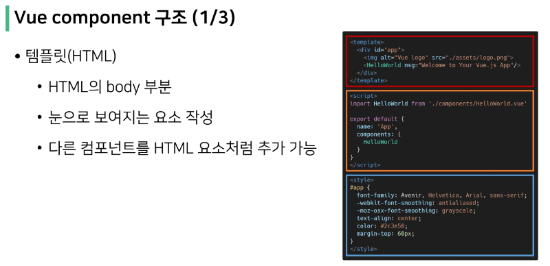

# Vue CLI

## Node.js
- 자바스크립트는 브라우저를 조작하는 유일한 언어
  - 하지만 브라우저 밖에서는 구동할 수 없었음
- 자바스크립트를 구동하기 위한 런타임 환경인 Node.js로 인해 브라우저가 아닌 환경에서도 구동할 수 있게 됨

 

> NPM (Node Package Manage)
- 자바스크립트 패키지 관리자
  - Python의 pip 같은 존재
  - 다양한 의존성 패키지 관리
- Node.js의 기본 패키지 관리자
  - Node.js 설치 시 함께 설치됨

 

> Vue CLI
- Vue 개발을 위한 표준 도구
- 프로젝트의 구성을 도와주는 역활 = 폴더구조
- 확장 플러그인, GUI, Babel 등 다양한 tool 제공 = 개발 유용한 설치

cf) 'vite'를 많이 쓰기도 함

## Vue CLI 프로젝트 구조

> node_modules - Babel
- "JavaScript compiler"
- 자바스크립트의 ES6+ 코드를 구버전으로 번역/변환 해주는 도구
- 자바스크립트의 파편화, 표준화의 영향으로 작성된 코드의 스펙트럼이 매우 다양
  - 최신 문법을 사용해도 브라우저의 영향으로 작성된 코드의 스펙트럼이 매우 다양
  - 버전에 따른 같은 의미의 다른 코드를 작성하는 등의 대응이 필요해졌고, 이러한 문제를 해결하기 위한 도구
  - 원시 코드(최신 버전)를 목적 코드(구 버전)으로 옮기는 번역기가 등장하면서 더 이상 고민 X

> Module
- 개발하는 애플리케이션의 크기가 커지고 복잡해지면 파일 하나에 모든 기능을 담기가 어려워짐
- 따라서 자연스럽게 파일을 여러 개로 분리하여 관리를 하게 되었고, 이때 분리된 파일 각각이 모듈(module) 즉, js 파일 하나가 하나의 모듈
- 모듈은 대개 기능 단위로 분리하며, 클래스 하나 혹은 특정한 목적을 가진 복수의 함수로 구성된 라이브러리 하나로 구성됨
- 여러 모듈 시스템
  - ESM(ECMA Script Module), AMD, CommonJS, UMD

 

> Module 의존성 문제
- 모듈의 수가 많아지고 라이브러리 혹은 모듈 간의 의존성(연결성)이 깊어지면서 특정한 곳에서 발생한 문제가 어떤 모듈 간의 문제인지 파악하기 어려움
  - Webpack은 이 모듈 간의 의존성 문제를 해결하기 위해 등장

 

> Bundler
- 모듈 의존성 문제를 해결해주는 작업이 Bundling
- 이러한 일을 해주는 도구가 Bundler이고, Webpack은 다양한 Bundler 중 하나
- 모듈들을 하나로 묶어주고 묶인 파일은 하나(혹은 여러 개)로 만들어짐
- Bundling된 결과물은 개별 모듈의 실행 순서에 영향을 받지 않고 동작하게 됨
- snowpack, parcel, rollup.js 등의 webpack 이외에도 다양한 모듈 번들러 존재

- Vue CLI는 이러한 Babel, Webpack에 대한 초기 설정이 자동으로 되어 있음.

 

> Webpack - static module bundler
- 의존성을 Webpack이 담당해 주므로 개발자는 npm install을 사용해 다양한 모듈을 한 번에 설치하고 각 모듈을 사용해 개발에 집중할 수 있음.

 

 

> src/
- src/assets
  - 정적 파일을 저장하는 디렉토리
- src/components
  - 하위
- src/App.vue
  - 최상위 컴포넌트
  - public/index.html과 연결됨
- src/main.js
  - webpack이 빌드를 시작할 때 가장 먼저 불러오는 entry point
  - public/index.html과 src/App.vue를 연결시키는 작어비 이루어지는 곳
  - Vue 전역에서 활용할 모듈을 등록할 수 있는 파일

 

## Component
- UI를 독립적이고 재사용 가능한 조각들로 나눈 것
  - 기능별로 분화된 코드 조각
- CS에서는 다시 사용할 수 있는 범용성을 위해 개발된 소프트웨어 구성 요소를 의미
- 하나의 app을 구성할 때 중첩된 컴포넌트들의 tree로 구성하는 것이 보편적임
  - == Web의 HTML 요소들의 중첩
    - Body tag를 root node로 하는 tree의 구조
    - Vue에서는 src/App.vue를 root node로 하는 tree의 구조
- 컴포넌트는 유지보수를 용이하게 하고, 재사용성의 측면에서도 매우 강력한 기능을 제공

 

> Component based architecture 특징
- 관리 용이
  - 유지/보수 비용 감소
- 재사용성
- 확장 가능
- 캡슐화
- 독립적

 

# SFC

> component in Vue
- Vue에서의 component
  - 이름이 있는, 재사용 가능한 Vue instance
- Vue instance
  - new Vue()로 만든 인스턴스

 

> SFC (Single File Component)
- 하나의 .vue 파일이 하나의 Vue instance이고, 하나의 컴포넌트이다.
  - Single File Component
- Vue instance에서는 HTML, CSS, JavaScript 코드를 한번에 관리
  - Vue instance를 기능 단위로 작성하는 것이 핵심
- 컴포넌트 기반 개발의 핵심 기능

 

> 정리
- HTML, CSS, JavaScript를 .vue라는 확장자를 가진 파일 안에서 관리하며 개발
- 이 파일을 Vue instance, 또는 Vue component라고 하며, 기능 단위로 작성
- Vue CLI가 Vue를 Component based하게 사용하게 도와줌

 

## Vue component

 

 

 

 

## Vue component 실습

