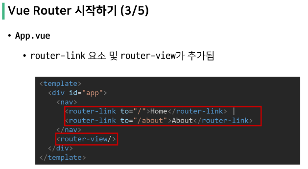
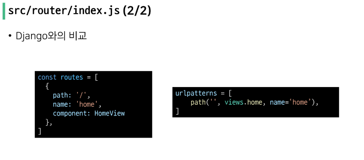
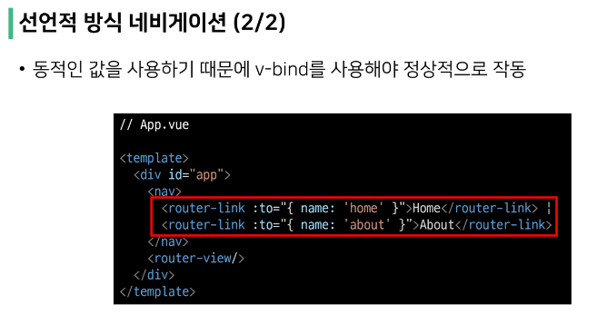
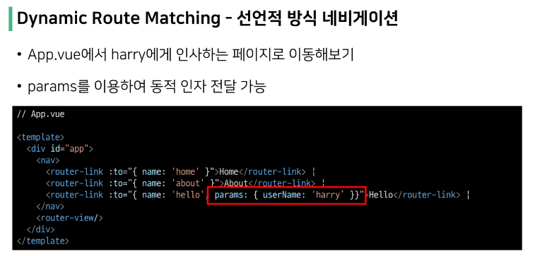

# UX & UI

> UX (User Experience)
- 유저와 가장 가까이 있는 분야
- 데이터를 기반으로 유저를 조사하고 분석해서 개발자, 디자이너가 이해할 수 있게 소통
- 유저가 느끼는 느낌, 태도 그리고 행동을 디자인
- 사람들의 마음과 생각을 이해하고 정리해서 제품에 녹여내는 과정 필요
- 유저 리서치, 데이터 설계 및 정제, 유저 시나리오, 프로토타입 설계 등 필요

 

> UI (User Interface)
- 유저에게 보여지는 화면을 디자인
- UX를 고려한 디자인을 반영, 이 과정에서 기능 개선 혹은 추가가 필요한 경우 Front-end 개발자와 가장 많이 소통

 

> Interface
- 서로 다른 두 개의 시스템, 장치 사이에서 정보나 신호를 주고받는 경우의 접점
  - 즉, 사용자가 기기를 쉽게 동작 시키는데 도움을 주는 시스템
- CLI(command-line interface)나 GUI(Graphic User Interface)를 사용해서 컴퓨터를 조작

# Vue Router

## Routing

> Routing
- 네트워크에서 경로를 선택하는 프로세스
- 엡 서비스에서의 라우팅
  - 유저가 방문한 URL에 대해 적절한 결과를 응답하는 것
- ex) /articles/index/에 접근하면 articles의 index에 대한 결과를 보내줌

 

> Routing in SSR
- Server가 모든 라우팅을 통제
- URL로 요청이 들어오면 응답으로 완서오딘 HTML 제공
  - Django로 보낸 요청의 응답 HTML은 완성본 상태
- 결론적으로, Routing(URL)에 대한 결정권을 서버가 가짐

 

> Routing in SPA / CSR
- 서버는 하나의 HTML(index.html)만을 제공
- 이후에 모든 동작은 하나의 HTML 문서 위에서 JavaScript 코드를 활용
  - DOM을 그리는데 필요한 추가적인 데이터가 있다면 axios와 같은 AJAX 요청을 보낼 수 있는 도구를 사용하여 데이터를 가져오고 처리
-  즉, 하나의 URL만 가질 수 있음 

 

> Why routing?
- 동작에 따라 URL이 반드시 바뀌어야 하나?
  - No! 단, 유저의 사용성 관점에서 필요
- Routing이 없다면,
  - 유저가 URL을 통한 페이지의 변화를 감지할 수 없음
  - 페이지가 무엇을 렌더링 중인지에 대한 상태를 알 수 없음
    - 새로고침 시 처음 페이지로 돌아감
    - 링크를 공유할 시 처음 페이지만 공유 가능
  - 브라우저의 뒤로 가기 기능을 사용할 수 없음

## Vue Router

## Vue Router 실습

> 주소를 이동하는 2가지 방법
1. 선언적 방식 네비게이션
2. 프로그래밍 방식 네비게이션

