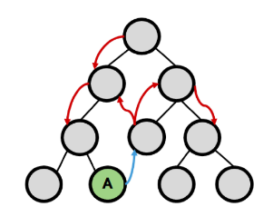
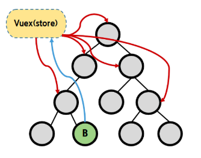
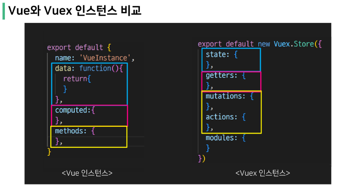

# Vue State Management

## State Management

> 상태 관리
<span style="color:red">State(변수)</span> Management

- 상태(State)
  - 현재에 대한 정보
  - 변수
  - 현재 App이 가지고 있는 Data로 표현 가능

- 각 component는 독립적이기에 각각의 상태(data)를 가지나, 
- 여러 개의 component들을 조합 == 하나의 App
  - <span style="color:red">여러 개의 component가 같은 상태(data)를 유지할 필요가 있음</span>

</br>

> Pass Props & Emit Event
- 각 컴포넌트는 독립적으로 데이터를 관리
- 같은 데이터를 공유함으로, 각 컴포넌트가 동일한 상태를 유지
- 데이터의 흐름을 직관적으로 파악 가능
- 그러나 component의 중첩이 깊어지면, compoenent가 많아지면 데이터 전달 구조가 복잡해짐



</br>

> Centralized Store
- 중앙 저장소(store)에 데이터를 모아서 상태 관리
- 각 component는 중앙 저장소의 데이터를 사용
- component의 계층과 무관하게 중앙 저장소에 접근, 데이터를 fetch, change... 가능
- 중앙 저장소의 데이터가 변경되면 각각의 component는 해당 데이터의 변화에 반응하여 새로 변경된 데이터를 반영
- 규모가 크거나 컴포넌트 중첩이 깊은 프로젝트의 관리가 매우 편리



## Vuex 시작하기

> 프로젝트 with vuex

```
$ vue create vuex-app   // Vue 프로젝트 생성
$ cd vuex-app   // 디렉토리 이동
$ vue add vuex    // Vue CLI를 통해 vuex plugin 적용
```

- src / store / index.js 가 생성됨
- vuex의 핵심 컨셉 4가지
1. state
2. getters
3. mutations
4. actions

```js
// index.js

import Vue from 'vue'
import Vuex from 'vuex'

Vue.use(Vuex)

export default new Vuex.Store({
  state: {
  },
  getters: {
  },
  mutations: {
  },
  actions: {
  },
  modules: {
  }
})
```



</br>

> 1. State
- vue 인스턴스의 data에 해당
- <span style="color:red">중앙에서 관리하는 모든 상태 정보</span>
- 개별 component는 state에서 데이터를 가져와서 사용
  - 개별 component가 관리하던 data를 중앙 저장소(Vuex Store의 state)에서 관리하게 됨
- state의 데이터가 변화하면 해당 데이터를 사용(공유)하는 compoenent도 자동으로 다시 렌더링
- <span style="color:red">$store.state</span>로 state 데이터에 접근

</br>

> 2. Mutations


> CSM
- data : 상태
  methods : 행동
  computed : 상태 표현
- state == data
- mutations + actions == methods
  - mutations : state를 변경(update)하는 기능만 한다.
    - mutations이 call 됬는지만 확인하면 변경된 데이터가 적용됬는지 확인 가능
  - actions : 그 외 싹 다 (axios 등)
- getters == computed