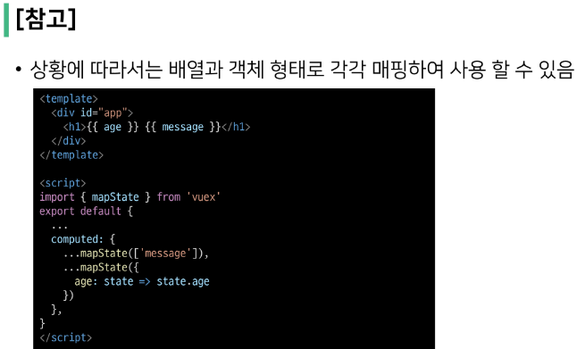

# Local Storage

> 상태 유지하기
- 현재 앱을 재실행 하거나, 새로 고침을 하면 초기 값으로 돌아감

- MDN 메인 페이지에서 테마를 설정하고, 새로 고침해도 테마는 유지되어 있음

 

> Window.localStorage
- 브라우저의 내장 객체 중 하나
- Key-Value 형태로 데이터를 저장할 수 있는 저장소
- localStorage에 저장된 데이터는 브라우저를 종료해도 계속해서 유지됨
  - 다른 텝에서도 동일한 데이터를 공유
  - 다른 도메인에서는 접근 불가능
  -  보안과 관련된 중요한 정보를 저장하기 적합하지 않음 

 

# Plugins
- Vuex store에 추가적인 기능을 제공하는 확장 기능
- 일반적으로 state의 변화를 감지해, 어플리케이션의 성능을 최적화하는 목적
- 일단 일반적인 code 작성 후, 최적화하려는 노력을 할 것

# Vuex Binding Helper

# modulus

