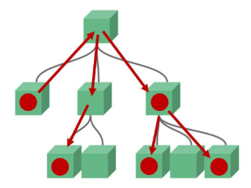

bb# Vue Data Management

## Data in components

> Data in components
- 동적 웹페이지
  - 웹페이지에서 다뤄야 할 데이터 등장
  - User data, 게시글 data, ...
- 한 페이지 내에서 같은 데이터를 공유
  - But 페이지들은 components로 구분
- 컴포넌트의 데이터를 다른 컴포넌트에서 사용할려면
  - 컴포넌트는 부모-자식 관계를 가지고 있으므로, 부모-자식 관계만 데이터를 주고 받게 하자
    - 데이터의 흐름을 파악하기 용이
    - 유지 보수하기 쉬워짐

 

> pass props & emit event
- 부모 => 자식으로의 데이트 흐름
  - pass props 방식
- 자식 => 부모로의 데이터 흐름
  - emit event 방식

 

### Pass Props

> Pass Props
- 요소의 속성(property)을 사용하여 데이터 전달
- props는 부모(상위) 컴포넌트의 정보를 전달하기 위한 사용자 지정 특성
- 자식(하위) 컴포넌트는 props 옵션을 사용하여 수신하는 props를 명시적으로 선언해야 함

# Lifecycle Hooks