# HTML

## 웹 사이트

</br>

> 웹 사이트는 웹 페이지의 모음
- 웹 브라우저를 통해서 접속하는 웹 페이지들의 모음!
- 웹 페이지는 글, 그림, 동영상 등 여러가지 정보를 담고 있으며, 링크를 통해 다른 웹 페이지로 이동이 가능
- 웹 사이트 = 링크를 통해 여러 웹 페이지를 연결한 것

</br>

> HTML & CSS & JavaScript

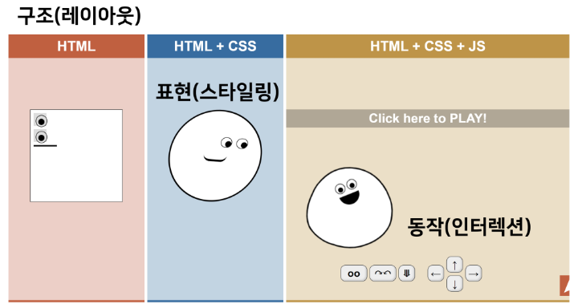

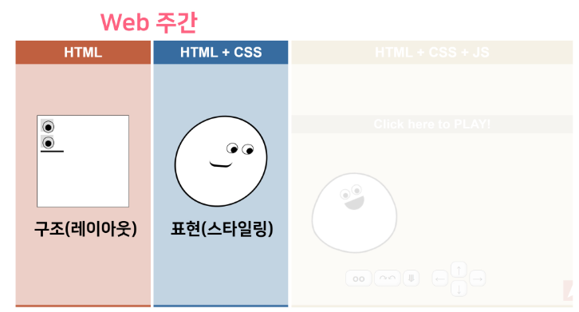

- FrontEnd
  - html : 텍스트, 구조
  - CS : 구조, 꾸미기
  - JavaScript : 상호작용
- BackEnd
  - django : 데이터 불러오기, 데이터베이스

</br>

## HTML : Hyper Text Markup Language

> Hyper Text
- 참조(하이퍼링크)를 통해 사용자가 한 문서에서 다른 문서로 즉시 접근할 수 있는 텍스트

</br>

> Markup Language
- 태그 등을 이용하여 문서나 데이터의 구조를 명시하는 언어
  - 대표적인 예 : HTML, Markdown

</br>

> HTML(.html)
- 웹 페이지를 작성(구조화)하기 위한 언어
- 암기로 다가가지 말 것
  - 기본 컨셉을 이해하기
  - MDN: html 성경
  - W3Schools : html 자습서

</br>

> HTML 기본 구조
- html : 문서의 최상위(root) 요소
- head : 문서 메타데이터 요소
  - 문서 제목, 인코딩, 스타일, 외부 파일 로딩 등
  - 일반적으로 브라우저에 나타나지 않는 내용
- body : 문서 본문 요소
  - 실제 화면 구성과 관련된 내용

```
- <title> : 브라우저 상단 타이틀
- <link> : 외부 리소스 연결 요소(CSS 파일 등)
- <style> : CSS 직접 작성
```

</br>

> head 예시
```html
<head>
  <title>HTML 수업</title>
  <meta charset="UTF-8">
  <link href="style.css" rel = "stylesheet">
  <script src="javascript.js"></script>
  <style>
    p {
      color: black;
    }
  </style>
</head>
```

</br>

> 요소(element)
- HTML의 요소는 태그와 내용(contents)으로 구성되어 있다.
  - 열었으면, 닫아야 한다.
  - 모든 내용은 태그로 감싸져 있어야 한다.

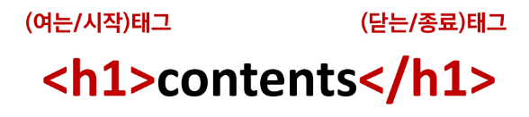


</br>

- HTML 요소는 시작 태그와 종료 태그, 그리고 태그 사이에 위치한 내용으로 구성
  - 태그(element, 요소)는 컨텐츠(내용)를 감싼는 것으로 그 정보의 성격과 의미를 정의
- 내용이 없는 태그들
  - br(breaking line, 줄바꿈), hr(수평선), img(이미지), input, link, meta
- 요소는 중첩(nested)될 수 있음
  - 요소의 중첩을 통해 하나의 문서를 구조화
  - 여는 태그와 닫는 태그의 쌍을 잘 확인해야함
    - 오류를 반환 X
    - 그냥 레이아웃이 깨진 상태로 출력(디버깅이 힘듬)

</br>

> 속성
- 각 태그별로 사용할 수 있는 속성이 다르다.
- 속성은 속성명과 속성값으로 이루어져 있다.

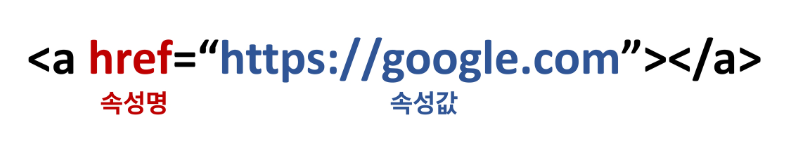

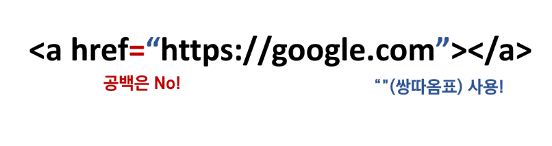


</br>

- 속성을 통해 태그의 부가적인 정보를 설정할 수 있음
- 요소는 속성을 가질 수 있으며, 경로나 크기와 같은 추가적인 정보를 제공
- 요소의 시작 태그에 작성하며 보통 이름과 값이 하나의 쌍으로 존재
- 태그와 상관없이 사용 가능한 속성들도 있음

</br>

> Tip for vscode 용
- ctrl + d : 다중선택
- alt + shift + 화살표 : 복사
- alt + 화살표 : 이동
- alt + 클릭 : 커서 다중 선택

</br>

> Tip for pycharm 용
- alt + j : 다중선택
- alt + shift + 화살표 : 복사
- alt + 화살표 : 이동


```html
<body>
  <p>안녕하세요 <span>김싸피

```

</br>

## CSS 기본기

### Box Model

> CSS 원칙 1
- 모든 요소는 네모(박스모델)
- 위에서부터 아래로, 왼쪽에서 오른쪽으로 쌓인다.(= normal flow) = 좌측 상단에 배치

</br>

> Box model 구성
- 모든 HTML 요소는 box 형태로 되어있음
- 하나의 박스는 네 영역으로 이루어짐
  - content
  - padding
  - border
  - margin

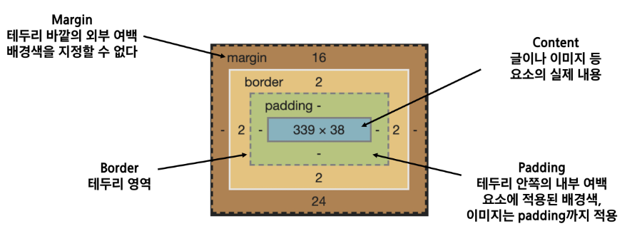  


</br>

> box-sizing
- 기본적으로 모든 요소의 box-sizing은 content-box
  - Padding을 제외한 순수 contents 영역만을 box로 지정
- 다만, 우리가 일반적으로 영역을 볼 때는 border까지의 너비를 100px 보는 것을 원함
  - 그 경우 box-sizing을 border-box으로 설정

</br>

> box-sizing 실습

```html
<!DOCTYPE html>
<html lang="en">
<head>
  <meta charset="UTF-8">
  <meta http-equiv="X-UA-Compatible" content="IE=edge">
  <meta name="viewport" content="width=device-width, initial-scale=1.0">
  <title>Document</title>
  <style>
    .box1 {
      width: 500px;
      border-width: 2px;
      border-style: dashed;
      border-color: black;
      padding-left: 50px;
      margin-bottom: 30px;
    }

    .box2 {
      width: 500px;
      border: 2px solid black;
      padding: 20px 30px;
    }
  </style>
</head>


<body>
  <div class="box1">div</div>
  <div class="box2">div</div>
</body>
</html>
```


```html
<!DOCTYPE html>
<html lang="en">
<head>
  <meta charset="UTF-8">
  <meta http-equiv="X-UA-Compatible" content="IE=edge">
  <meta name="viewport" content="width=device-width, initial-scale=1.0">
  <title>Document</title>
  <style>
    .box {
      width: 100px;
      margin: 10px auto;
      padding: 20px;
      bottom: 1px solid black;
      color: white;
      text-align: center;
      background-color: blueviolet;
    }

    .box-sizing {
      box-sizing: border-box;
      margin-top: 50px;
    }
  </style>
</head>


<body>
  <div class="box">content-box</div>
  <div class="box box-sizing">border-box</div>
</body>
</html>
```
위 코드의 보라색 사각형의 넓이는 얼마일까?
'width'가 100px이니 100이라고 생각할 수 있지만, 사실 F12로 보면 padding에 테두리까지 해서 142px로 나온다. 

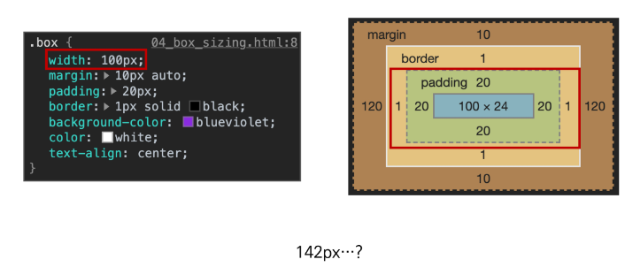

그러나 우리가 원하는 너비는 100px! 그러므로 border-box로 box-sizing을 주자!

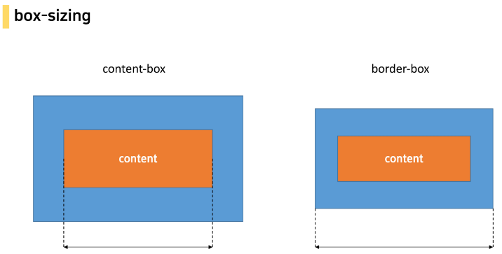

</br>

## 개발자 도구
- 많은 웹브라우저들 중 우리는 가장 보기 편한 크롬을 이용할 예정
- F12

</br>

### Emmet
> HTML Emmet
- ! + tab : 기본적인 html 구조 만들어줌
- div.[class 이름] + tab
 
```html
<div class="class 이름"></div>
```

- div#[id 이름] + tab

```html
<div id="id 이름"></div>
```

- div.[class 이름]*n + tab

```html
<div class="class 이름"></div> n개 생성
```

- div.[class 이름]>p#[id 이름]*n : 

```html  
<div class="class 이름">
  <p id="id 이름"></p>
  <p id="id 이름"></p>
  ......
  n개 생성
</div>
```

- lorem : 의미 없는 텍스트 채우기 for 화면, 디자인을 더 잘 보기 위해
  - lorem[n]: n단어
  - lorem*n: n단락

</br>

> CSS Emmet
- mt[n] : margin-top [n]px;
- pd[n] : padding-top [n]px;
- w[n] : width: [n]px;
- h[n] : height: [n]px;
---


## CSS Display

> CSS 원칙 2
- display에 따라 크기와 배치가 달라진다.

</br>

> 대표적으로 활용되는 display
- display: block (블럭 요소)
  - 한 줄 전체를 차지하는 요소!(=화면 크기 전체의 가로 폭을 차지한다.)
  - 줄 바꿈이 일어나는 요소(다른 elem를 밀어낸다!)
  - 블록 레벨 요소 안에 인라인 레벨 요소가 들어갈 수 있음.
  - width, height, margin-top, margin-bottom을 지정할 수 있다.
  - ex) div / p / ul,ol,li / hr / form 등

- display: inline (인라인 요소)
  - 줄 바꿈이 일어나지 않는 행의 일부 요소
  - content를 마크업 하고 있는 만큼만 가로폭을 차지한다. = 기본 너비 : 컨텐츠 영역만큼
  - width, height, margin-top, margin-bottom을 지정할 수 없다.
  - 상하 여백은 line-height로 지정
  - ex) span / a / img / input, label / b, em, i, strong 등

- display: inline-block
  - block과 inline 레벨 요소의 특징을 모두 가짐
  - inline처럼 한 줄에 표시 가능하고, block처럼 width, height, margin 속성을 모두 지정할 수 있음

- display: none
  - 해당 요소를 화면에 표시하지 않고 공간조차 부여되지 않음
  - 이와 비슷한 visibility:hidden은 해당 요소가 공간은 차지하나 화면에 표시만 하지 않는다.


</br>

```html
<!-- HTML -->
<!DOCTYPE html>
<html lang="en">
<head>
  <meta charset="UTF-8">
  <meta http-equiv="X-UA-Compatible" content="IE=edge">
  <meta name="viewport" content="width=device-width, initial-scale=1.0">
  <title>Document</title>
  <link rel="stylesheet" href="block.css">
</head>
<body>
  <div class="box"></div>
  <div class="box"></div>
</body>
</html>
```

```CSS
/* CSS */
.box {
  background-color: aquamarine;
  width: 100px;
  height: 100px;
  margin-top: 20px;
}
```

</br>

> 속성에 따른 수평 정렬

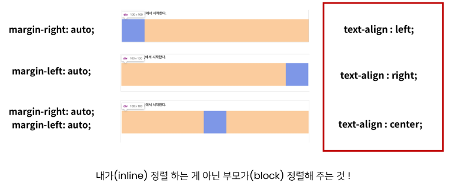


```html
<!-- HTML -->
<!DOCTYPE html>
<html lang="en">
<head>
  <meta charset="UTF-8">
  <meta http-equiv="X-UA-Compatible" content="IE=edge">
  <meta name="viewport" content="width=device-width, initial-scale=1.0">
  <link rel="stylesheet" href="block.css">
  <title>Document</title>
</head>
<body>

  <div>
    <div class="box">
      <span>DIV</span>
    </div>
    <div class="box">
      <span>DIV</span>
    </div> 
  </div>

</body>
</html>
```

```CSS
/* CSS */
.box {
  background-color: aquamarine;
  width: 100px;
  height: 100px;
  /* margin-top: 20px; */

  /*기본설정: margin-right: auto; */
  
  /* margin-left: auto; */

  /* margin-right: auto;
  margin-left: auto; */

  margin: 20px auto;

  /* 텍스트 가운데 이동 */
  text-align: center;

  /* inline 형태로 직접 바꿔줄 수 있다.
  display: inline */
}

span  {
  line-height: 100px;
}
```

```html
<!DOCTYPE html>
<html lang="en">
<head>
  <meta charset="UTF-8">
  <meta http-equiv="X-UA-Compatible" content="IE=edge">
  <meta name="viewport" content="width=device-width, initial-scale=1.0">
  <link rel="stylesheet" href="display_none.css">
  <title>Document</title>
</head>
<body>

  <div>
    <div class="box test">
      <span>1</span>
    </div>
    <div class="box">
      <span>2</span>
    </div> 
  </div>

</body>
</html>
```
```css
.box {
  background-color: aquamarine;
  width: 100px;
  height: 100px;
  margin: 20px auto;

  /* 텍스트 가운데 이동 */
  text-align: center;
}

span  {
  line-height: 100px;
}

.test {
  display: none;

  /* visibility: hidden; */
}
```

</br>

## CSS Position
- 문서 상에서 요소의 위치를 지정(어떤 기준으로 어디에 배치시킬지)
- 모를 때는 공식 문서로

---

- static : 모든 태그의 기본 값(기준 위치)
  - 일반적인 요소의 배치 순서에 따름(좌측 상단)
  - 부모 요소 내에서 배치도리 때는 부모 요소의 위치를 기준으로 배치됨
- relative: 상대 위치
  - 자기 자신의 static 위치를 기준으로 이동(normal flow 유지)
  - 레이아웃에서 요소가 차지하는 공간은 static일 때와 같음(normal position 대비 offset)
- absolute : 절대 위치
  - 요소를 일반적인 문서 흐름에서 제거 후 레이아웃에 공간을 차지하지 않음(normal flow에서 벗어남)
  - static이 아닌 가장 가까이 있는 부모/조상 요소를 기준으로 이동(없는 경우 body)
- fixed : 고정 위치
  - 요소를 일반적인 문서 흐름에서 제거 후 레이아웃에 공간을 차지하지 않음(normal flow에서 벗어남)
  - 부모 요소와 관계없이 viewpoint를 기준으로 이동
    - 스크롤 시에도 항상 같은 곳에 위치함
- sticky : 스크롤에 따라 static -> fixed로 변경
  - 속성을 적용한 박스는 문서 안에서 position: static 상태와 같이 일반적인 흐름에 따르지만, 스크롤 위치가 임계점에 이르면 position: fixed와 같이 박스를 화면에 고정할 수 있는 속성

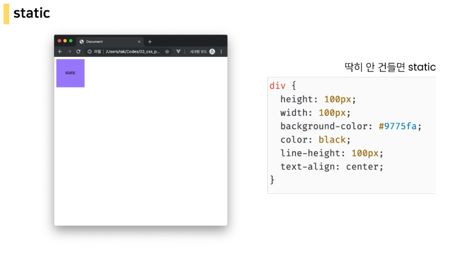

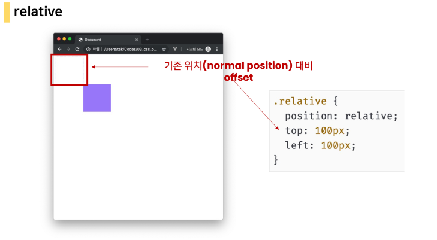

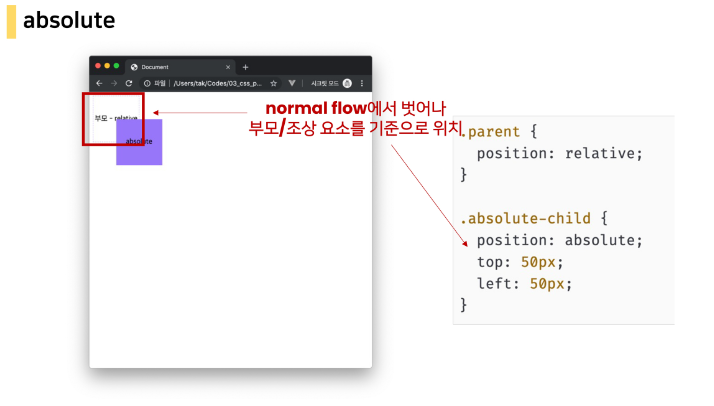

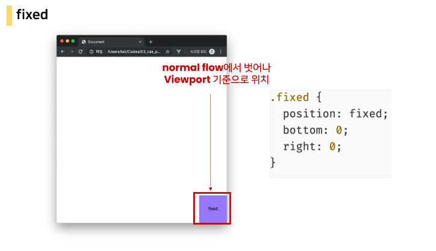

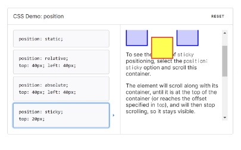

</br>

> absolute vs. relative

```html
<body>
  <div class="parent">
    <div class="absolute">형</div>
    
```