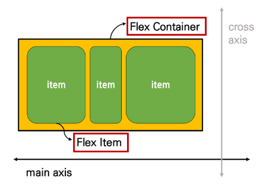
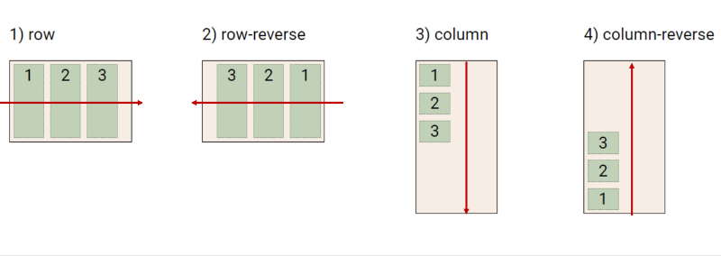
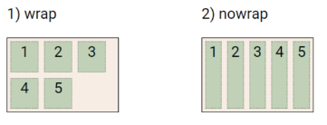

# Float
- 박스를 왼쪽 혹은 오른쪽으로 이동시켜 텍스트를 포함 인라인 요소들이 주변을 wrapping 하도록 함
- 요소가 Normal flow를 벗어나도록 함

 

> Float 속성
- none: 기본값
- left: 요소를 왼쪽으로 띄움
- right: 요소를 오른쪽으로 띄움

> Float 정리
- Float는 레이아웃을 구성하기 위해 필수적으로 활용 되었으나, 최근 Flexbox, Grid 등장과 함께 사용도가 낮아짐
- 활용 전략 : Normal Flow에서 벗어난 레이아웃 구성
  - 원하는 요소들을 Float로 지정하여 배치

 

# Flexbox
- Layout을 위해 탄생

 

> CSS Flexible Box Layout
- 행과 열 형태로 아이템들을 배치하는 1차원 레이아웃 모델
- 축
  - main axis (메인 축)
  - cross axis (교차 축)
- 구성 요소
  - Flex Container (부모 요소)
  - Flex Item (자식 요소)

- 컨테이너 안에 아이템이 담겨있다!
- 컨테이너를 조작해서 아이템을 이리저리 배치하자!

 

> Flexbox 구성 요소
- Flex Container (부모 요소)
  - flexbox 레이아웃을 형성하는 가장 기본적인 모델
  - Flex Item들이 놓여있는 영역
  - display 속성을 flex 혹은 inlin-flex로 지정
- Flex Item (자식 요소)
  - 컨테이너에 속해 있는 컨텐츠(박스)

 

> Flex 속성 (필요할 때마다 MDN 검색해서 사용)
- 배치 설정
  - flex-direction
  - flex-wrap
- 공간 나누기
  - justify-content (main axis)
  - align-content (cross axis)
- 정렬
  - align-itmes (모든 아이템을 cross axis 기준으로)
  - align-self (개별 아이템)

※ justify vs. align  
- justify : 메인축을 기준으로  
- align: 교차축을 기준으로 

 

> flex-direction
- Main axis 기준 방향 설정
- 역방향의 경우 HTML 태그 선언 순서와 시각적으로 다르니 유의

> flex-wrap
- 요소들이 강제로 할 줄에 배치 되게 할 것인지 여부 설정
- 아이템이 컨테이너를 벗어나는 경우 해당 영역 내에 배치되도록 설정
- 기본적으로 컨테이너 영역을 벗어나지 않도록 함
- 결국 줄넘김
  - nowrap (기본 값): 한 줄 배치
  - warp: 넘치면 그 다음 줄로 배치

> flex-flow
- flex-direction과 flex-wrap의 shorthand
- flex-direction과 flex-warp에 대한 설정값을 차례로 작성
- ex) flex flow: row nowrap;

 

> justify-content
- Main axis를 기준으로 공간 배분

