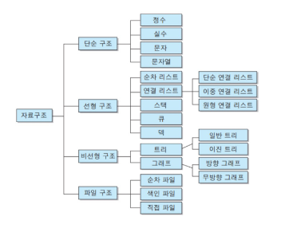
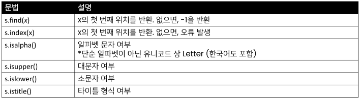
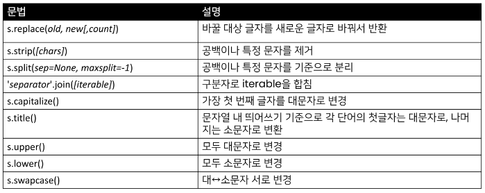
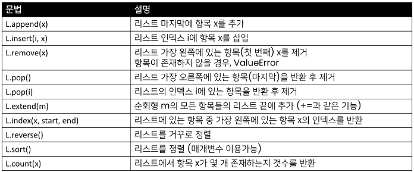
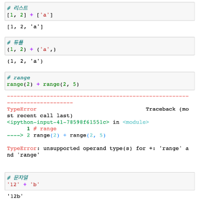
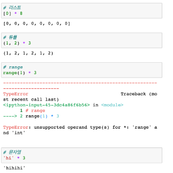

# 가상환경

- 파이썬 표준 라이브러리가 아닌 외부 패키지
- ex) random, calendar, requests, BeautifulSoap
- Python 공식으로 만들어둔 모듈 : import
- 개별적으로 만든 모듈 : pip install 

```Git bash
cd ssafy9/
mkdir virtual_env/
cd virtual_env/
mkdir prac
cd prac
```

- 가상환경을 생성하면, 해당 디렉토리에 별도의 파이썬 패키지가 설치됨.
```Git bash
python -m venv venv
```
python(아) venv(가상환경) venv('venv'라는 이름으로 만들어줘, 일종의 약속된 이름)

'pip list'

```Git bash
source venv/Scripts/activate
(venv)
```
venv안의 Scripts라는 모듈을 activate 시켜줘.

'pip list' 해보면 환경에는 python 밖에 없다

-  가상환경 비활성화

```git bash
deactivate
```

[실습]  

'virtual_env'파일 안에 'random_lunch'파일을 만들고, 안에 'random_lunch.py'를 만들자.

```python
import random
import requests

lst = [1, 2, 3]

print(random.sample(lst, 1))

response = requests.get('url')

print(response.json())
```

```git bash
python random_lunch.py
python -m venv venv
python random_lunch.py
```

갑자기 실행이 안 된다.

requests 필요

```git bash
pip install requests
```

설치 후 실행하면 실행된다.

결국, 가상환경은 다른 환경에서 서로 사용하는 프로그램의 버전이 다를 때, 'venv'라는 가상환경의 독립된 공간을 만들어 라이브러리 간의 버전 충돌을 막는 용도.

```git bash
git freeze
```


# 데이터 구조
- <span style="color:yellow">데이터 구조</span>와 <span style="color:yellow">연산</span>을 같이 봐야한다.
- 여러 데이터를 효과적으로 사용, 관리하기 위한 구조 (많이 사용해보니, 비슷한 구조가 존재)
- 파이썬에는 대표적으로 List, Tuple, Dict, Set 등의 데이터 구조가 있음

</br>

## 자료구조
---
- 컴퓨터 공학에서는 '자료구조'라고 함
- 각 데이터의 효율적인 저장, 관리를 위한 구조를 나눠 놓은 것 



 ex) 생각해보기
[플레이 리스트]
- 순환 구조
- 순서
- list에 담는 것이 좋아보임

[팔로잉 리스트]
- 순서 X
- 관계도, 연결 구조
- 그래프 구조

</br>

> 데이터 구조 활용하기
- 데이터 구조를 활용하기 위해서는 메서드(method)를 사용
  - 메서드는 클래스 내부에 정의한 <span style="color:yellow">함수</span>, 사실상 함수 동일
  - 쉽게 설명하자면 객체의 기능(추후 객체 지향 프로그래밍에서 학습)

</br>

- <span style="color:skyblue;font-size:120%">데이터 구조</span>.<span style="color:red;font-size:120%">메서드()</span> 형태로 활용
  - = 주어.동사()  
 
ex) list.append(), string.split()

</br>

> 파이썬 공식 문서의 표기법
- python 구문이 아니며, 문법을 표현하기 위한 것
- ex) str.replace(old, new, [, count])
  - old, new는 필수 / [, count]는 선택적 인자를 의미  

</br>

<b><span style="color:white; background-color:red; font-size:120%">※ 파이썬 공식 문서 보는 습관화 (개발자들은 vertical dual monitor에 항상 공식 문서를 띄워두고 작업한다!)</span></b>

</br>

## 문자열(String Type)
---
- 문자들의 나열(sequence of characters)
  - 모든 문자는 str 타입(변경 불가능한 immutable)  
</br>
- 문자열은 작음 따옴표(')나 큰 따옴표(")를 활용하여 표기
  - 문자열을 묶을 때 동일한 문장부호 사용
  - PEP8에서는 소스코드 내에서 하나의 문장부호를 선택하여 유지

```python
print('hello') # hello
print(type('hello')) # <class 'str'>

print('철수 "안녕"') # 철수 "안녕"
print("철수 '안녕'") # 철수 '안녕'
```

</br>

> 문자열 조회/탐색 및 검증 메서드



</br>

- .find(x) : x의 첫번째 위치를 반한, 없으면 -1을 반환함 (오류가 나지 않음)

```python
print('aiden'.find('a'))

# 0

print('aiden'.find('z'))

# -1
```

</br>

- .index(x) : x의 첫번째 위치를 반환, 없으면 <span style="color:red">오류 발생</span>

```python
print('apple'.index('p')) # 1

print('apple'index('k')) # ValueError: substring not found
```

```python
print('abc'.isalpha()) # True
print('ㄱㄴㄷ'.isalpha()) # True
print('Ab'.isupper()) # False
print('ab'.islower()) # True
print('Title Title!'.istitle()) # True
```

</br>

> 문자열 변경 메서드(S는 문자열)



</br>

> 문자열은 immutable(불변형)인데, 문자열 변경이 되는 이유
- 기존의 문자열을 변경하는 게 아니라, 변경된 문자열을 새롭게 만들어서 반환
  - ex) replace, strip, title

```python
word = 'python' # python
print(id(word)) # 주소 : 2006262763184
print(word.upper()) # PYTHON
print(id(word.upper())) # 주소 : 2006262763120
```

</br>

> 문자열 변경
- .replace(old, new, [,count])
  - 바꿀 대상 글자를 새로운 글자로 바꿔서 반환
  - count를 지정하면, 해당 개수만큼만 시행

```python
print('coone'.replace('o', 'a')) # caane

print('woooowoo'.replace('o', '!', 2)) # w!!oowoo
```

</br>

- .strip([chars])
  - 특정한 문자들을 지정하면, 양쪽을 제거하거나(strip), 왼쪽을 제거하거나(lstrip), 오른쪽을 제거(rstrip)
  - 문자열을 지정하지 않으면 공백을 제거함

```python
print('   와우!\n'.strip()) # '와우!'
print('   와우!\n'.lstrip()) # '와우!'
print('   와우!\n'.rstrip()) # '   와우!'
print('안녕하세요????'.rstrip('?')) # '안녕하세요'
```

</br>

- .split(sep = None, maxsplit=-1)
  - 문자열을 특정한 단위로 나눠 리스트로 반환
    - sep이 None이거나 지정되지 않으면 연속된 공백문자를 단일한 공백문자로 간주하고, 선행/후행 공백은 빈 문자열에 포함시키지 않음.
    - maxsplit이 -1인 경우에는 제한이 없음.

```python
print('a,b,c'.split(',')) # ['a', 'b', 'c']
print('a b c'.split()) # ['a', 'b', 'c']
```

</br>

- 'separator'.join([iterable])
  - 반복가능한(iterable) 컨테이너 요소들을 separator(구분자)로 합쳐 문자열 반환
    - iterable에 문자열이 아닌 값이 있으면 TypeError 발생

```python
print('!'.join('ssafy')) # 's!s!a!f!y'

print(' '.join(['3', '5'])) # '3 5'
```

</br>

Ex) 문자열 변경 예시
```python
msg = 'hI! Everyone, I\'m ssafy'

print(msg) # hI! Everyone, I'm ssafy
print(msg.capitalize()) # Hi! everyone, i'm ssafy
print(msg.title()) # Hi! Everyone, I'M Ssafy
print(msg.upper()) # HI! EVERYONE, I'M SSAFY
print(msg.lower()) # hi! everyone, i'm ssafy
print(msg.swapcase()) # Hi! eVERYONE, i'M SSAFY
```

</br>

---
## 리스트(List)
---
- 리스트는 여러 개의 값을 순서가 있는 구조로 저장하고 싶을 때 사용

</br>

> 리스트의 생성과 접근
- 리스트는 대괄호([]) 혹은 list()를 통해 생성
  - 파이썬에서는 어떠한 자료형도 저장할 수 있으며, 리스트 안에 리스트도 넣을 수 있음
  - 생성된 이후 내용 변경이 가능 -> 가변 자료형
  - 유연성 때문에 파이썬에서 가장 흔히 사용
- 순서가 있는 시퀀스로 인덱스를 통해 접근 가능
  - 값에 대한 접근은 list[i]

```python
# 리스트명 = [요소1, 요소2, 요소3, ...]
list_a = []
list_b = [1, 2, 3]
list_c = ['Life', 'is', 'too', 'short']
list_d = [1, 2, 3, 'Python', ['리스트', '안에', '리스트']]
```



</br>

> 값 추가 및 삭제
- .append(x) : 리스트에 값을 추가함

```python
cafe = ['starbucks', 'tomntoms', 'hollys']
print(cafe) # ['starbucks', 'tomntoms', 'hollys']
cafe.append('banapresso')
print(cafe) # ['starbucks', 'tomntoms', 'hollys', 'banapresso']
```

</br>

- . insert(i, x) : 정해진 위치 i에 x값을 추가함

```python
cafe = ['starbucks', 'tomntoms', 'hollys']
print(cafe) # ['starbucks', 'tomntoms', 'hollys']
cafe.insert(0, 'start')
print(cafe) # ['start', 'starbucks', 'tomntoms', 'hollys']
```

```python
cafe = ['starbucks', 'tomntoms', 'hollys']
print(cafe) # ['starbucks', 'tomntoms', 'hollys']
cafe.insert(len(cafe), 'end')
print(cafe) # ['starbucks', 'tomntoms', 'hollys', 'end']

# 리스트 길이보다 큰 경우 맨 뒤
cafe = ['starbucks', 'tomntoms', 'hollys']
print(cafe) # ['starbucks', 'tomntoms', 'hollys']
cafe.insert(10000, 'end')
print(cafe) # ['starbucks', 'tomntoms', 'hollys', 'end']
```

</br>

- .extend(iterable) : 리스트에 iterable의 항목을 추가함

```python
cafe = ['starbucks', 'tomntoms', 'hollys']
print(cafe) # ['starbucks', 'tomntoms', 'hollys']
cafe.extend(['coffee'])
print(cafe) # ['starbucks', 'tomntoms', 'hollys', 'coffee']
cafe += ['coffee']
print(cafe) # ['starbucks', 'tomntoms', 'hollys', 'coffee']
cafe.extend('cup')
print(cafe) # ['starbucks', 'tomntoms', 'hollys', 'c', 'u', 'p']
```

</br>

- .remove(x) : 리스트에서 값이 x인 것 삭제

```python
numbers = [1, 2, 3, 'hi']
print(numbers)
numbers.remove('hi')
print(numbers) # [1, 2, 3]

numbers.remove('hi')
# 없는 경우 ValueError
# ValueError: list.remove(x): x not in list
```

</br>

- .pop(i)
  - 정해진 위치 i에 잇는 값을 삭제하고, 그 항목을 반환함
  - i가 지정되지 않으면, 마지막 항목을 삭제하고 반환함

```python
numbers = ['hi', 1, 2, 3]
print(numbers) # ['hi', 1, 2, 3]
numbers.pop()
print(numbers) # ['hi', 1, 2]
```

```python
numbers = ['hi', 1, 2, 3]
print(numbers) # ['hi', 1, 2, 3]
numbers.pop(0)
print(numbers) # [1, 2, 3]
numbers.pop(1)
print(numbers) # [1, 3]
```

</br>

- .clear() : 모든 항목을 삭제함

```python
numbers = [1, 2, 3]
print(numbers) # [1, 2, 3]
numbers.clear()
print(numbers) # []
```

</br>

> 탐색 및 정렬

- .index(x) : x값을 찾아 해당 index 값을 반환

```python
numbers = [1, 2, 3, 4]
print(numbers) # [1, 2, 3, 4]
print(numbers.index(3)) # 2
print(numbers.index(100)) 
# 없는 경우 ValueError
# ValueError: 100 is not in list
```

</br>

- .count(x) : 원하는 값의 개수를 반환함

```python
numbers = [1, 2, 3, 1, 1]

print(numbers.count(1)) # 3
print(numbers.count(100)) # 0
```

</br>

- .sort() 
  - 원본 리스트를 정렬함. None 반환
  - sorted 함수와 비교할 것. 
    - .sort() : print 함수와 유사, 원본을 변경
    - sorted() : 원본 유지, 정렬된 새로운 리스트를 다른 주소로 저장

```python
# .sort()

numbers = [3, 2, 5, 1]
result = numbers.sort()
print(numbers, result) # [1, 2, 3, 5] None
```

```python 
# sorted()

numbers = [3, 2, 5, 1]
result = sorted(numbers)
print(numbers, result) # [1, 2, 3, 5] [1, 2, 3, 5]
```

</br>

- .reverse() : 순서를 반대로 뒤집음 (정렬하는 것이 아님)

```python
numbers = [3, 2, 5, 1]
result = numbers.reverse()
print(numbers, result) # [1, 5, 2, 3] None
```

</br>

---
## 튜플
---
- 튜플은 여러 개의 값을 순서가 있는 구조로 저장하고 싶을 때 사용
  - 리스트와의 차이점은 생성 후, 담고 있는 값 변경이 불가(불변 자료형)
- 항상 소괄호 형태로 사용
  
```python
print((1, 2, 3, 1)) # (1, 2, 3, 1)
print(tuple((1, 2, 3, 1))) # (1, 2, 3, 1)
print(type((1, 2, 3, 1))) # <class 'tuple'>

a = (1, 2, 3, 1)
a[0] = 3 # 에러 발생
```

</br>

> 튜플 관련 메서드
- 튜플은 변경할 수 없기 때문에 값에 영향을 미치지 않는 메서드만을 지원
- 리스트 메서드 중 항목을 변경하는 메서드들을 제외하고 대부분 동일

```python
day_name = ('월', '화', '수', '목', '금')
print(type(day_name)) # <class 'tuple'>

# 인덱스로 접근
print(day_name[-2]) # 목

# 반복결합 연산자
print(day_name * 2)
# ('월', '화', '수', '목', '금', '월', '화', '수', '목', '금')

# 확장연산자 : 값을 병합해서 재할당 (같은 자료형)
# 그러나 extend는 값을 변경하기 때문에 지원하지 않음
day_name += False, True
print(day_name)
# ('월', '화', '수', '목', '금', False, True)
```

</br>

---
## 연산자
---
> 멤버십 연산자(Memebership Operator)
- 맴버십 연산자 in을 통해 특정 요소가 속해 있는지 여부를 확인

```python
'a' in 'apple'

# True
```

- 포함 여부 확인
  - in
  - not in

```python
# 리스트
1 in [3, 2] # False

# 튜플
4 in (1, 2, 'hi') # False

# range
-3 in range(3) # False

# 문자열
'a' in 'apple' # True

# not in
'b' not in 'apple' # True
```

</br>

> 시퀸스형 연산자 (Sequence Type Operator)
- 산술연산자(+)
   -  시퀸스 간의 concatenation(연결/연쇄)


</br>

- 반복연산자(*)
  - 시퀸스를 반복



```python
# 주어진 문자열에서 숫자, 문자, 기호가 각각 몇개인지를 판단하는 함수를 작성해보세요.

def check(target_str):
  pass

# 문자 : 10개, 숫자 : 2개, 기호 : 7개
```
