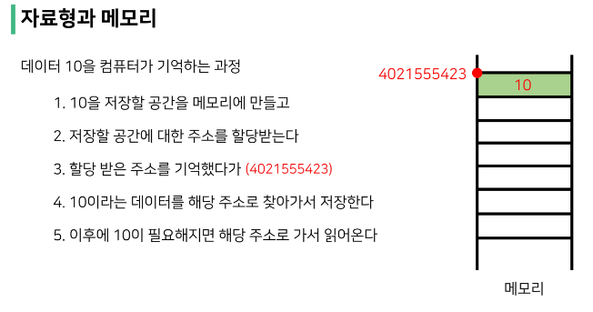

## 순서가 없는 데이터 구조
---
> 셋(Set) = 집합
- <span style="color:yellow">중복되는 요소가 없이</span>, 순서에 상관없는 데이터들의 묶음
  - 데이터의 중복을 허용하지 않기 때문에 중복되는 원소가 있다면 하나만 저장
  - 순서가 없기 때문에 인덱스를 이용한 접근 불가능
- 수학에서의 집합을 표현한 컨테이너
  - 집합 연산이 가능(여집합을 표현하는 연산자는 별도로 존재 X)
  - 중복된 값이 존재하지 않음
- 담고 있는 요소를 삽입 변경, 삭제 가능 = 가변 자료형(mutable)


</br>

[추가 및 변경]
- .add(elem) : 셋에 값을 추가

```python
a = {'사과', '바나나', '수박'}
print(a) # {'사과', '바나나', '수박'}
a.add('딸기')
print(a) # {'사과', '딸기','바나나', '수박'}
```

- .update(*others) : 여러 값을 추가

```python
a = {'사과', '바나나', '수박'}
print(a) # {'사과', '바나나', '수박'}
a.update(['딸기', '바나나', '참외'])
print(a)  # {'참외', '바나나', '딸기', '수박', '사과'}
```

</br>

[요소 삭제]
- .remove(elem) : Set에서 삭제하고, 없으면 KeyError

```python
a = {'사과', '바나나', '수박'}
print(a) # {'바나나', '사과', '수박'}
a.remove('사과')
print(a) # {'바나나', '수박}
a.remove('애플')
print(a) # KeyError: '애플'
```

- .discard(elem) : Set에서 삭제하고, 없어도 에러가 발생하지 않음

```python
a = {'사과', '바나나', '수박'}
print(a) # {'바나나', '사과', '수박'}
a.remove('사과')
print(a) # {'바나나', '수박}
a.remove('애플')
print(a) # {'바나나', '수박}
```

</br>

[삭제]
- .pop() : 임의의 원소를 <span style="color:yellow">제거</span>해 <span style="color:yellow">반환</span>

```python
a = {'사과', '바나나', '수박'}

print(a) # {'바나나', '사과', '수박'} 
a.pop()
print(a) # {'사과', '수박'}
```

```python
a = {'1', '2', '3'}

print(a) # {'3', '1', '2'}
a.pop()
print(a) # {'1', '2'}
```

</br>

[모두 삭제]
- .clear() : 모든 항목을 제거
```python
a = {'사과', '바나나', '수박'}
a.clear()
print(a) # set()
```

</br>

[집합 관련 함수]
- s.isdisjoint(t) : 셋 s가 셋 t의 서로 같은 항목을 하나라도 갖고 있지 않은 경우, True 반환(서로소)
- s.issubset(t) : 셋 s가 셋 t의 하위 셋인 경우, True 반환
- s.issuperset(t) : 셋 s가 셋 t의 상위 셋인 경우, True 반환

```python
a = {'사과', '바나나', '수박'}
b = {'포도', '망고'}
c = {'사과', '포도', '망고', '수박', '바나나'}

print(a.isdisjoint(b)) # True, A와 B는 서로 서로소인가?
print(b.issubset(c)) # True, B가 C의 하위셋인가?
print(a.issuperset(c)) # False, A가 C의 상위셋인가?
```

> 딕셔너리


[조회]
- .get(key[,default])
  - key를 통해 value를 가져옴
  - KeyError가 발생하지 않으며, default 값을 설정할 수 있음 (기본: None)

```python
my_dict = {'apple': '사과', 'banana': '바나나'}
my_dict['pineapple'] # KeyError: 'pineapple'

my_dict = {'apple': '사과', 'banana': '바나나'}
print(my_dict.get('pineapple')) # None
print(my_dict.get('apple')) # 사과
print(my_dict.get('pineapple', 0)) # 0
```

[추가 및 삭제]
- .pop(key[,default])
  - key가 딕셔너리에 있으면 제거하고 해당 값을 반환
  - 그렇지 않으면 default를 반환
  - default값이 없으면 KeyError

```python
my_dict = {'apple': '사과', 'banana': '바나나'}
data = my_dict.pop('apple')
print(data, my_dict) # 사과 {'banana': '바나나'}

my_dict = {'apple': '사과', 'banana': '바나나'}
data = my_dict.pop('pineapple')
print(data, my_dict) # KeyError: 'pineapple'

my_dict = {'apple': '사과', 'banana': '바나나'}
data = my_dict.pop('pineapple', 0)
print(data, my_dict) # 0 {'apple': '사과', 'banana': '바나나'}
```

[추가 및 삭제]
- .update() : 값을 제공하는 key, value로 덮어씁니다.

```python
my_dict = {'apple': '사', 'banana': '바나나'}
my_dict.update(apple = '사과')
print(my_dict) # {'apple': '사과', 'banana': '바나나'}
```


[리스트 메서트 연습]

```python
sample_list = [11, 22, 33, 55, 66]

# 주어진 리스트의 3번 index에 있는 항목을 제거하고 변수에 할당해 주세요.

# 제거 & 할당 = pop 메서드

x = sample_list.pop(3)

print('list after: ', sample_list)
print('elem: ', x)

# sample_list의 가장 뒤에 77을 추가해보세요.

sample_list.append(77)

# 할당해 놓은 변수의 값을 sample_list의 2번 index에 추가해보세요.

sample_list.insert(2, x)
```

[튜플 메서드 연습]

```python
my_tuple = (11, 22, 33, 44, 55, 66)

# 주어진 튜플에서 44와 55의 값을 새로운 튜플에 할당해보세요.

new_tuple = my_tuple[3:5] = my_tuple[3:-1]
```

[lambda 연습]

```python
test_list = [1, 2, 3, 7, 4, 6, 5]
test_list.sort()

scores = [('eng', 88), ('sci', 90), ('math', 80)]

# 정렬
print(scores) # [('eng', 88), ('sci', 90), ('math', 80)]
scores.sort() 
print(scores) #  [('eng', 88), ('math', 80), ('sci', 90)]

# 맨 앞에 있는 값 기준으로 정렬

# 뒤에 값 기준으로 정렬하고 싶을 때

def check(x):
  return x[1]

scores.sort(key = check) # 첫번째 함수 기준으로 정렬

# 따로 함수 만들지 않고 한 줄로

scores.sort(key = lambda x: x[1])
```


## 얕은 복사와 깊은 복사
---
컴퓨터 구조 배울 때 컴퓨터가 데이터를 기억하는 과정 기억하시나요? 



그런데 이렇게 저장하면 하나의 기억에 하나의 주소를 할당해야합니다.  
그러면 100개를 저장하려면 주소 100개가, 1000개를 저장하려면 주소 1000개가 필요합니다.  
메모리 소모가 너무 심해요. 저장을 많이 못합니다.  


그래서 여러 기억을 하나의 주소로 찾아갈 수 있도록 방법을 강구한 결과, 연속적인 공간에 데이터를 저장되도록 하고, 맨 처음 기억의 주소만 가지고 있으면 나머지 데이터도 그 주소를 기준으로 찾을 수 있도록 발생을 해냅니다.  

</br>

예를 들어 '서울_1반_학생들_점수표'라는 변수를 선언하고 주소값을 할당했다고 합시다.  
그리고 새로운 변수 '우리반_점수표'라는 변수를 대입 연산자(=)를 통해 복사 시키면,  
둘의 주소값은 완전히 동일하게 됩니다. 그럼 할당되는 값 또한 완전히 같을 겁니다.  

이걸 우리는 '얕은 복사'라고 합니다. 객체도, 객체 참조도 똑같은 복사입니다.


그런데 이러면 어느 쪽이든 데이터를 변경하면 고스란히 원본 데이터가 변경됩니다. 만약 원본을 냅두고 완전히 독립적인 사본을 만들어 변경하고 싶으면 어떡할까요?  

객체를 복사해서 다른 주소에 할당해주면 됩니다. 객체는 같지만 서로 다른 주소에 담겨져 있어 독립적인 복사, 이걸 우리는 '깊은 복사'라고 부릅니다.  


> 할당
- 대입 연산자 (=)
  - 리스트 복사 확인하기

```python
original_list = [1, 2, 3]
copy_list = original_list # 얕은 복사
print(original_list, copy_list) # [1, 2, 3], [1, 2, 3]

copy_list[0] = 'hello'
print(original_list, copy_list) # ['hello', 2, 3], ['hello', 2, 3]
```

<span style="color:red">※ 대입 연산자(=)를 통한 복사는 해당 객체에 대한 객체 참조(=주소)를 복사  
해당 주소의 일부 값을 변경하는 경우 이를 참조하는 모든 변수에 영향</span>

</br>

> 얕은 복사(shallow copy)
- Slice 연산자 활용하여 같은 원소를 가진 리스트지만 연산된 결과를 복사 (다른 주소)

```python
a = [1, 2, 3]
b = a[:]
print(a, b) # [1, 2, 3] [1, 2, 3]
b[0] = 5 
print(a, b) # [1, 2, 3] [5, 2, 3]
```
어? Slice 연산자를 쓰면 다른 주소로 연산된 결과를 복사하니까 깊은 복사인 거 아닌가요?  

이게......깊은 복사 같기도 한데, 아예 깊은 복사라고 하기에도 애매합니다.

복사하는 리스트의 원소가 주소를 참조하는 경우를 보죠.

```python
a = [1, 2, ['a', 'b']]
b = a[:]
print(a, b) # [1, 2, ['a', 'b']] [1, 2, ['a', 'b']]
b[2][0] = 0
print(a, b) # [1, 2, [0, 'b']] [1, 2, [0, 'b']]
```

```python
a = [1, 2, ['a', 'b']]
```

여기서 a는 1, 2 그리고 'a', 'b' 저장해 놓은 주소값을 index로 가지고 있습니다.  
그래서 a[2]는 주소값을 호출, 주소값에 해당하는 리스트 ['a', 'b']를 가지고 오는 겁니다.  


```python
b = a[:]
```

Slice 연산자를 쓰면 다른 주소로 연산된 결과를 복사하니까,  
다른 주소에 1, 2, 그리고 주소값을 저장합니다.  
그런데 이 주소값이 어떤 주소값이죠? 'a'와 'b'의 주소값입니다.  

</br>

그래서 

```python
b[2][0] = 0
```

을 하면 결국 'a'값을 변경해서 0을 집어넣게 되고, 이는 a에까지 영향을 끼치는 겁니다. 결국 얕은 복사에 속하게 되는 것이죠.  


깊은 복사를 원한다면 참조까지 다 복사가 되어야 하는 겁니다.


> 깊은 복사(deep copy)
- 리스트 복사 확인하기
- copy.deepcopy() : 내용과 참조까지 다 복사
- copy.copy()
- 모든 내용을 다 복사하기엔 메모리 용량이 너무 증가하기에,
- 리스트를 복사하고 싶다는 욕망이 든다면 무조건 print 찍어봅시다! (아님 디버깅 툴로 리스트 변화를 확인하던지)

```python
import copy
a = [1, 2, ['a', 'b']]
b = copy.deepcopy(a)
print(a, b) # [1, 2, ['a', 'b']] [1, 2, ['a', 'b']]
b[2][0] = 0
print(a, b) # [1, 2, ['a', 'b']] [1, 2, [0, 'b']]
```