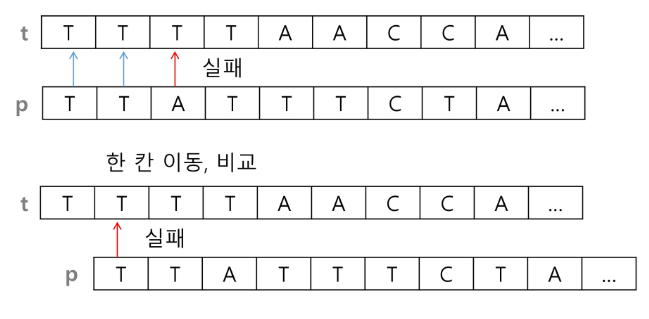
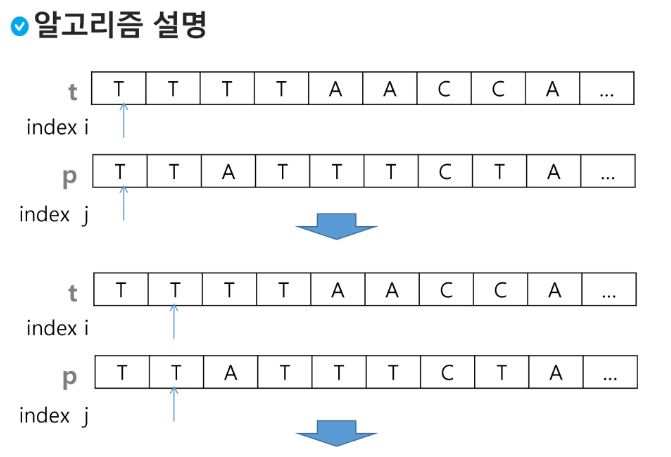
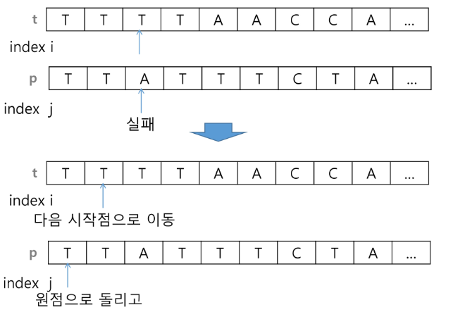
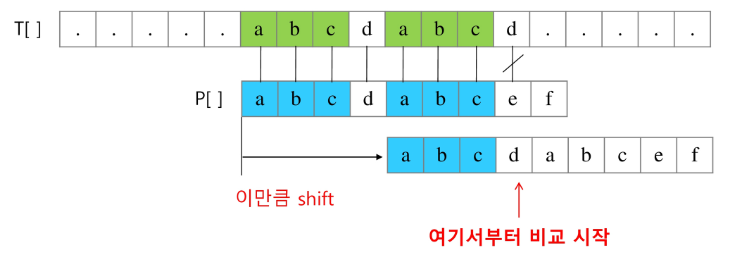
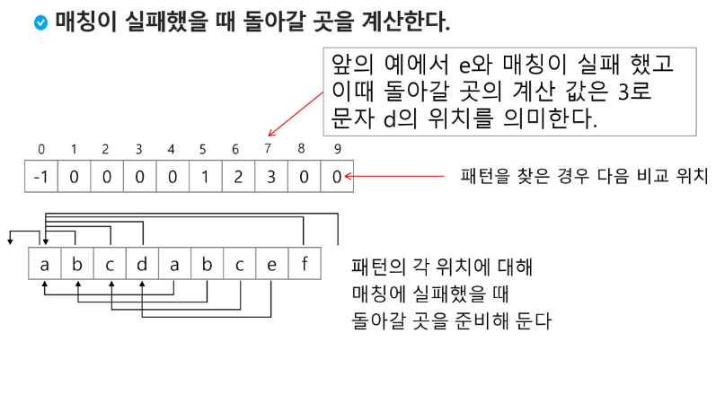
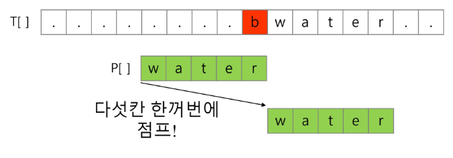
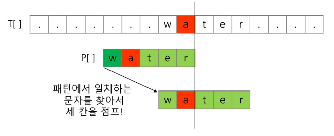
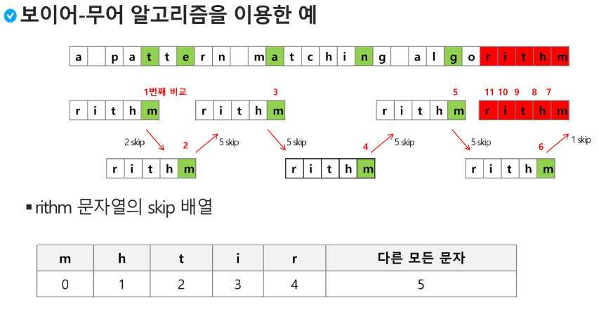

# 고지식한 패턴 
- 본문 문자열을 처음부터 끝까지 차례대로 순회하면서 패턴 내의 문자들을 일일이 비교하는 방식으로 동작








```python
p = 'ab'  # 찾을 패턴
t = 'aaabaaaabaaaaaabab'  # 전체 문장

M = len(p)
N = len(t)

def bf(p, t, M, N): # lenOfText , lenOfPattern이 더 나은 변수 이름
  i = 0 # t에서의 비교위치
  j = 0 # p에서의 비교위치
  
  while i < N and j < M:  # 비교할 문장이 남아있고, 패턴을 찾기 전이면
    if t[i] != p[j]:  # 서로 다른 글자를 만나면
      i -= j  # 비교를 시작한 위치로
      j = -1  # 패턴의 시작 전으로
    i += 1
    j += 1
  
  if j == M: # 패턴을 찾은 경우
    return i - M
  else:
    return -1

print(bf(p,t))

# 3 : 같은 문자열이 3번째에 처음 위치

def bf2(p, t, M, N): # lenOfText , lenOfPattern이 더 나은 변수 이름
  i = 0 # t에서의 비교위치
  j = 0 # p에서의 비교위치
  
  while i < N and j < M:  # 비교할 문장이 남아있고, 패턴을 찾기 전이면
    if t[i] == p[j]:
      i += 1
      j += 1
    else:
      i = i - j + 1
      j = 0

  if j == M: # 패턴을 찾은 경우
    return i - M
  else:
    return -1
```

```python
def bf3(p,t, N, M):
  for i in range(N-M+1):
    for j in range(M):
      if t[i] != p[j]:
        break
    else:
      return i
  return -1

print(bf2(p, t, N, M))
```

```python
def bf4(p,t, N, M):
  cnt = 0
  for i in range(N-M+1):
    for j in range(M):
      if t[i] != p[j]:
        break
    else:
      cnt += 1
  return cnt
```

</br>

# KMP 알고리즘
- 불일치가 발생한 텍스트 스트링의 앞 부분에 어떤 문자가 있는지를 미리 알고 있으므로, 불일치가 발생한 앞 부분에 대하여 다시 비교하지 않고 매칭을 수행
- 패턴을 전처리하여 배열 next[M]을 구해서 잘못된 시작을 최소화함
  - next[M]: 불일치가 발생했을 경우 이동할 다음 위치
- 시간 복잡도: O(M+N)

</br>

> 아이디어 설명
- 텍스트에서 abcdabc까지는 매치되고, e에서 실패한 상황 패턴의 맨 앞의 abc와 실패 직전의 abc는 동일함을 이용할 수 있다.
- 실패한 텍스트 문자와 P[4]를 비교한다.






</br>

# 보이어-무어 알고리즘
- 오른쪽에서 왼쪽으로 비교(끝에서 맨앞 순으로 비교)
- 대부분의 상용 소프트웨어에서 채택하고 있는 알고리즘
- 보이어-무어 알고리즘은 패턴에 오른쪽 끝에 있는 문자가 불일치하고 이 문자가 패턴 내에 존재하지 않은 경우, 이동 거리는 무려 패턴의 길이만큼이 된다.



</br>

> 오른쪽 끝에 있는 문자가 불일치하고 이 문자가 패턴 내에 존재할 경우





</br>

> 문자열 매칭 알고리즘 비교
- 찾고자 하는 문자열 패턴의 길이 m, 총 문자열 길이 n
- 고지식한 패턴 검색 알고리즘: 수행시간 O(mn)
- 카프-라빈 알고리즘: 수행시간 O(n)
- KMP 알고리즘: 수행시간 O(mn)
- 보이어-무어 알고리즘
  - 앞의 두 매칭 알고리즘들의 공통점 텍스트 문자열의 문자를 적어도 한번 씩 훑어서, 최선의 경우에도 
  - 보이어-무어 알고리즘은 텍스트 문자를 다 보지 않아도 된다.
  - 발상의 전환 : 패턴의 오른쪽부터 비교
  - 최악의 경우 수행시간: O(mn)
  - 입력에 따라 다르지만 일반적으로 O(n)보다 시간이 덜 든다.