# 배열 1 (Array 1)
- 알고리즘
- 배열
- 버블 정렬(Bubble Sort)
- 카운팅 정렬(Counting Sort)
- 완전검색
- 그리디(Greedy Algorithm)

---

## 알고리즘
- 문제를 해결하기 위한 절차나 방법
- APS 과정의 목표 : 보다 좋은 알고리즘을 이햐하고 활용하는 것
- 좋은 알고리즘
  - 정확성
  - 작업량
  - 메모리 사용량
  - 단순성
  - 최적성

</br>

> 알고리즘의 성능 분석 필요
- 알고리즘의 작업량 비교
- 알고리즘의 작업량 = 시간 복잡도(Time Complexity)
  - 실제 걸리는 시간을 측정
  - 실행되는 명령문의 개수를 계산

</br>

> 시간 복잡도 = 빅-오(O) 표기법
- 시간 복잡도 함수 중에서 가장 큰 영향력을 주는 n에 대한 항만을 표시
- 계수(Codefficient)는 생략하여 표시

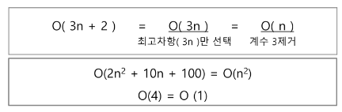

- n 개의 데이터를 입력 받아 저장한 후 각 데이터에 1씩 증가시킨 후 각 데이터를 화면에 출력하는 알고리즘의 시간복잡도
  - O(n)

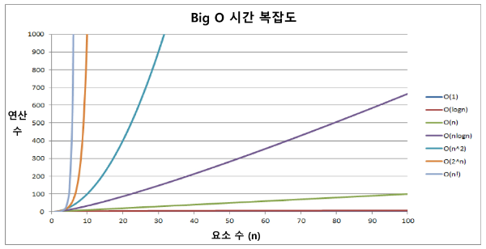

</br>

## 배열

- 배열 : 일정한 자료형의 변수들을 하나의 이름으로 열거하여 사용하는 자료구조

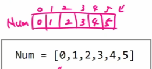

- 배열의 필요성
  - 프로그램 내에서 여러 개의 변수가 필요할 때, 일일이 다른 변수명을 이용하여 자료에 접근하는 것은 매우 비효율적
  - 배열 사용 시 하나의 선언으로 둘 이상의 변수를 선언
  - 다수의 변수로는 하기 힘든 작업을 배열을 활용하여 쉽게 처리

</br>

- 1차원 배열의 선언
  - 변수에 처음 값을 할당할 때 생성
  - 프로그램에서 사용할 배열의 이름
  - ex) Arr = list(), []

</br>

> 배열 활용 예제 : Gravity
- 상자들이 쌓여있는 방이 있다. 방이 오른쪽으로 90도 회전하여 상자들이 중력의 영향을 받아 낙하한다고 할 때, 낙차가 가장 큰 상자를 구하여 그 낙차를 리턴하는 프로그램을 작성
- 중력은 회전이 완료된 후 적용
- 상자들은 모두 한쪽 벽면에 붙여진 상태로 쌓여 2차원의 형태를 이루며 벽에서 떨어져서 쌓인 상자는 없다.
-  방의 가로, 세로 길이는 항상 100
-  상자는 최소 0, 최대 100 높이로 쌓을 수 있다.
- [그림 설명]
- 아래 예) 총 26개의 상자가 회전 후, 오른쪽 방 그림의 상태가 된다. A 상자의 낙차가 7로 가장 크므로 7을 리턴하면 된다.
- 회전 결과, B 상자의 낙차는 6, C 상자의 낙차는 1이다.

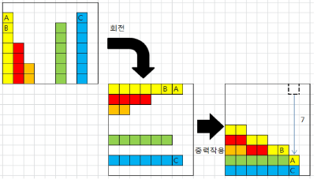

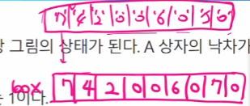

</br>

<b><span style="color:white; background-color:red; font-size:150%">※ 입출력을 제외한 내장함수 사용 금지</b></span>

</br>

-  풀이
  - 맨 앞의 주소를 최대값으로 가정
  - for i : 0 -> N - 1 
```python
max V = ans[0]
for i : 1 -> N - 1
  if max V < M ans[i]
     max V <- ans[i]
```

```python
# box[i]의 오른쪽, box[i + 1] ~ box[N - 1]

for i : 0 -> N - 1 # box의 각 원소
  cnt = 0
  
  for j : i + 1 -> N - 1
    if box [i] > box[j]
    cnt = cnt + 1

  ans[i] = cnt
```

</br>

<b><span style="color:white; background-color:red; font-size:150%">※ append 최소화, 크기를 미리 정해놓고 출발 (크기 = 100 : a = [0]*100)</b></span>

</br>

## 정렬
- 키 : 자료를 정렬하는 기준이 되는 특정 값
- 대표적인 정렬 방식 종류
  - <b><span style="color:white; background-color:red; font-size:150%">버블 정렬</b></span>
  - 카운팅 정렬
  - <b><span style="color:white; background-color:red; font-size:150%">선택 정렬</b></span>
  - 퀵 정렬
  - 삽입 정렬
  - 병합 정렬

</br>

## 버블 정렬 (Bubble Sort)
- 인접한 두 개의 원소를 비교하며 자리를 계속 교환하는 방식
- 정렬 과정 (오름차순)
  - 첫 번째 원소부터 인접한 원소끼리 계속 자리를 교환하면서 맨 마지막 자리까지 이동
  - 한 단계가 끝나면 가장 큰 원소가 마지막 자리로 정렬
- 시간 복잡도 : O(n^2)

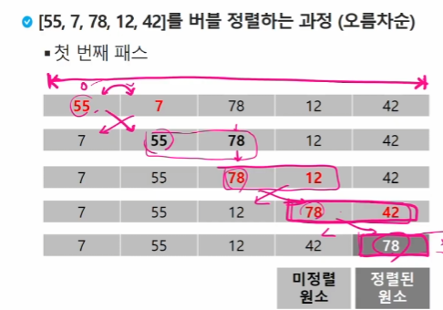

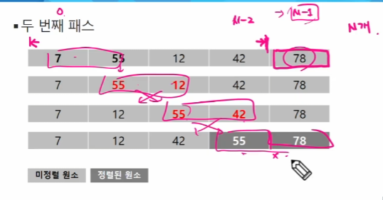

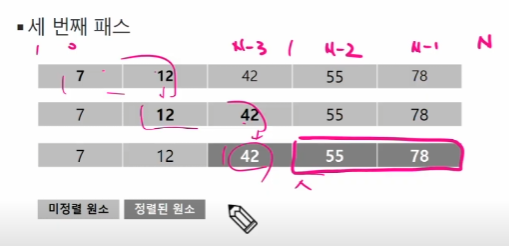

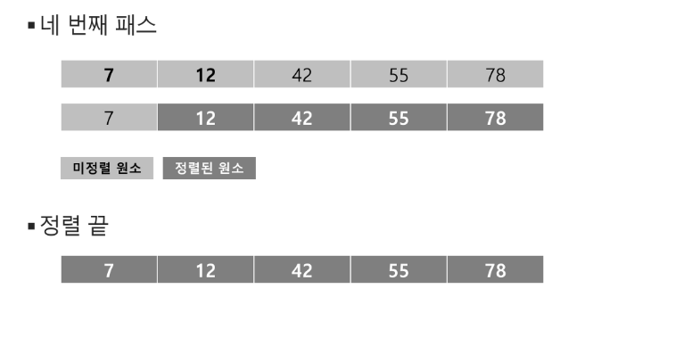

```python
# 구간의 끝 : i
# 주어진 구간의 왼쪽 인덱스 : j
for i : N - 1 -> 1
  for j : 0 -> i - 1
    if A[j] > A[j+1]
      위치 스왑
```

</br>

## 카운팅 정렬(Counting Sort)
- 항목들의 순서를 결정하기 위해 집합에 각 항목이 몇 개씩 있는지 세는 작업을 하여, 선형 시간에 정렬하는 효율적인 알고리즘
- 제한 사항
  - 정수나 정수로 표현할 수 있는 자료에 한 해 적용 가능 : 각 항목의 발생 횟수 기록을 위해, 정수 항목으로 인덱스 되는 카운트들의 배열을 사용하기 때문
  - 충분한 공간을 할당하려면 집합 내 가장 큰 정수를 알아야 한다.
- 시간 복잡도
  - O(n+k) : n은 리스트 길이, k는 정수의 최대값

``` python
# 0 ~ 9 숫자 각각 몇개씩 있는가?
cnt = [0] * 10

for x in A:
  cnt[x] += 1
```

> [0, 4, 1, 3, 1, 2, 4, 1]을 카운팅 정렬하는 과정
- Data에서 각 항목들의 발생 횟수를 세고, 정수 항목들로 직접 인덱스 되는 카운트 배열 counts에 저장

- 정렬된 집합에서 각 항목의 앞에 위치할 항목의 개수를 반영하기 위해 counts의 원소를 조정

- counts[1]을 감소시키고 Temp에 1을 삽입한다.
  - 맨 뒤에서부터 확인
    - 뒤에서 부터 읽는 이유는 안정 정렬이 되기 때문이다. 안정 정렬은 값이 같은 경우 정령되기 전의 순서가 정렬 후에도 유지된다.
  - 원본 data의 맨 뒤의 '1'. '1'의 counts 값은 4이다. 그럼 숫자 '1'은 최소한 무조건 4번째에는 있다. 
  - counts 값에 1을 빼주고(4-1), Temp의 4번째 위치에 숫자 '1' 삽입
  - 정리하자면, 입출력만 보면 TEMP는 DATA의 안정정렬 결과물로, DATA의 값으로 cnts의 인덱스를 찾아가고, cnts의 인덱스에 있는 값은 Temp의 인덱스, 그 인덱스에 아까 읽었던 DATA의 값을 집어넣었고, Temp의 현재 인덱스는 채워졌으니, cnts의 값을 1 감소 시킨 것이다.

> cf) TEMP에 저장할 때 앞에서부터 채워나가면 내림차순이 되나?  
> Tip) Counts 개수 자체가 자기보다 작은 거 기준으로 만들어졌다.  
> 어떤 순서를 바꿔야할까?


```python
def Counting_Sort(A, B, k)
# A [] -- 입력 배열(0 to k)
# B [] -- 정렬된 배열
# C [] -- 카운트 배열

  k = max(A) # A의 범위(카운트 배열의 크기)
  C = [0] * (k+1)

  for i in range(0, len(A)): # len(A) = n 
  # for x in A:
  #   C[x] += 1
    C[A[i]] += 1 
  
  for i in range(1, len(C)): # len(C) = k
    C[i] += C[i-1]

  for i in range(len(B)-1, -1, -1):
    C[A[i]] -= 1
    B[C[A[i]]] = A[i]
```

## Baby-gin Game
- 설명
  - 0~9 사이의 숫자 카드에서 임의의 카드 6장을 뽑았을 때, 3장의 카드가 연속적인 번호를 갖는 경우를 run이라 하고, 3장의 카드가 동일한 번호를 갖는 경우를 triplet이라고 한다.
  - 그리고, 6장의 카드가 run과 triplet로만 구성된 경우를 baby-gin으로 부른다.
  - 6자리의 숫자를 입력 받아 baby-gin 여부를 판단하는 프로그램을 작성


## 2차원 배열
- 1차원 List를 묶어놓은 List
- 2차원 이상의 다차원 List는 차원에 따라 Index를 선언
- 2차원 List의 선언 : 세로 길이(행의 개수), 가로길이(열의 개수)를 필요로 함
- Python에서는 데이터 초기화를 통해 변수선언과 초기화 가능

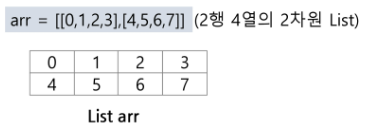

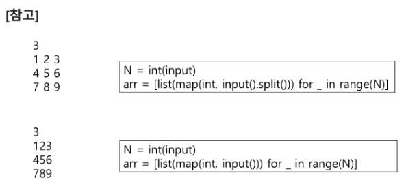

</br>

> 배열 순회 
- n X M 배열의 n*m개의 모든 원소를 빠짐없이 조사하는 방법

</br>

> 행 우선 순회

```python
# i 행의 좌표
# j 행의 좌표

for i in range(n):
  for j in range(m):
      Array[i][j] # 필요한 연산 수행
```

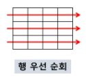

</br>

> 열 우선 순회

```python
# i 행의 좌표
# j 행의 좌표

for j in range(m):
  for i in range(n):
      Array[i][j] # 필요한 연산 수행
```

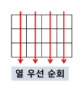

</br>

> 지그재그 순회

```python
# i 행의 좌표
# j 행의 좌표

for j in range(m):
  for i in range(n):
      Array[i][j + (m-1-2*j)*(i%2)] # 굳이 한 줄로 하지 말고 'for if 짝수 / if 홀수'로 해도 된다.
      # 필요한 연산 수행
```

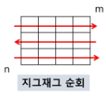

</br>

> 델타를 이용한 2차 배열 탐색
- 2차 배열의 한 좌표에서 4방향의 인접 배열 요소를 탐색하는 방법

```python
arr[0...N-1][0...N-1] # NxN 배열
di[] <- [0, 0, -1, 1] 
dj[] <- [-1, 1, 0 , 0]
for i : 0 -> N - 1
  for j : 0 -> N - 1:
    for k in range(4):
      ni <- i + di[k]
      nj <- j + dj[k]
      if 0 <= ni < N and 0 <= nj < N # 유효한 인덱스면
        test(arr[ni][nj])
```

```python
di = [0, 1, 0, -1]
dj = [1, 0, -1, 0]
N = 3
for i in range(N):
  for j in range(N):
    for k in range(4):
      ni, nj = i+di[k], j+dj[k]
#      print(i, j, ni, nj)
```

```python
N = 3
for i in range(N):
  for j in range(N):
    for di, dj in [[0,1], [1, 0], [0, -1], [-1, 0]]
      ni, nj = i+di[k], j+dj[k]
#      print(i, j, ni, nj)
```

```python
# 상하좌우 l칸씩 할 경우
# 곱해주는 방식
# ni, nj에 한 번씩 더 더해주는 방식도 가능
di = [0, 1, 0, -1]
dj = [1, 0, -1, 0]
N = 3
P = 3
for i in range(N):
  for j in range(N):
    for k in range(4):
      for l in range(1, p + 1)
      ni = i + di[k] * l
      nj = j + dj[k] * l
#      print(i, j, ni, nj)
```


</br>

> 전치 행렬

```python
# i : 행의 좌표, lens(arr)
# j : 열의 좌표, len(arr[0])
arr = [[1, 2, 3], [4, 5, 6], [7, 8 ,8]] # 3*3 행렬

for i in range(3):
  for j in range(3):
    if i < j:
      arr[i][j], arr[j][i] = arr[j][i], arr[i][j]
```

</br>

## 연습문제1

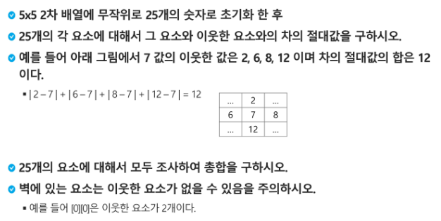

## 부분집합 합(Subset Sum) 문제
- 유한 개의 정수로 이루어진 집합이 있을 때,  이 집합의 부분집합 중에서 그 집합의 원소를 모두 더한 값이 0이 되는 경우가 있는지를 알아내는 문제
- 예를 들어, [-7, -3, -2, 5, 8]라는 집합이 있을 때, [-3, -2, 5]는 이 집합의 부분집합이면서 (-3)+(-2)+5=0이므로 이 경우의 답은 참이 된다.

</br>

## 부분집합 생성하기
- 완전검색 기법으로 부분집합 합 문제를 풀기 위해서는, 우선 집합의 모든 부분집합을 생성한 후에 각 부분집합의 합을 계산해야 한다.
- 주어진 집합의 부분집합을 생성하는 방법에 대해서 생각해보자.
- 부분집합의 수
  - 집합의 원소가 n개일 때, 공집합을 포함한 부분집합의 수는 2^n개이다.
  - 이는 각 원소를 부분집합에 포함시키거나 포함시키지 않는 2가지 경우를 모든 원소에 적용한 경우의 수와 같다.

- 각 원소가 부분집합에 포함되었는지를 loop를 이용하여 확인하고 부분집합을 생성하는 방법

```python
A = [1, 2, 3, 4]
bit = [0] * 4
for i in range(2):
  bit[0] = i
  for j in range(2):
    bit[1] = j
    for k in range(2):
      bit[2] = k
      for l in range(2):
        bit[3] = l
        print(bit, end = ' ')
        for p in range(4):
          fi bit[p]:
          print(A[p], end=' ')
          s += A[p]
        print()
        print(s)
```

</br>

## 비트 연산자
> 비트 연산자
- & 연산자 : 비트 단위로 AND 연산을 한다.
  - i & (1<<j) : i의 j번째 비트가 1인지 아닌지를 검사한다
- | 연산자 : 비트 단위로 OR 연산을 한다.
- << 연산자 : 피연산자의 비트 열을 왼쪽으로 이동시킨다.
  - 1 << n : 2^n 즉, 원소가 n개일 경우의 모든 부분집합의 수를 의미
- \>> 연산자 : 피연산자의 비트 열을 오른쪽으로 이동시킨다.

```python
# 보다 간결하게 부분집합을 생성하는 방법

arr = [3, 6, 7, 1, 5, 4]

n =  len(arr) # n : 원소의 개수

for i in range(1<<n): # 1<<n : 부분 집합의 개수, 0 ~ 2^n - 1
  for j in range(n):  # 원소의 수만큼 비트를 비교함
    if i & (1<<j):  # i의 j번 비트가 1인 경우
      print(arr[j], end=", ") # j번 원소 출력
  print()
print()
```

</br>

---

## 검색
- 순차 검색(sequential search)
- 이진 검색(binary search)
- 해쉬(hash)

</br>

## 순차 검색(Sequential Search)
- 일렬로 되어 있는 자료를 순서대로 검색하는 방법
  - 가장 간단하고 직관적인 검색 방법
  - 배열이나 연결 리스트 등 순차구조로 구현된 자료구조에서 원하는 항목을 찾을 때 유용
  - 알고리즘이 단순하여 구현이 쉽지만, 검색 대상의 수가 많은 경우 수행시간이 급격히 증가하여 비효율적

- 2가지 경우
  - 정렬 O
  - 정렬 X

- 검색 과정
  - 첫 번째 원소부터 순서대로 검색 대상과 키 값이 같은 원소가 있는지 비교하며 찾는다.
  - 키 값이 동일한 원소를 찾으면 그 원소의 인덱스를 반환
  - 자료구조의 마지막까지 검색 대상을 찾지 못하면 검색 실패

</br>

> 정렬되어 있지 않은 경우
- 찾고자 하는 원소의 순서에 따라 비교회수가 결정됨
  - 첫 번째 원소를 찾을 때는 1번 비교, 두 번째 원소를 찾을 때는 2번 비교
  - 정렬되지 않은 자료에서의 순차 검색의 평균 비교 횟수 = (1/n)*(1+2+3+...+n) = (n+1)/2
  - 시간 복잡도: O(n)

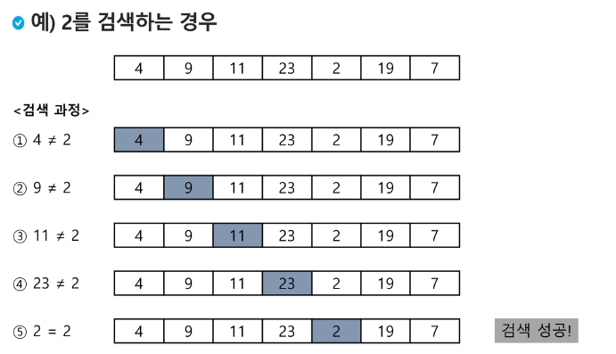

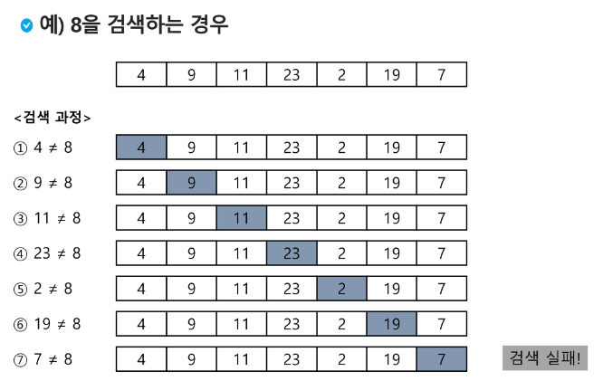

```python
def sequentialSearch(a, n, key)
  i <- 0
  while i < n and a[i] != key:  # 안전장치 : 앞 명제가 False면 뒤 명제 실행 X 그대로 통과
    i <- i + 1
  if i < n : return i # 뒤 명제에 의해 중단된 경우 : 값을 찾은 것
  else : return -1  # 못 찾아서 중단된 경우
```

> 정렬되어 있는 경우
- 검색 과정
  - 자료가 오름차순으로 정렬된 상태에서 검색을 실시
  - 자료를 순차적으로 검색하면서 키 값을 비교, 원소의 키 값이 검색 대상의 키 값보다 크면 찾는 원소가 없으므로 검색을 종료

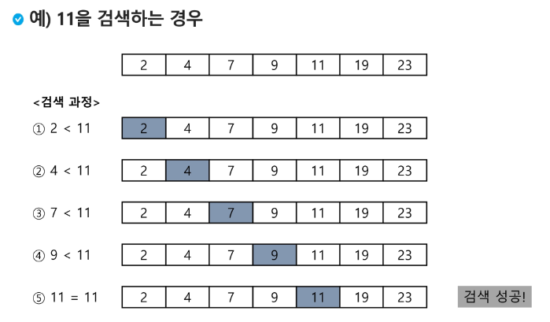

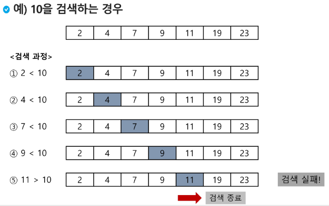

```python
def sequentialSearch2(a, n, key)
  i <- 0
  while i < n and a[i] < key:
    i <- i + 1

  if i < n and a[i] == key: # 찾아서 중단된 경우
    return i
  else:
    return -1
```

</br>

## 이진 검색(Binary Search)
- 자료의 가운데에 있는 항목의 키 값과 비교하여 다음 검색의 위치를 결정하고 검색을 계속 진행하는 방법
  - 목적 키를 찾을 때까지 이진 검색을 순환적으로 반복 수행함으로써 검색 범위를 반으로 줄여가면서 보다 빠르게 검색을 수행

- 자료가 정렬된 상태여야 한다.

- 검색 과정
  - 자료의 중앙에 있는 원소를 고른다.
  - 중앙 원소의 값과 찾고자 하는 목표 값을 비교한다.
  - 목표 값이 중앙 원소의 값보다 작으면 자료의 왼쪽 반에 대해서 새로 검색을 수행, 크다면 자료의 오른쪽 반에 대해서 새로 검색을 수행
  - 찾는 값을 찾을 때까지 위 과정 반복

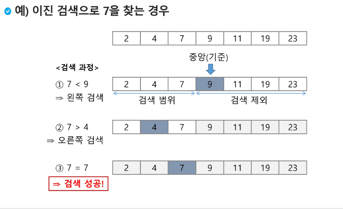

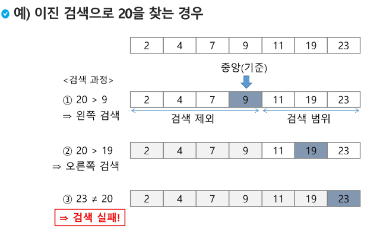

- 구현
  - 검색 범위의 시작점과 종료점을 이용하여 검색을 반복 수행
  - 자료에 삽입이나 삭제가 발생했을 때 배열의 상태를 항상 정렬 상태로 유지하는 추가 작업 필요

```python
def binarySearch(a, N, key)
  start = 0
  end = N -1
  while start <= end: # 검색 구간이 남아있으면
    middle = (start + end) // 2
    if a[middle] == key:  # 검색 성공
      return true
    elif a[middle] > key:
      end = middle - 1
    else:
      start = middle + 1

  return false  # 검색 실패
```

```python
# selection sort

N = int(input())
arr = list(map(int, input().split()))

for i in range(N - 1):  # 작업 구간의 시작인덱스(기준 인덱스)
  minIdx = i  # 맨 앞이 최소라 가정
  for j in range(i + 1, N):
    if arr[minIdx] > arr[j]:
      minIdx = j
  arr[minIdx], arr[j] = arr[j], arr[minIdx]
```