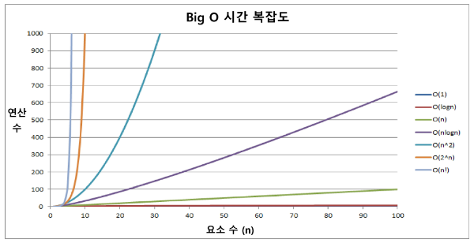
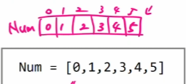
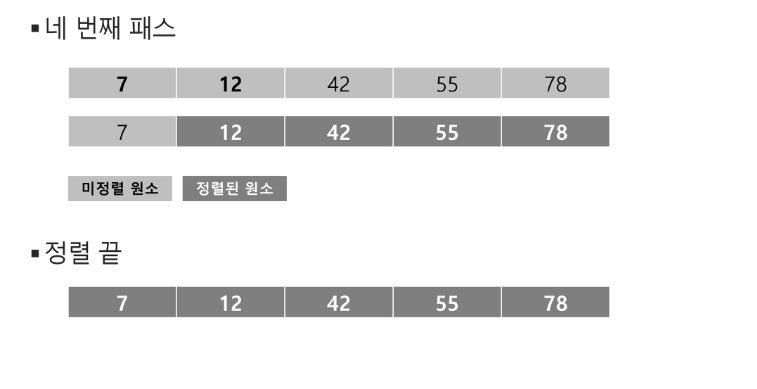

# 배열 1 (Array 1)
- 알고리즘
- 배열
- 버블 정렬(Bubble Sort)
- 카운팅 정렬(Counting Sort)
- 완전검색
- 그리디(Greedy Algorithm)

---

## 알고리즘
- 문제를 해결하기 위한 절차나 방법
- APS 과정의 목표 : 보다 좋은 알고리즘을 이햐하고 활용하는 것
- 좋은 알고리즘
  - 정확성
  - 작업량
  - 메모리 사용량
  - 단순성
  - 최적성

</br>

> 알고리즘의 성능 분석 필요
- 알고리즘의 작업량 비교
- 알고리즘의 작업량 = 시간 복잡도(Time Complexity)
  - 실제 걸리는 시간을 측정
  - 실행되는 명령문의 개수를 계산

</br>

> 시간 복잡도 = 빅-오(O) 표기법
- 시간 복잡도 함수 중에서 가장 큰 영향력을 주는 n에 대한 항만을 표시
- 계수(Codefficient)는 생략하여 표시


- n 개의 데이터를 입력 받아 저장한 후 각 데이터에 1씩 증가시킨 후 각 데이터를 화면에 출력하는 알고리즘의 시간복잡도
  - O(n)



</br>

## 배열

- 배열 : 일정한 자료형의 변수들을 하나의 이름으로 열거하여 사용하는 자료구조



- 배열의 필요성
  - 프로그램 내에서 여러 개의 변수가 필요할 때, 일일이 다른 변수명을 이용하여 자료에 접근하는 것은 매우 비효율적
  - 배열 사용 시 하나의 선언으로 둘 이상의 변수를 선언
  - 다수의 변수로는 하기 힘든 작업을 배열을 활용하여 쉽게 처리

</br>

- 1차원 배열의 선언
  - 변수에 처음 값을 할당할 때 생성
  - 프로그램에서 사용할 배열의 이름
  - ex) Arr = list(), []

</br>

> 배열 활용 예제 : Gravity
- 상자들이 쌓여있는 방이 있다. 방이 오른쪽으로 90도 회전하여 상자들이 중력의 영향을 받아 낙하한다고 할 때, 낙차가 가장 큰 상자를 구하여 그 낙차를 리턴하는 프로그램을 작성
- 중력은 회전이 완료된 후 적용
- 상자들은 모두 한쪽 벽면에 붙여진 상태로 쌓여 2차원의 형태를 이루며 벽에서 떨어져서 쌓인 상자는 없다.
-  방의 가로, 세로 길이는 항상 100
-  상자는 최소 0, 최대 100 높이로 쌓을 수 있다.
- [그림 설명]
- 아래 예) 총 26개의 상자가 회전 후, 오른쪽 방 그림의 상태가 된다. A 상자의 낙차가 7로 가장 크므로 7을 리턴하면 된다.
- 회전 결과, B 상자의 낙차는 6, C 상자의 낙차는 1이다.


</br>

<b><span style="color:white; background-color:red; font-size:150%">※ 입출력을 제외한 내장함수 사용 금지</b></span>

</br>

-  풀이
  - 맨 앞의 주소를 최대값으로 가정
  - for i : 0 -> N - 1 
```python
max V = ans[0]
for i : 1 -> N - 1
  if max V < M ans[i]
     max V <- ans[i]
```

```python
# box[i]의 오른쪽, box[i + 1] ~ box[N - 1]

for i : 0 -> N - 1 # box의 각 원소
  cnt = 0
  
  for j : i + 1 -> N - 1
    if box [i] > box[j]
    cnt = cnt + 1

  ans[i] = cnt
```

</br>

<b><span style="color:white; background-color:red; font-size:150%">※ append 최소화, 크기를 미리 정해놓고 출발 (크기 = 100 : a = [0]*100)</b></span>

</br>

## 정렬
- 키 : 자료를 정렬하는 기준이 되는 특정 값
- 대표적인 정렬 방식 종류
  - <b><span style="color:white; background-color:red; font-size:150%">버블 정렬</b></span>
  - 카운팅 정렬
  - <b><span style="color:white; background-color:red; font-size:150%">선택 정렬</b></span>
  - 퀵 정렬
  - 삽입 정렬
  - 병합 정렬

</br>

## 버블 정렬 (Bubble Sort)
- 인접한 두 개의 원소를 비교하며 자리를 계속 교환하는 방식
- 정렬 과정 (오름차순)
  - 첫 번째 원소부터 인접한 원소끼리 계속 자리를 교환하면서 맨 마지막 자리까지 이동
  - 한 단계가 끝나면 가장 큰 원소가 마지막 자리로 정렬
- 시간 복잡도 : O(n^2)




```python
# 구간의 끝 : i
# 주어진 구간의 왼쪽 인덱스 : j
for i : N - 1 -> 1
  for j : 0 -> i - 1
    if A[j] > A[j+1]
      위치 스왑
```

