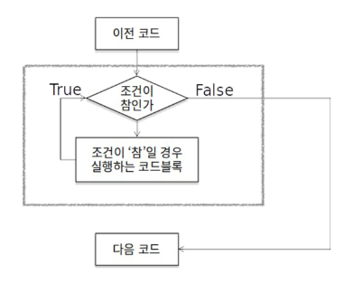

# 제어문
- <span style="color:yellow">순차</span>, 선택, 반복 구조
- 특정 상황에 따라 코드를 선택적으로 실행 or 계속하여 실행(반복)하는 제어
- 순서도(flowchart)  

</br>

## 코드 스타일 가이드
---
- 코드를 '어떻게 작성할지'에 대한 가이드라인 for 협업 & 가독성
- 파이썬에서 제안하는 스타일 가이드
  - PEP8(https://www.python.org/dev/peps/pep-0008/)

- 각 회사/프로젝트마다 따로 스타일 가이드 설정하기도 함
  - Google Style guide(http://google.github.io/styleguide/pyguide.html)


</br>
  
## 들여쓰기(Space Sensitive)
---
- 4칸(Space) or 1탭(Tab)
  - <span style="color:red">주의! 한 코드 안에서는 반드시 한 종류의 들여쓰기를 사용 = 혼용금지</span>
  - 원칙적으로는 공백(빈칸,space) 사용을 권장(PEP8 권장사항)
  
## 조건문
---
- 참/거짓을 판단할 수 있는 조건식과 함께 사용
- 순서도(flowchart)를 먼저 그리면 코드 짜는게 편하고 빠르다!


</br>

> 기본 형식
- 조건에는 참/거짓에 대한 조건식
  - 조건이 참인 경우 이후 들여쓰기 되어 있는 코드 블록을 실행
  - 이외의 경우 else 이후 들여쓰기 되어 있는 코드 블록을 실행
    - else는 선택적으로 활용할 수 있음
  
```python
if 조건 == True:

else:
  
```

ex) 조건문 예시
- 아래 순서도를 코드로 나타내시오.


```python
a = 5
if a > 5:
  print('5 초과')
else:
  print('5 이하')
print(a)

'''
5 이하
5
'''
```

ex) 조건문 실습 문제
- 조건문을 통해 변수 num의 값의 홀수/짝수 여부를 출력하시오.

```python
num = int(input("숫자 입력: ")) # input() : 문자열(str)로 받아옵니다.

if num % 2 == 0: 
  print("짝수")
else:             # if num % 2: 도 가능, 0이 아닌 값을 모두 True로 받기 때문
  print("홀수")
```

</br>

> 복수 조건문
- 복수의 조건식을 활용할 경우 elif를 활용하여 표현

```python
if 조건:

elif 조건: 

elif 조건: 

else:

```

ex) 복수 조건문 실습 문제
- 미세먼지 농도에 따른 위험 등급, dust 값에 따라 등급을 출력하는 조건식
- 조건식 완료 후 미세먼지 확인 완료라는 문구 출력


```python
dust = 80
if dust > 150:
  print('매우 나쁨')
elif dust > 80:
  pritn('나쁨')
elif dust > 30:
  print('보통')
else:
  print('좋음')
print('미세먼지 확인 완료!')
```

</br>

> 중첩 조건문
- 조건문은 다른 조건문에 중첩되어 사용될 수 잇음
  - 들여쓰기에 유의!

```python
if 조건:
  # Code block
  if 조건:
    # Code block
else:
  # Code block
```

ex) 중첩 조건문 실습 문제
- 미세먼지 코드에 미세먼지 농도(dust 값)가 300이 넘는 경우 '실외 활동을 자제하세요'를 추가로 출력하고 음수인 경우 '값이 잘못되었습니다'를 출력하시오.

```python
dust = 80
if dust > 150:
  print('매우 나쁨')
  if dust > 300:
    print('실외 활동을 자제하세요')
elif dust > 80:
  pritn('나쁨')
elif dust > 30:
  print('보통')
else:
  print('좋음')
  if dust < 0:
    print('값이 잘못되었습니다')
print('미세먼지 확인 완료!')
```

</br>

## 조건 표현식(Conditional Expression)
---
- 간단한 조건문일때 라인을 최대한 줄이고 싶을 때
- 일반적으로 조건에 따라 값을 정할 때 활용
- 삼항 연산자(Ternary Operator)

```python
true인 경우 값 if 조건 else flase인 경우 값
```

ex) 조건 표현식 실습 문제

```python
value = num if num >= 0 else -num
# 참일 경우       조건      거짓일 경우 
# 절대값을 저장하기 위한 코드
```

</br>

## 반복문
---
- 특정 조건을 만족할 때까지 같은 동작을 계속 반복하고 싶을 때 사용



</br>

> 반복문의 종류  
- while 문 (조건)
  - 종료 조건에 해당하는 코드를 통해 반복문을 종료시켜야 함
- for 문 (반복 횟수)
  - 반복가능한 객체를 모두 순회하면 종료 (별도의 종료 조건이 필요 없음)
- 반복 제어
  - break, continue, for-else

</br>

> While 문
- <span style="color:yellow">특정 조건이 주어진 상태</span>
- while문은 조건식이 참인 경우 반복적으로 코드를 실행
  - 조건이 참인 경우 들여쓰기 되어 있는 코드 블록이 실행
  - 코드 블록이 모두 실행되고, 다시 조건식을 검사하며 반복적으로 실행
  - while문은 무한 루프를 하지 않도록 종료 조건이 반드시 필요
    - 종료 조건 (특정 조건일 때 탈출)
    1. False를 만들어준다
    2. break (mostly if 문과 함께 쓰인다)  

> <Tip> while 문을 쓸 때, 일단 while 1 or while True 박고 시작해라! 그 다음에 False를 만드는 조건을 만들자!

</br>

ex) while 문 예시
- 아래의 순서도를 while 반복문을 이용해서 코드로 나타내시오.


```python
a = 0
while a < 5:
  print(a)
  a += 1
print('끝')
```

</br>

> 복합 연산자(In-Place Operator)
- 연산과 할당을 합쳐 놓은 것 (+=)

</br>

> for 문  
- <span style="color:yellow">개수가 정해진 상태 or iterable이 주어진 상태</span>
- 시퀸스(string, tuple, list, range)를 포함한 순회 가능한 객체(iterable)의 요소를 모두 순회
  - 처음부터 끝까지 모두 순회하므로 별도의 종료 조건이 필요하지 않음
- Iterable
  - 순회할 수 있는 자료형(string, dict, list, tuple, range, set 등)
  - 순회형 함수(range, enumerate)SS
- <span style="color:red">주의! for 문에서 iterable 요소는 무조건 건드리지 말자!!!</span>  


ex)

```python
for i in lst:
  lst.append() # <= 이런 짓 하지 말라는 거다.
# cf: .append()는 리스트에 요소를 추가해주는 명령문
```

ex) for 문 예시

```python
for fruit in ['apple', 'mango', 'banana']
  print(fruit)
print('끝')
'''
apple
mango
banana
끝
'''
```

- 사용자가 입력한 문자를 한 글자씩 출력

```python
chars = input()

for char in chars:
  print(char)
```

```python
chars = input()

for idx in range(len(chars)):
  print(chars[idx])
```

</br>

> 딕셔너리(Dictionary) 순회
- 기본적으로 key를 순회, key를 통해 값을 활용

```python
grades = {'john' : 80, 'eric': 90}
for student in grades:
  print(student, grades[student])
'''
john 80
eric 90
'''
```

</br>

> 추가 메서드를 활용한 딕셔너리 순회
- 추가 메서드를 활용하여 순회할 수 있음
  - keys(): Key로 구성된 결과
  - values(): value로 구성된 결과
  - items(): (Key,value)의 튜플로 구성된 결과
  
```python
grades = {'john': 80, 'eric': 90}
print(grades.keys())
print(grades.values())
print(grades.items())

'''
dict_keys {['john', 'eric']}
dict_values {[80, 90]}
dict_items {[('john', 80), ('eric', 90)]}
'''
```

```python
grades = {'john': 80, 'eric': 90}
for student, grade in grades.items():
  print(student, grade)

'''
john 80
eric 90
'''
```

</br>

> enumerate 순회
- enumerate()
  - 인덱스와 객체를 쌍으로 담은 열거형(enumerate) 객체 반환
    - (index, value) 형태의 tuple로 구성된 열거 객체를 반환
- 안 써도 상관 없는데(두 줄만 추가하면 됨), 쓰면 코드가 깔끔해지고 읽기도 편함.

```python
members = ['민수', '영희', '철수']

for idx, number in enumerate(members):
  print(idx, number)
# enumerate로 인해 members의 '민수'를 (0, 민수), (1, 영희), (2, 철수)로 반한
'''
0 민수
1 영희
2 철수
'''
```

```python
members = ['민수', '영희', '철수']
enumerate(members) # enumerate at 0x105d3e100
print(list(enumerate(members))) # 숫자와 값의 tuple : [(0, '민수'), (1, '영희'), (2, '철수')]
print(list(enumerate(members, start=1))) # 기본값 0, start를 지정하면 해당 값부터 순차적으로 증가 : [(1, '민수'), (2, '영희'), (3, '철수')]
```

</br>

> List Comprehension
- 표현식과 제어문을 통해 특정한 값을 가진 리스트를 간결하게 생성하는 방법
- 리스트의 요소를 넣는 것이 아니라, 리스트의 <span style="color:yellow">규칙성</span>을 통해 반복해서 넣는 것이다.

```python
[code for 변수 in iterable]
[code for 변수 in iterable if 조건식]
```

</br>

> 실습) 1~3의 세제곱의 결과가 담긴 리스트를 만드시오.

```python
# 1~3의 세제곱 리스트 만들기
cubic_list = []
for number in range(1,4):
  cubic_list.append(number ** 3)
print(cubic_list)

# [1, 8, 27]
```

```python
cubic_list = [number ** 3 for number in range(1,4)]
print(cubic_list)

# [1, 8, 27]
```

</br>

> Dictionary Comprehension
- 표현식과 제어문을 통해 특정한 값을 가진 딕셔너리를 간결하게 생성하는 방법

```python
{key:value for 변수 in iterable}
{key:value for 변수 if 조건식}
```

> 실습) 1~3의 세제곱의 결과가 담긴 딕셔너리를 만드시오.

```python
# 1~3의 세제곱 리스트 만들기
cubic_dict = {}

for number in range (1,4):
  cubic_dict[number] = number ** 3
print(cubic_dict)

# {1: 1, 2: 8, 3: 27}
```

```python
cubic_dict = {number: number ** 3 for number in range(1,4)}
print(cubic_dict)

# {1: 1, 2: 8, 3: 27}
```

</br>

## 반복문 제어
---
- break
  - 반복문을 종료  
  - 특정 조건에서 반복문을 종료시키기 위해 사용
   
ex) 
```python 
for num in range(5):
  if num == 4:
    break
print(num)

'''
0
1
2
3
''''
```

```python
n = 0
while True:
  if n == 3:
    break
  print(n)
  n += 1

'''
0
1
2
'''
```

```python
for i in range(10):
  if i > 1:
    print('0과 1만 필요해!')
    break
  print(i)
'''
0
1
0과 1만 필요해!
'''
```

</br>

- continue
  - continue 이후의 코드 블록은 수행하지 않고, 다음 반복을 수행

ex) 
```python 
for num in range(5):
  if num == 4:
    continue
print(num)

'''
0
1
2
3
5
''''
```

```python
# 짝수만 출력
# 1. 짝수 : print
#        or
# 2. 홀수 : 넘어가 그 다음에 프린트 해줘

# 이게 5의 배수로 가면 첫번째 방식은 코드가 더러워 지지만, 두번째 방식은 깔끔하다
for i in range(n):
  if i % 5 == 1:
    프린트해줘
  if i % 5 == 2:
    프린트해줘
  if i % 5 == 3:
    프린트해줘
  if i % 5 == 4:
    프린트해줘
#      vs.
for i in range(n):
  if 5의 배수면:
    넘어가
  프린트해줘
```

</br>

- for-else
  - 끝까지 반복문을 실행한 이후에 else 문 실행
    - break를 통해 중간에 종료되는 경우 else 문은 실행되지 않음

ex) 
```python
for i in lst
  동작
else:
  일 끝났다!
```

```python
# 특정 단어를 찾는 코드
for char in 'apple':
  if char == 'b':
    print('b!')
    break
else:
  print('b가 없습니다.')

# b가 없습니다.
```

```python
for char in 'bate':
  if char == 'b':
    print('b!')
    break
else:
  print('b가 없습니다.')

# b!
```

- pass
  - 아무것도 하지 않음(문법적 필요성 but 할 일이 없을 때 사용)
    - 특별히 넣을 게 없을 때 채워넣는 용도
    
ex) 
```python
num = 5
if num == 0;
  # 조건을 만족할 때 실행할 코드 블럭이 필요, 그냥 채워넣을 때 pass 넣는 용도
print(num)

# 문법적으로 틀려서 실행이 안 된다.
```

```python
# i가 2일때 pass

for i in range(4):
  if i == 2:
    pass
  print(i)

'''
0
1
2
3
'''
# pass vs. continue : continue는 2를 넘겼지만, pass는 그냥 아무 역활도 안 한다. 
```


