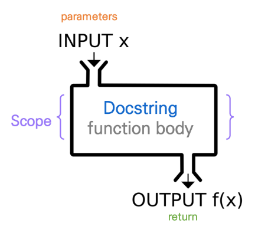
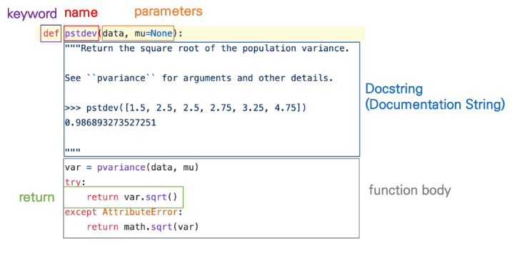
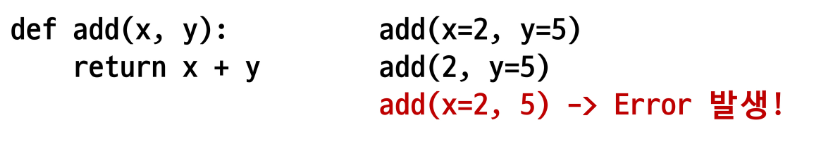
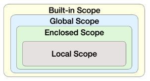

# 함수
1. 함수 기초
2. 함수의 결괏값(Output)
3. 함수의 입력(Input)
4. 함수의 범위(Scope)  
<br/>

## 함수
---
- 분해(Decomposition) 
  - 기능을 분해
  - <span style = "color : yellow">재사용 가능하게 함</span>
- 추상화(Abstraction)
  - 복잡한 내용을 모르더라도 사용 가능
  - 재사용성, 가독성, 생산성
  - 전체가 아닌 특정 단위로 분해해서 사용
  - 사실 내부 구조를 변경할게 아니라면 몰라도 무방  
<br/>

## 함수 기초
---
- 함수는 크게 3가지로 분류  
  1. 내장함수
       -  파이썬에 기본적으로 포함된 함수
  2. 외장함수
       - import 문을 통해 사용
       - 외부 라이브러리에서 제공하는 함수
  3. 사용자 정의 함수 
        - 직접 사용자가 만드는 함수  
<br/>
- 함수의 정의
  - 특정 기능을 하는  코드의 조각(묶음)
  - 특정 코드를 매번 다시 작성하지 않고, 필요시에만 호출하여 사용
  - Input = parameter
  - Output = return
  - Docstring : 함수가 어떠한 기능을 하는지 설명하는 설명서  
<br/>
- 함수의 기본 구조
  - 선언과 호출 (define & call)
  - 입력 (Input)
  - 문서화 (Docstring)
  - 범위 (Scope)
  - 결과값 (Output) : return으로 결과값을 밖으로 내보낸다.  
    
  

  

<br/>

> 선언과 호출(define & call)
- 함수의 선언 : def 키워드 활용
- 들여쓰기를 통해 Function body(실행될 코드 블록)를 작성함
  - Docstring은 함수 body 앞에 선택적으로 작성 가능
    - 작성 시에는 반드시 첫 번째 문장에 문자열 ''''''
- 함수는 parameter을 넘겨줄 수 있음
- 함수는 동작 후에 return을 통해 결괏값을 전달  

1. 함수를 정의
2. 함수는 함수명()으로 호출하여 사용
   - parameter가 있는 경우, 함수명(값1, 값2,...)으로 호출  

<br/>

[함수 실행 순서 예시] 

```python
num1 = 0
num2 = 1

def func1(a, b):
  return a + b
def func2(a, b):
  return a - b
def func3(a, b):
  return func1(a, 5) + func2(5, b) # func1 = a + 5, func2 = 5 - b

result = func3(num1, num2) # a = 0, b = 1
print(result) # 9
```

<br/>

> <span style="color:yellow">함수는 호출되면 코드를 실행하고 return 값을 반환하며 종료된다.  </span>

<br/>

## 함수의 결과값(Output)
---
> 값에 따른 함수의 종류
- Void function
   -  명시적인 return 값이 없는 경우, None(생략)을 반환하고 종료
- Value returning function
  - 함수 실행 후, return문을 통해 값 반환
  - <span style="color:red">[주의!] return을 하게 되면, 값 반환 후 함수가 바로 종료(return 뒤에 있는 logic은 실행되지 않는다.)</span>  
<br/>  

> <span style="color:red">[주의!] 'print'는 값을 출력하지만, 값을 반환하지는 않음</span> 

```python
# my_max 두 수의 최대값을 출력하는 함수 만들기

def my_max_print(x, y):
  if x < y:
    print(y)
  else:
    print(x)

def my_max(x, y):
  if x < y:
    return(y)
  else:
    return(x)

print(my_max_print(2, 3))
print('--'*20)
print(my_max(2,3))

'''
3
None
--------
3
'''
```  
<br/>  

> [주의!] print vs return
- print : 호출될 때마다 값이 출력 (주로 테스트를 위해 사용), 화면에 보여준다가 기능의 끝
- return : 데이터 처리, 값을 반환하고 함수를 종료시킨다

```python
# Void function 예시
def void_product(x, y):
  print(f'{x} x {y} = {x * y}')

void_product(4, 5) # 4 X 5 = 20
ans = void_product(4, 5) # 4 X 5 = 20
print(ans) # None
```

```python
# Void function 예시
def void_product(x, y):
  return x * y

void_product(4, 5) # 4 X 5 = 20
ans = void_product(4, 5) # 4 X 5 = 20
print(ans) # 20
```
<br/>  

> 두 개 이상의 값 반환
- return은 항상 하나의 값만을 반환

```python
def minus_and_product(x, y):
  return x - y
  return x * y # 이미 탈출해서 무시됨

y = minus_and_product(4, 5)
print(y) # -1
```

- 두 개 이상의 값을 반환하는 방법
  - 반한 값으로 튜플 사용

```python
def minus_and_product(x, y):
  return x - y, x * y 

y = minus_and_product(4, 5)
print(y) # (-1, 20)
print(type(y)) # <class 'tuple'>
```

<br/>

> 함수 반환 정리
- return X => None
- return O => 하나를 반환
- 여러 개를 원하면, Tuple, 리스트와 같은 컨테이너 활용

```python
# 똑바로 읽어도 거꾸로 읽어도 같은 단어를 찾는 함수
word_list = ['우영우', '기러기', '별똥별', '파이썬']
def is_palindrome(word_list):
  palindrome_list = []
  for word in word_list:
    if word == word[::-1]:
      palindrome_list.append(word)
  return palindrome_list
print(is_palindrome(word_list))
# ['우영우', '기러기', '별똥별']
```
<br/>  

## 함수의 입력(Input)
---
- Parameter (매개변수) : 함수를 <span style="color:yellow">정의</span>할 때, 함수 내부에서 사용되는 변수
- Argument (인자) : 함수를 <span style="color:yellow">호출</span>할 때, 넣어주는 값
  - 함수 호출 시 함수의 parameter를 통해 전달되는 값
  - Argument는 소괄호 안에 할당 func_name(argument)
    - 필수 Argument : 반드시 전달 되어야 하는 argument
    - 선택 Argument : 값을 전달하지 않아도 되는 경우는 기본값이 전달
  
```python
def function(ham) # parameter : ham
  return ham

funtion('spam') # argument : 'spam'

# 함수 리턴값 : spam
```

</br>

> Positional Arguments
- 기본적으로 함수 호출 시 Argument는 위치에 따라 함수 내에 전달됨.

 

</br>

> Keyword Arguments
- 직접 변수의 이름으로 특정 Argument를 전달할 수 있음
- Keyword Argument 다음에 Positional Argument를 활용할 수 없음

 

</br>

> Default Arguments Values
- 기본값(Default)을 지정하여 함수 호출 시 argument 값을 설정하지 않도록 함
  - 정의된 것 보다 더 적은 개수의 argument 들로 호출될 수 있음

 

</br>

## Python의 범위(Scope)
---
> Python의 범위(Scope)
- 함수는 코드 내부에 local scope를 생성하며, 그 외의 공간인 global scope로 구분
- scope
  - global scope : 코드 어디에서든 참조할 수 있는 공간
  - local scope : 함수가 만든 scope, 함수 내부에서만 참조 가능
- variable
  - global variable : global scope에 정의된 변수
  - local variable : local scope에 정의된 변수  

<br/>

- 할당 연산자(=)로 할당 시 Namespace(파이썬의 기억 저장 공간)에 딕셔너리 형태로 저장  

<br/>

- Namespace 종류
1. Built-in Namespace : 이미 내장된, 파이썬의 keywords들 저장, 모든 것을 담고 있는 범위, 정의하지 않고 사용 가능한 모든 것
2. Global Namespace : 파이썬 script(.py)가 실행될 때 생기는 실행 공간
3. Enclosing Namespace : 중첩 함수가 있을 때 바깥쪽의 함수의 Namespace, 지역 범위 한 단계 위 범위
4. Local Namespace : 어떤 함수를 실행할 때 함수 안쪽에 생성되는 namespace, 현재 작업 중인 지역 범위  

 

<br/>

- 여러 Namespace가 존재하면 같은 이름이 존재할 수 있다.  
=> 규칙(찾는 순서, 우선 순위)이 필요 = LEGB Rule  
=> scope : 변수의 제한 범위, 찾고자하는 변수가 존재할 수 있는 프로그램 상의 범위
  - 찾는 순서 : L => E => G => B
  - 크기 순서 : L < E < G < B  

<br/>

- 변수 수명주기(lifecycle) : 변수가 사라진다 = 더 이상 접근이 안 된다
  - built-in scope 
    - 파이썬이 실행된 이후부터 영원히 유지
  - global scope
    - 모둘(하나의 .py 파일)이 호출된 시점 이후 or 인터프리터가 끝날 때까지 유지
  - local scope 
    - 함수가 호출될 때 생성되고 함수가 종료될 때까지 유지  

```python
def func1():
  print('func1 시작')

  def func2():
    print('func2 시작')
    print('func2 끝')
    return
  
  func2()
  return

func1() # 함수(func1)를 콜해서 실행해야 출력

'''
func1 시작
func2 시작
func2 끝
'''
```

```python
x = '글로벌!' # Global variable

def func1(): 
  # func1 Local namespace
  def fun2():
    # func2 Local namespace
    print(x) # L(X) => E(X) => G(O)
  
  func2()

func1()

# 글로벌!
```

```python
x = '글로벌!' # Global variable

def func1(): 
  # func1 Local namespace
  x = '인클로징!'

  def fun2():
    # func2 Local namespace
    print(x) # L(X) => E(O)
  
  func2()

func1()

# 인클로징!
```

```python
x = '글로벌!' # Global variable

def func1(): 
  # func1 Local namespace
  x = '인클로징!'

  def fun2():
    # func2 Local namespace
    x = '로컬!'
    print(x) # L(O) 
  
  func2()

func1()

#로컬!
```

</br>

> Tip) locals(), globals() 함수를 쓰면 그 지역에서 호출할 수 있는 Namespace를 볼 수 있다.  

</br>

```python
x = '글로벌!' # Global variable

def func1(): 
  # func1 Local namespace
  x = '인클로징!'

  def fun2(a, b):
    # func2 Local namespace
    x = '로컬!'
    print(x) # L(O)
    print(locals())
    # print(globals()) => {'x' : '글로벌!'}
  
  func2(2, 3)

func1()

# {'x' : '로컬!'}

# 'a' : 2, 'b' : 3, 'x' : '로컬!' : 매개변수로 정의된 애들도 값이 할당되어서 local 변수가 된다. 지금은 func2 local space 안 쪽의 변수이다.
```

> Tip) 빠르게 주석 처리/해지 : ctrl + /  

```python
x = '글로벌!' # Global variable

def func1(): # func1에 들어있는 변수의 이름을 바꾸고 싶을 때 or function을 실행할 때 글로벌 변수를 바꾸고 싶을 때
  global x   # global : local space에서 변수가 나오면 local이 아니라 global에서 찾아!
  x = '인클로징!' # global 아래의 참조 x는 글로벌에서 가져와서 쓴다.
  print(x)

func1()
print(x)

'''
인클로징!
인클로징!
'''
```

```python
x = '글로벌!'
my_list = [1, 2, 3, 4] # Global variable

def func1(): 
  my list[1] = 5554 # namespace의 이름이나 변수를 할당하거나 바꾸는 게 아니라, my_list가 가지고 있는 내부의 성분을 바꾸는 것
  # Global variable에서 찾아서 가져옴

func1()
print(my_list)

# [1, 5554, 3, 4]
```
```python
x = '글로벌!'
my_list = [1, 2, 3, 4] # Global variable

def func1(): 
  my_list = [5, 6, 7]

func1()
print(my_list)

# [1, 2, 3, 4]
```

```python
x = 1

def func1();
  x = 2 # x = 3으로 변경

  def func2():
    global x # func2 내부의 x는 글로벌 x다 선언
    x = 3
    print(x)

  func2()
  print(x)

func1()
print(x)

'''
3
2
3
'''
```

> nonlocal : 나를 감싸고 있는 가장 첫번째 함수의 변수에 접근하여 쓰는 것

```python
def func1();
  x = 10 # x = 20 by nonlocal

  def func2():
    nonlocal x 
    
    x = 20

  func2()
  print(x) # func1 namespace

func1()
print(x) # Global 영역에서의 x를 가져와야 하는데, 없음 so Error

'''
20
Error
'''
```

> <span style="color:red">함수의 범위 주의</span>
- <span style="color:yellow">함수 내에서 필요한 상위 scope 변수는 argument로 넘겨서 활용할 것</span>
- 즉, global 명령어는 조심해서 써야 함. 알고리즘 할 때만 1, 2개 정도 쓰면 쉽게 풀릴 수 있다.
- 다 argument, parament로 넘겨서 쓰자
- <span style="color:yellow">함수로 값을 바꾸고자 한다면 항상 argument로 넘기고 리턴 값을 사용하는 것을 추천</span>


