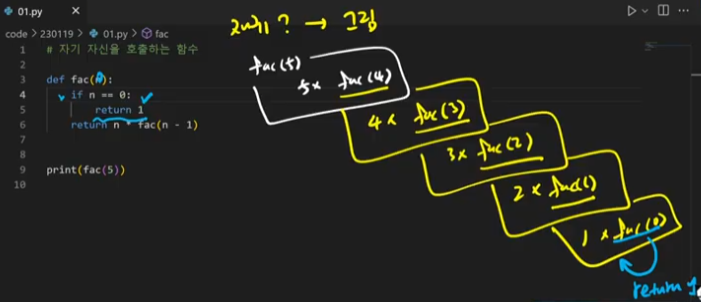
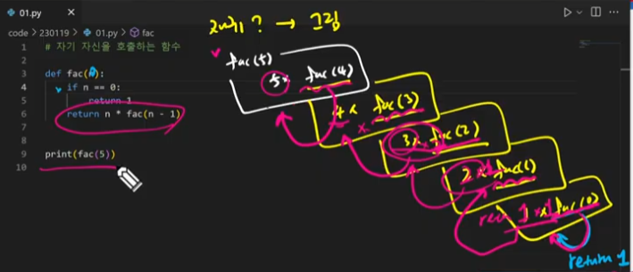
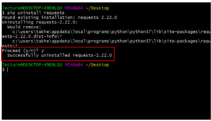
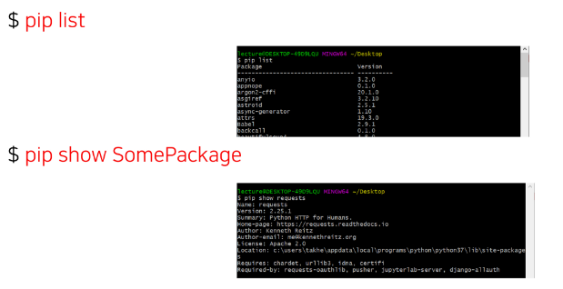
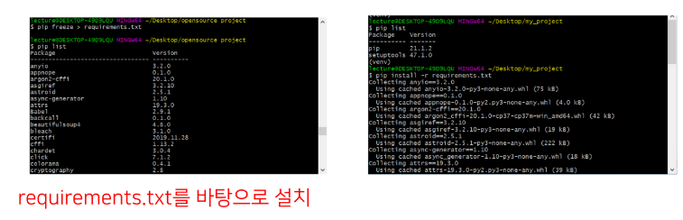
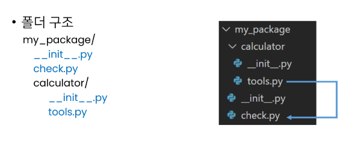

## 함수 응용
---
> map
- map(function, iterable)
- [x,y,z]를 f([x,y,z])가 아닌, [f(x), f(y), f(z)]로 받고 싶은 경우
- 순회 가능한 데이터구조(iterable)의 모든 요소에 함수(function) 적용하고, 그 결과를 map object로 반환

list(map()

```python
numbers = [1, 2, 3]
result = map(str, numbers)
print(result, type(result)) # <map object at 0X0000020984097FA0> <class 'map'>
print(list(result)) # ['1', '2', '3']
```

```python
def my_magic_func(n):
  return n * 10

my_lst = [1, 2, 3, 4, 5]

map_object = map(my_magic_func, my_lst)

rlt = list(map_object)

print(rlt)
```  

<br/>  

> map 활용 사례
- 알고리즘 문제 풀이 시 input 값들을 숫자로 바로 활용하고 싶을 때
```python
n, m = map(int, input().split()) 
print(n, m)
print(type(n), type(m)) # <class 'int'> <class 'int'>
```  

<br/>  

> filter
- filter(function, iterable)
- 조건에 True인 것들만 선별해서 모음
- 순회 가능한 데이터구조(iterable)의 모든 요소에 함수(function) 적용하고, 그 결과가 True인 것들을 filter object로 반환

```python
def odd(n):
  return n % 2
numbers = [1, 2, 3]
result = filter(odd, numbers)
print(result, type(result)) # <filter object at 0X0000020984097FA0> <class 'filter'>
print(list(result)) # [1, 3]
```

<br/>

> zip
- zip(*iterables)
- [a, b, c], [x, y, z], [1, 2, 3] => (a, x, 1), (b, y, 2), (c, z, 3)
- <span style = "color : yellow">복수의 iterable</span>을 모아 튜플을 원소로 하는 zip objet를 반한
```python
girls = ['jane', 'ashley']
boys = ['justin', 'eric']

for each in zip(girls, boys):
  print(each)

'''
('jane', 'justin') ('ashley', 'eric')
'''
```

<br/>

> lambda 함수
- lambda 매개변수 : 매개변수를 이용한 리턴값
- lambda[parameter]: 표현식
- 람다함수(익명함수)
  - 표현식을 계산한 결괏값을 반환하는 함수로, 이름이 없는 함수여서 익명 함수라고도 불림
- 특징
  - return문을 가질 수 없음
  - 간편 조건문 외 조건문이나 반복문을 가질 수 없음
- 장점
  - 함수를 정의해서 사용하는 것보다 간결하게 사용 가능
  - def를 사용할 수 없는 곳에서도 사용 가능  

```python
rlt = (lambda x: x * x)(2) # 4

my_func = lambda n: n * 2
my_func(2) # 4
```
```python
map_objec = map(lambda x: x * 10, [1, 2, 3])
rlt = list(map_objec)

print(rlt)
``` 

```python
# 삼각형의 넓이를 구하는 공식 - def
def triangle_area(b,h):
  return 0.5 * b * h
print(triangel_area(5, 6)) # 15.0

# 삼각형의 넓이를 구하는 공식 - 람다
triangle_area = lambda b, h : 0.5 * b * h
print(triangle_area(5, 6)) # 15.0
```

<br/>

> 재귀 함수(recursive function)
- 자기 자시늘 호출하는 함수
- 무한한 호출을 목표로 하는 것이 아니며, 알고리즘 설계 및 구현에서 유용하게 활용
  - 알고리즘 중 재귀 함수로 로직을 표현하기 쉬운 경우가 있음(ex. 점화식)
  - 변수의 사용이 줄어들며, 코드의 가독성이 높아짐
- 1개 이상의 base case(종료되는 상황)가 존재하고, 수렴하도록 작성
- 단점 : 내 머리 속의 한계! (머리 속으로 logic을 그리기가 너무 힘들다) so 재귀를 쓸거면 손으로 그림을 그리자!

```python
def recur():
  print('SSAFY')
  recur()

recur()
# SSAFY 무한 출력하다 Error
# 메모리 스택이 넘치게 되면(stack overflow) 프로그램이 동작하지 않게 됨
# 파이썬에서는 최대 재귀 깊이(maximum recursion depth)가 1000번으로, 호출 횟수가 이를 넘어가게 되면 Recursion Error 발생
```

```python
# Factorial(n!)
def fac(n):
  if n == 0:
    return 1 # 0! = 1 이기 때문
             # break는 for나 while의 반복문을 멈출 때 사용, 우리는 함수의 실행을 막아야 한다.
  return n * fac(n-1)

# 언제 재귀를 멈출 지 꼭 정해줘야 한다!
```

<br/>

이 경우엔 base case는 'if n ==0: return 1'이겠네요. 



<br/>

자, 근데 fac(5)일 때를 가정했을 때, 누가 가장 먼저 연산이 끝났을까요?  
fac(0)입니다.  
왜냐하면 fac(0)만 return 1을 만났고, 나머지 fac()들은 'return n * fac(n-1)' 중 'fac(n-1)'의 실행이 안 끝났기 때문입니다. 
결과적으로 실행은 마지막에 호출한 함수인 fac(0)부터 타고 올라오며 연산이 되는 겁니다.  
<span style = "color : yellow">즉, 시작은 fac(5)에서 했더라도, 끝나는 것은 가장 마지막에 호출한 fac(0)부터 끝나서 올라오는 겁니다.</span>  



<br/>

> 반복문과 재귀 함수 비교
- 알고리즘 자체가 재귀적인 표현이 자연스러운 경우 재귀함수를 사용
- 재귀 호출은 변수 사용을 줄여준다.
- 재귀 호출은 입력 값이 커질 수록 연산 속도가 오래 걸림.

<br/>

--- 

<br/>

## 패킹/언패킹 (Packing/Unpacking)
---
> 패킹/언패킹 연산자 (*)
- 모든 시퀀스형(리스트, 튜플 등)은 패킹/언패킹 연산자 *를 사용하여 객체의 패킹 또는 언패킹이 가능
- x, *y = i, j, k ...

<br/>

> 패킹/언패킹
- 패킹 : 여러 개의 데이터를 묶어서 변수에 할당하는 것
- 언패킹 : 시퀸스 속의 요소들을 여러 개의 변수에 나누어 할당하는것
- *패킹의 경우, 리스트로 대입
- *언패킹의 경우 튜플 형태로 대입

```python
# 패킹 / 언패킹

x, y = 1, 2
z = 1, 2, 3

print(z, type(z))

# (1, 2, 3) <class 'tuple'>

# 언패킹 시 변수의 개수와 할당하고자 하는 요소의 갯수가 동일해야함.

a, b = 1, 2, 3, 4

# ValueError : too many values to unpack (expected 2)
# 어디에 뭘 넣어야할 지 모르겠어!

a, *b = 1, 2, 3, 4 # a에 맨 앞에 있는 1 하나만 넣고, 나머지는 b에 다 넣으면 돼!

def my_sum(a, b, c):
  return a + b + c

num_list = [10, 20, 30]

rlt = my_sum(num_list[0], num_list[1], num_list[2])

rlt = my_sum(*num_list) # 리스트 풀어서 각각 넣어

# 패킹 개수 조절
a, b, c*
a, b, c, *d
```

<br/>

> 가변 인자(*args = arguments)
- 가변인자
  - 여러 개의 Positional Argument를 하나의 필수 parameter로 받아서 사용
  - 몇 개의 Positional Argument를 받을지 모르는 함수를 정의할 때 유용
- Asterisk(*) 
  - 시퀀스 언패킹 연산자 = 스퀸스를 풀어 헤치는 연산자
  - 주로 튜플이나 리스트를 언패킹하는데 사용
  - 가변 인자를 만드는데 사용


<br/>

```python
def test(*values):
  for value in values:
    print(value)

test(1)
test(1, 2)
test(1, 2, 3, 4)
# 매개변수를 가변적으로 넣을 수 있다. = 가변 인자

def func(*args):
  print(args)
  print(type(args))

func(1, 2, 3, 'a', 'b')

'''
(1, 2, 3, 'a', 'b')
<class 'tuple'>
```

```python
def my_sum(*agrs): 
  rlt = 0 
  for value in agrs:
    rlt += value
  return rlt

my_sum() # 0
my_sum(1, 2, 3) # 6

def my_sum(a, *agrs): # 1개는 꼭 받아야 할 때
  rlt = 0 
  for value in agrs:
    rlt += value
  return rlt

my_sum() # Error
my_sum(1, 2, 3) # 1은 a에 넣고, 나머지는 다 agrs에 넣는다
```

<br/>

>가변 인자 예시
- 반드시 받아야하는 인자와 추가적인 인자를 구분해서 사용할 수 있음
```python
def print_family_name(father, mother, *pets)
  print(f'아버지 : {father}')
  print(f'어머니 : {mother}')
  print('반려동물들...')
  for name in pets:
    print(f'반려동물: {name}')

print_family_name('아부지', '어무니', '멍멍이', '냥냥이')

'''
아버지 : 아부지
어머니 : 어무니
반려동물...
반려동물 : 멍멍이
반려동물 : 냥냥이
'''
```

<br/>

> 가변 키워드 인자(**kwargs)
- 몇 개의 키워드 인자를 받을지 모르는 함수를 정의할 때 유용
- **kwargs는 딕셔너리로 묶여 처리
- parameter에 **를 붙여 표현

<br/>

```python
# Keyword 활용
def test(**kwargs): # kwargs = keyword arguments, ** : keywords를 몇 개를 넣든 가변적으로 안쪽으로 다 넣을 수 있다.
  print(kwargs, type(kwargs))
  kwargs['name'] # 'aiden'이 나올 것
  return kwargs

test(name = 'aiden', age = 21)

# {'name': 'aiden', 'age': 21} <class 'dict'>
```

```python
# 가변인자와 keyword 인자를 모두 받을 경우
def test(*args, **kwargs):

test(1, 2, 3, 4, name = 'aiden', age = 21, music = 'IU')
```

<br/>

```python
def print_family_name(father, mother, **pets):
  print("아버지 :", father)
  print("어머니 :", mother)
  if pets:
    print("반려동물...")
    for species, name in pets.items():
        print(f'{species} : {name}')

print_family_name('아부지', '어무이', dog = '멍멍이', cat = '냥냥이')

'''
아버지 : 아부지
어머니 : 어무니
반려동물...
dog : 멍멍이
cat : 냥냥이
'''
```

<br/>

## 모듈 (Python File(.py))
---
- 다양한 기능을 하나의 파일로, 그리고 재사용 가능 (모듈, module)
- 다양한 파일을 하나의 폴더로 (패키지, package)
- 다양한 패키지를 하나의 묶음으로 (라이브러리, library)
- 관리하는 관리자 (pip)
- 패키지의 활용 공간 (가상환경)

</br>

> 모듈
- 특징 기능을 하는 코드를 파이썬 파일(.py) 단위로 작성한 것

</br>

> 패키지
- 특징 기능과 관련된 여러 모듈의 집합
- 패키지 안에는 또 다른 서브 패키지 포함

</br>

> 모듈과 패키지 불러오기
- import module
- from module import var, function, class
- from module import *(all)  

<br/>

- from package import module
- from package.module import var, function, Class

```python
import random

num_lsit = [1, 2, 3, 4]
random_shuffle(num_list)
print(num_list)
```

```python
from random import shuffle

num_list = [1, 2, 3, 4]
shuffle(num_list)
print(num_list)
```  

<br/>  

> 파이썬 패키지 관리자(pip)
- 패키지 설치
  - 최신 버전 / 특정 버전/ 최소 버전을 명시하여 설치 가능
  - 이미 설치되어 있는 경우 이미 설치되어 있음을 알리고 아무것도 하지 않음
- $ pip install [패키지명]
- $ pip install [패키지명] == 
- $ pip install [패키지명] >=  

<br/>  

- 모두 bash, cmd 환경에서 사용되는 명령어

<br/>

- 패키지 삭제 
  - $ pip uninstall [패키지명]



<br/>

- 패키지 목록 및 특정 패키지 정도
  - $ pip list
  - $ pip show SomePackage




<br/>

- 패키지 관리하기
  - 아래의 명령어들을 통해 패키지 목록을 관리[1]하고 설치할 수 있음[2]
  - 일반적으로 패키지를 기록하는 파일의 이름은 requirements.txt로 정의함
  - $ pip freeze > requirements.txt
  - $ pip -r requirements.txt
  - 장고에서 많이 사용할 예정



<br/>

> 패키지
- 패키지는 여러 모듈/하위 패키지로 구조화
- <span style = "color : yellow">모든 폴더에는 _ _ _init_ _ _.py를 만들어 패키지로 인식 </span>




```python
from calc import tools

print(tools.add(m, n))
print(tools.sub(m, n))
```

```python
from calc.tools import add, sub

print(add(m, n))
print(sub(m, n))
```

